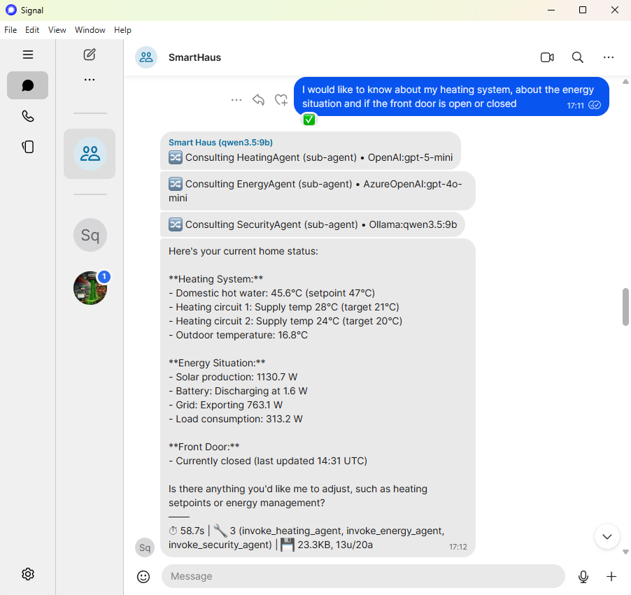
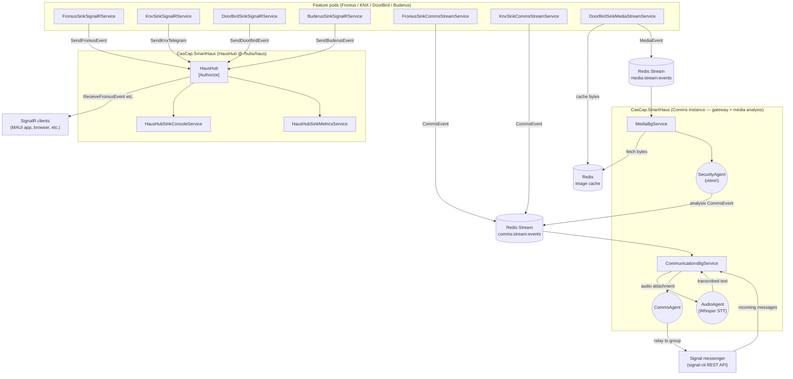

# SmartHaus — IoT & Agentic Smart Home on the Edge

[cascap.api.buderus-badge]: https://img.shields.io/nuget/v/CasCap.Api.Buderus?color=blue
[cascap.api.buderus-url]: https://nuget.org/packages/CasCap.Api.Buderus
[cascap.api.buderus.sinks-badge]: https://img.shields.io/nuget/v/CasCap.Api.Buderus.Sinks?color=blue
[cascap.api.buderus.sinks-url]: https://nuget.org/packages/CasCap.Api.Buderus.Sinks
[cascap.api.doorbird-badge]: https://img.shields.io/nuget/v/CasCap.Api.DoorBird?color=blue
[cascap.api.doorbird-url]: https://nuget.org/packages/CasCap.Api.DoorBird
[cascap.api.doorbird.sinks-badge]: https://img.shields.io/nuget/v/CasCap.Api.DoorBird.Sinks?color=blue
[cascap.api.doorbird.sinks-url]: https://nuget.org/packages/CasCap.Api.DoorBird.Sinks
[cascap.api.fronius-badge]: https://img.shields.io/nuget/v/CasCap.Api.Fronius?color=blue
[cascap.api.fronius-url]: https://nuget.org/packages/CasCap.Api.Fronius
[cascap.api.fronius.sinks-badge]: https://img.shields.io/nuget/v/CasCap.Api.Fronius.Sinks?color=blue
[cascap.api.fronius.sinks-url]: https://nuget.org/packages/CasCap.Api.Fronius.Sinks
[cascap.api.knx-badge]: https://img.shields.io/nuget/v/CasCap.Api.Knx?color=blue
[cascap.api.knx-url]: https://nuget.org/packages/CasCap.Api.Knx
[cascap.api.knx.sinks-badge]: https://img.shields.io/nuget/v/CasCap.Api.Knx.Sinks?color=blue
[cascap.api.knx.sinks-url]: https://nuget.org/packages/CasCap.Api.Knx.Sinks

> **Early proof-of-concept / first public release.** This project is under active development — expect rough edges, breaking changes, and missing documentation. Bugs are expected and the project is **fully unsupported**. Contributions and feedback are welcome, but please set expectations accordingly.

> I started this IoT/home automation project in 2022 and for four years struggled to find the time to get it over the line. In the last two months I switched to agentic development using [GitHub Copilot](https://github.com/features/copilot) — and this is the end result!

An open-source, [.NET 10](https://dotnet.microsoft.com/en-us/download/dotnet/10.0) IoT smart-home platform designed to run on the edge — from a Raspberry Pi to a full GPU-accelerated workstation. SmartHaus connects real-world devices (solar inverters, heating systems, lighting, security cameras, smart plugs, and more) into a single, event-driven application with AI-powered decision-making via the [Microsoft Agent Framework](https://github.com/microsoft/agents) and [Model Context Protocol (MCP)](https://modelcontextprotocol.io/).



### Highlights

- **Edge-first architecture** — runs on ARM64 (Raspberry Pi 4/5), x64, and ARM via a cross-architecture container image published to [GitHub Container Registry](https://github.com/f2calv/SmartHaus/pkgs/container/smarthaus)
- **Agentic AI** — 12+ [MCP](https://modelcontextprotocol.io/introduction) tool services expose device telemetry, control, and automation to LLM agents. Domain-specific agents (CommsAgent, SecurityAgent, HeatingAgent, AudioAgent) orchestrate decisions autonomously — see the [CasCap.SmartHaus README](src/CasCap.SmartHaus/README.md) for the full agent architecture, MCP tool registry, and Signal messenger integration. Run locally with [Ollama](https://ollama.com/) or connect to [Azure OpenAI](https://learn.microsoft.com/en-us/azure/ai-services/openai/)
- **Feature-flag driven** — enable only the integrations you need; each feature is an independent module with its own data pipeline, sinks, and [MCP tools](https://modelcontextprotocol.io/specification/2025-03-26/server/tools)
- **Azure cloud integration** — optional [Azure Table Storage](https://learn.microsoft.com/en-us/azure/storage/tables/) and [Azure Blob Storage](https://learn.microsoft.com/en-us/azure/storage/blobs/) sinks for telemetry persistence, with local [Azurite](https://learn.microsoft.com/en-us/azure/storage/common/storage-use-azurite) emulation for development
- **Azure Key Vault** — optional [Azure Key Vault](https://learn.microsoft.com/en-us/azure/key-vault/) integration for secrets management (disabled via `KeyVaultName=skip` for local development)
- **Standalone NuGet client libraries** — device-specific API libraries (Fronius, Buderus, KNX, DoorBird, and more) are designed to be 100% standalone and published as individual [NuGet](https://www.nuget.org/) packages — use them independently of SmartHaus in your own projects. *Some libraries are not yet published and require further work before release.*
- **Real-time event streaming** — [SignalR](https://learn.microsoft.com/en-us/aspnet/core/signalr/) hub, [Redis Streams](https://redis.io/docs/latest/develop/data-types/streams/), and [OpenTelemetry](https://opentelemetry.io/) metrics for observability
- **GitOps-ready** — Kubernetes deployment via [Helm](https://helm.sh/) charts and [ArgoCD](https://argo-cd.readthedocs.io/), with CI/CD through [GitHub Actions](https://github.com/features/actions)

## Quick Start

Clone the repo and run the self-contained demo — no external hardware or Azure subscription required.

**Prerequisites:** [Docker](https://docs.docker.com/get-docker/) with an NVIDIA GPU and the [NVIDIA Container Toolkit](https://docs.nvidia.com/datacenter/cloud-native/container-toolkit/latest/install-guide.html) for GPU-accelerated LLM inference. CPU-only mode works by removing the `deploy` block from the Ollama service in `docker-compose.yml`.

```bash
git clone https://github.com/f2calv/SmartHaus.git
cd KNX
docker compose --profile demo up --build
```

This builds the application from source and launches **EdgeHardware** (CPU/GPU telemetry monitoring), **Ubiquiti** (webhook-based camera events), and **Comms** (Signal messaging pipeline) with local infrastructure: Redis, Azurite, OpenTelemetry Collector, Ollama, and signal-cli.

Wait for the Ollama model pull to finish:

```bash
docker compose --profile demo logs ollama-init -f
```

Then explore:

- **Swagger UI** — <http://localhost:8080/swagger>
- **EdgeHardware snapshot** — `curl http://localhost:8080/api/v1.0/edgehardware`
- **Ubiquiti test event** — `curl -X POST "http://localhost:8080/api/v1.0/ubiquiti/event/smart?type=person&camera_name=FrontDoor&score=0.95"`
- **Redis UI** — <http://localhost:7843>

See the [Docker Compose](#docker-compose) section below for full details, including Signal messaging setup.

## Features

Defined as constants in [`FeatureNames`](src/CasCap.SmartHaus/Models/FeatureNames.cs), validated at startup by [`FeatureConfig.GetEnabledFeatures()`](src/CasCap.App/Models/_FeatureConfig.cs).

| Name | Description |
| --- | --- |
| [`Buderus`](src/CasCap.Api.Buderus/README.md) | Buderus heating system integration |
| [`Comms`](src/CasCap.SmartHaus/README.md) | Single-instance communications service that consumes a Redis Stream of key events and forwards agent-processed decisions |
| [`DDns`](src/CasCap.Api.DDns/README.md) | Dynamic DNS service |
| [`DoorBird`](src/CasCap.Api.DoorBird/README.md) | DoorBird video doorbell integration |
| [`EdgeHardware`](src/CasCap.Api.EdgeHardware/README.md) | Edge hardware monitoring — GPU telemetry via `nvidia-smi`, CPU temperature, and Raspberry Pi GPIO sensors. CPU monitoring is always enabled; GPU is auto-detected via ILGPU at startup |
| [`Fronius`](src/CasCap.Api.Fronius/README.md) | Fronius solar inverter integration |
| [`Knx`](src/CasCap.Api.Knx/README.md) | KNX home automation integration |
| [`Miele`](src/CasCap.Api.Miele/README.md) | Miele appliance integration |
| [`Shelly`](src/CasCap.Api.Shelly/README.md) | Shelly smart plug integration |
| [`Sicce`](src/CasCap.Api.Sicce/README.md) | Sicce aquarium pump integration |
| [`SignalRHub`](src/CasCap.SmartHaus/README.md) | Consolidated SignalR hub server, providing a single real-time event endpoint for all features. Can run as a standalone pod for separation of responsibility |
| [`Ubiquiti`](src/CasCap.Api.Ubiquiti/README.md) | Ubiquiti network device integration |
| [`Wiz`](src/CasCap.Api.Wiz/README.md) | Wiz smart lighting integration |

Features are configured via `CasCap:FeatureConfig:EnabledFeatures` as a comma-separated string (e.g. `Knx,Fronius,DoorBird`).

Multiple application deployment targets;

- **`CasCap.App.Server`** — Containerized backend services for Kubernetes, runnable locally during development. Visual Studio users should set this as the startup project to run the backend.
- **`CasCap.App.Console`** — Console application for local MCP/AI agent development and testing. Leverages many of the same MCP tools as the backend, providing a client-side console test environment. Visual Studio users should launch this project to interactively test MCP tools and agent behaviour.

## Agentic AI Architecture

SmartHaus uses a multi-agent architecture where a central **CommsAgent** orchestrates domain-specific sub-agents, each with their own [MCP](https://modelcontextprotocol.io/) tools and instruction prompts. Users interact with the system via [Signal Messenger](https://signal.org/) — no custom mobile app required.

> For detailed configuration, Redis Stream settings, and implementation specifics, see the [CasCap.SmartHaus README](src/CasCap.SmartHaus/README.md).

### Agents

| Agent | Role | MCP Tools |
| --- | --- | --- |
| **[CommsAgent](src/CasCap.SmartHaus/Resources/CommsAgent.instructions.md)** | Gateway orchestrator — routes user messages and system events to sub-agents, relays responses to Signal | 8 direct + 98 via delegation |
| **[SecurityAgent](src/CasCap.SmartHaus/Resources/SecurityAgent.instructions.md)** | Front door intercom, IP cameras, door lighting | 17 |
| **[HeatingAgent](src/CasCap.SmartHaus/Resources/HeatingAgent.instructions.md)** | Heat pump control, KNX heating zones | 11 |
| **[EnergyAgent](src/CasCap.SmartHaus/Resources/EnergyAgent.instructions.md)** | Solar inverter telemetry and battery status | 13 |
| **[HomeControlAgent](src/CasCap.SmartHaus/Resources/HomeControlAgent.instructions.md)** | Shutters, outlets, rooms, floors, all lighting | 35 |
| **[InfraAgent](src/CasCap.SmartHaus/Resources/InfraAgent.instructions.md)** | Edge hardware monitoring (CPU/GPU metrics) | 7 |
| **[AppliancesAgent](src/CasCap.SmartHaus/Resources/AppliancesAgent.instructions.md)** | Miele appliance control (disabled — planned) | 15 |
| **[AudioAgent](src/CasCap.SmartHaus/Resources/AudioAgent.instructions.md)** | Speech-to-text transcription via Whisper | — |

### MCP Tool Services

[MCP](https://modelcontextprotocol.io/specification/2025-03-26/server/tools) query services expose 70+ tools and 25 prompts to AI agents, conditionally registered based on enabled features.

| Service | Tools | Prompts | Domain |
| --- | --- | --- | --- |
| [`SystemMcpQueryService`](src/CasCap.SmartHaus/Services/Mcp/SystemMcpQueryService.cs) | 3 | — | Date/time, provider list, agent list |
| [`BusSystemMcpQueryService`](src/CasCap.SmartHaus/Services/Mcp/BusSystemMcpQueryService.cs) | 19 | 5 | Shutters, HVAC, power outlets, diagnostics |
| [`HeatPumpMcpQueryService`](src/CasCap.SmartHaus/Services/Mcp/HeatPumpMcpQueryService.cs) | 2 | 5 | Heat pump state and control |
| [`InverterMcpQueryService`](src/CasCap.SmartHaus/Services/Mcp/InverterMcpQueryService.cs) | 7 | 5 | Solar inverter readings |
| [`FrontDoorMcpQueryService`](src/CasCap.SmartHaus/Services/Mcp/FrontDoorMcpQueryService.cs) | 8 | 5 | DoorBird intercom — photos, video, unlock |
| [`AppliancesMcpQueryService`](src/CasCap.SmartHaus/Services/Mcp/AppliancesMcpQueryService.cs) | 9 | 5 | Miele appliance management |
| [`EdgeHardwareMcpQueryService`](src/CasCap.SmartHaus/Services/Mcp/EdgeHardwareMcpQueryService.cs) | 1 | — | GPU/CPU telemetry snapshots |
| [`IpCameraMcpQueryService`](src/CasCap.SmartHaus/Services/Mcp/IpCameraMcpQueryService.cs) | 1 | — | UniFi Protect event status |
| [`AquariumMcpQueryService`](src/CasCap.SmartHaus/Services/Mcp/AquariumMcpQueryService.cs) | 2 | — | Sicce water pump control |
| [`SmartPlugMcpQueryService`](src/CasCap.SmartHaus/Services/Mcp/SmartPlugMcpQueryService.cs) | 3 | — | Shelly smart plug control |
| [`SmartLightingMcpQueryService`](src/CasCap.SmartHaus/Services/Mcp/SmartLightingMcpQueryService.cs) | 15 | — | KNX ceiling/wall lights and Wiz smart bulbs |
| [`MessagingMcpQueryService`](src/CasCap.SmartHaus/Services/Mcp/MessagingMcpQueryService.cs) | 3 | — | Signal messaging polls |

### Service Architecture



## Dependency Graph

> Direct `ProjectReference` links only. External NuGet packages from the [CasCap.Common](https://github.com/f2calv/CasCap.Common) and [CasCap.Api.Azure](https://github.com/f2calv/CasCap.Api.Azure) repos are omitted for clarity (consumed as `ProjectReference` in Debug, `PackageReference` in Release).

```mermaid
graph TD
    %% ── Applications ────────────────────────────────────────────────────────
    subgraph apps ["🖥️ Applications"]
        SERVER["CasCap.App.Server<br/><sub>ASP.NET Core · K8s</sub>"]
        CONSOLE["CasCap.App.Console<br/><sub>Spectre.Console · Dev tool</sub>"]
    end

    %% ── Shared App Bootstrap ────────────────────────────────────────────────
    subgraph shared ["📦 Shared App Bootstrap"]
        APP["CasCap.App"]
        EXT2["CasCap.Common.Configuration"]
    end

    %% ── Core Orchestration ──────────────────────────────────────────────────
    subgraph core ["⚙️ Core"]
        HAUS["CasCap.SmartHaus"]
    end

    %% ── Feature Libraries ───────────────────────────────────────────────────
    subgraph features ["🔌 Feature Libraries"]
        subgraph buderus ["Buderus (KM200)"]
            BUD["Api.Buderus"]
            BUD_SINKS["Api.Buderus.Sinks"]
        end
        subgraph doorbird ["DoorBird"]
            DB["Api.DoorBird"]
            DB_SINKS["Api.DoorBird.Sinks"]
        end
        subgraph fronius ["Fronius (Solar)"]
            FRO["Api.Fronius"]
            FRO_SINKS["Api.Fronius.Sinks"]
        end
        subgraph knx ["KNX (Bus)"]
            KNX["Api.Knx"]
            KNX_SINKS["Api.Knx.Sinks"]
        end
        subgraph miele ["Miele"]
            MIE["Api.Miele"]
            MIE_SINKS["Api.Miele.Sinks"]
        end
        subgraph sicce ["Sicce"]
            SIC["Api.Sicce"]
            SIC_SINKS["Api.Sicce.Sinks"]
        end
        subgraph wiz ["Wiz (Lighting)"]
            WIZ["Api.Wiz"]
            WIZ_SINKS["Api.Wiz.Sinks"]
        end
        subgraph shelly ["Shelly (Smart Plugs)"]
            SHEL["Api.Shelly"]
            SHEL_SINKS["Api.Shelly.Sinks"]
        end
        subgraph ubiquiti ["Ubiquiti"]
            UBI["Api.Ubiquiti"]
            UBI_SINKS["Api.Ubiquiti.Sinks"]
        end
        subgraph edgehw ["Edge Hardware"]
            EDGE["Api.EdgeHardware"]
            EDGE_SINKS["Api.EdgeHardware.Sinks"]
        end
        SIGNAL["Api.SignalCli"]
        DDNS["Api.DDns"]
    end

    %% ── AI / MCP ────────────────────────────────────────────────────────────
    subgraph ai ["🤖 AI / MCP"]
        HAUS_AI["CasCap.Common.AI<br/><sub>Consolidated MCP tools & prompts</sub>"]
    end

    %% ── Foundation ──────────────────────────────────────────────────────────
    subgraph foundation ["🧱 Foundation"]
        ABS["CasCap.Common.Abstractions"]
    end

    %% ── Test Projects ───────────────────────────────────────────────────────
    subgraph tests ["🧪 Tests"]
        T_APP["App.Tests"]
        T_BUD["Api.Buderus.Tests"]
        T_DB["Api.DoorBird.Tests"]
        T_FRO["Api.Fronius.Tests"]
        T_KNX["Api.Knx.Tests"]
        T_MIE["Api.Miele.Tests"]
        T_SIG["Api.SignalCli.Tests"]
    end

    %% ── Application edges ───────────────────────────────────────────────────
    SERVER --> APP
    CONSOLE --> APP
    CONSOLE --> HAUS_AI
    CONSOLE --> FRO_SINKS
    CONSOLE --> BUD_SINKS
    CONSOLE --> KNX_SINKS
    CONSOLE --> DB_SINKS
    APP --> HAUS
    APP --> EXT2

    %% ── Core edges ──────────────────────────────────────────────────────────
    HAUS --> SIGNAL
    HAUS --> HAUS_AI
    HAUS --> BUD_SINKS
    HAUS --> DB_SINKS
    HAUS --> FRO_SINKS
    HAUS --> KNX_SINKS
    HAUS --> MIE_SINKS
    HAUS --> SIC_SINKS
    HAUS --> WIZ_SINKS
    HAUS --> SHEL_SINKS
    HAUS --> UBI_SINKS
    HAUS --> EDGE_SINKS
    HAUS --> DDNS

    %% ── AI / MCP edges ─────────────────────────────────────────────────────
    HAUS_AI --> BUD
    HAUS_AI --> DB
    HAUS_AI --> FRO
    HAUS_AI --> KNX
    HAUS_AI --> MIE
    HAUS_AI --> SIC
    HAUS_AI --> WIZ
    HAUS_AI --> SHEL
    HAUS_AI --> UBI
    HAUS_AI --> EDGE
    HAUS_AI --> SIGNAL

    %% ── Feature ↔ Core edges ────────────────────────────────────────────────
    BUD_SINKS --> BUD

    DB_SINKS --> DB

    FRO_SINKS --> FRO

    KNX_SINKS --> KNX
    KNX_SINKS --> SIGNAL

    MIE_SINKS --> MIE

    SIC_SINKS --> SIC

    WIZ_SINKS --> WIZ

    SHEL_SINKS --> SHEL

    UBI_SINKS --> UBI

    EDGE_SINKS --> EDGE

    %% ── Foundation edges ────────────────────────────────────────────────────
    HAUS --> ABS

    %% ── Test edges ──────────────────────────────────────────────────────────
    T_APP --> SERVER & HAUS & KNX & EXT2
    T_BUD --> BUD & EXT2
    T_DB --> DB & EXT2
    T_FRO --> FRO & EXT2
    T_KNX --> KNX & KNX_SINKS & EXT2
    T_MIE --> MIE & EXT2
    T_SIG --> SIGNAL & EXT2

    %% ── Styles ──────────────────────────────────────────────────────────────
    classDef appNode fill:#1565C0,stroke:#0D47A1,color:#fff
    classDef coreNode fill:#6A1B9A,stroke:#4A148C,color:#fff
    classDef featureNode fill:#2E7D32,stroke:#1B5E20,color:#fff
    classDef mcpNode fill:#00695C,stroke:#004D40,color:#fff
    classDef sinkNode fill:#E65100,stroke:#BF360C,color:#fff
    classDef foundationNode fill:#455A64,stroke:#263238,color:#fff
    classDef testNode fill:#78909C,stroke:#546E7A,color:#fff

    class SERVER,CONSOLE appNode
    class APP,EXT2,HAUS coreNode
    class BUD,DB,FRO,KNX,MIE,SIC,WIZ,SHEL,UBI,EDGE,SIGNAL,DDNS featureNode
    class HAUS_AI mcpNode
    class BUD_SINKS,DB_SINKS,FRO_SINKS,KNX_SINKS,MIE_SINKS,SIC_SINKS,WIZ_SINKS,SHEL_SINKS,UBI_SINKS,EDGE_SINKS sinkNode
    class ABS foundationNode
    class T_APP,T_BUD,T_DB,T_FRO,T_KNX,T_MIE,T_SIG testNode
```



## NuGet Packages

Standalone device API libraries published from this repository. *Some libraries are not yet published — badges will appear once the first version is pushed to NuGet.*

| Library | Package |
| --- | --- |
| CasCap.Api.Buderus | [![Nuget][cascap.api.buderus-badge]][cascap.api.buderus-url] |
| CasCap.Api.Buderus.Sinks | [![Nuget][cascap.api.buderus.sinks-badge]][cascap.api.buderus.sinks-url] |
| CasCap.Api.DoorBird | [![Nuget][cascap.api.doorbird-badge]][cascap.api.doorbird-url] |
| CasCap.Api.DoorBird.Sinks | [![Nuget][cascap.api.doorbird.sinks-badge]][cascap.api.doorbird.sinks-url] |
| CasCap.Api.Fronius | [![Nuget][cascap.api.fronius-badge]][cascap.api.fronius-url] |
| CasCap.Api.Fronius.Sinks | [![Nuget][cascap.api.fronius.sinks-badge]][cascap.api.fronius.sinks-url] |
| CasCap.Api.Knx | [![Nuget][cascap.api.knx-badge]][cascap.api.knx-url] |
| CasCap.Api.Knx.Sinks | [![Nuget][cascap.api.knx.sinks-badge]][cascap.api.knx.sinks-url] |

## Prerequisites

- **.NET SDK**: 10.0.x stable (see `global.json` — `allowPrerelease: false`)
- **Docker**: Required for local infrastructure (Redis, Azurite, OpenTelemetry Collector)
- **NVIDIA GPU + [Container Toolkit](https://docs.nvidia.com/datacenter/cloud-native/container-toolkit/latest/install-guide.html)**: Required for GPU-accelerated Ollama inference in the demo profile (CPU-only mode available by removing the `deploy` block)
- **Azure subscription** *(optional)*: For cloud sinks (Table Storage, Blob Storage) and Key Vault secrets management. Not required for local development — Azurite emulates Azure Storage locally

## Docker Compose

A single `docker-compose.yml` with [profiles](https://docs.docker.com/compose/how-tos/profiles/) for different use cases.

### Default — Local Development

Starts infrastructure services only. The application runs from Visual Studio or `dotnet run`, with `appsettings.Development.json` pointing to these containers.

```bash
# 1. Start infrastructure dependencies
docker compose up

# 2. Restore and build
dotnet restore
dotnet build --no-restore
```

| Service | Port | Purpose |
| --- | --- | --- |
| Redis | 6379 | Cache, pub/sub, event sinks |
| P3x Redis UI | 7843 | Browser-based Redis inspection |
| OTEL Collector | 4317 / 4318 | OpenTelemetry gRPC and HTTP endpoints |
| Azurite | 10000–10002 | Azure Storage emulator (Blob, Queue, Table) |

### `demo` Profile — Visitor Demo

Self-contained demo for new visitors — see [Quick Start](#quick-start) above to get running in minutes.

Builds the application from source and launches **EdgeHardware** + **Ubiquiti** + **Comms** features with local AI inference via Ollama. No external hardware or Azure subscription required.

```bash
docker compose --profile demo up --build
```

Additional services started by the `demo` profile:

| Service | Port | Purpose |
| --- | --- | --- |
| SmartHaus | 8080 | Application with Swagger UI at `/swagger` |
| signal-cli REST | 8081 | Signal messaging API |
| Ollama | 11434 | Local LLM inference (GPU) |

#### Signal Messaging Setup

1. **Install Signal Messenger** on your phone:
   [Android (Google Play)](https://play.google.com/store/apps/details?id=org.thoughtcrime.securesms) |
   [iOS (App Store)](https://apps.apple.com/app/signal-private-messenger/id874139669)

2. **Link signal-cli to your phone** — open the QR code link endpoint in your browser:

   <http://localhost:8081/v1/qrcodelink?device_name=signal-api>

   Scan the QR code from Signal on your phone: **Settings → Linked Devices → Link New Device**.

3. **Send a test event** — this triggers the Comms pipeline which forwards the event via Signal:

   ```bash
   curl -X POST "http://localhost:8080/api/v1.0/ubiquiti/event/smart?type=person&camera_name=FrontDoor&score=0.95"
   ```

   Or use the `ubiquiti-demo.http` file with the VS Code REST Client extension.

## Project Configuration

### Solution Files

| File | Purpose |
| --- | --- |
| `SmartHaus.Debug.slnx` | Development — includes cross-repo references to [CasCap.Common](https://github.com/f2calv/CasCap.Common) and [CasCap.Api.Azure](https://github.com/f2calv/CasCap.Api.Azure) projects |
| `SmartHaus.Release.slnx` | Release builds — SmartHaus projects only, consumes dependencies as NuGet packages |

**Dependency:** Debug builds require [CasCap.Common](https://github.com/f2calv/CasCap.Common) and [CasCap.Api.Azure](https://github.com/f2calv/CasCap.Api.Azure) cloned at the same directory level.

### Key Files

| File | Purpose |
| --- | --- |
| `Directory.Build.props` | C# 14.0, `ImplicitUsings`, `Nullable: enable`, `TreatWarningsAsErrors: true`, `IsPackable: false` by default |
| `Directory.Packages.props` | Central package version management (`ManagePackageVersionsCentrally: true`) |
| `.editorconfig` | Code style rules (4-space indent, LF line endings, full formatting rules) |
| `global.json` | SDK constraint — stable releases only |
| `docker-compose.yml` | Infrastructure services + `demo` profile for visitor demo |
| `ubiquiti-demo.http` | REST Client test requests for the Ubiquiti demo webhook endpoints |
| `GitVersion.yml` | Semantic versioning configuration (ContinuousDeployment mode) |

### Suppressed Warnings

Configured in `Directory.Build.props`: `IDE1006`, `IDE0079`, `IDE0042`, `CS0162`, `CS1574`, `S125`, `NETSDK1233`, `NU1901`, `NU1902`, `NU1903`

## CI/CD Pipeline

### GitHub Actions (`.github/workflows/ci.yml`)

**Triggers**: Push (except documentation files), PRs to `main`, manual dispatch.

**Jobs**:

1. **release** — Reusable workflow from `f2calv/gha-workflows` for semantic versioning and GitHub release creation

Additional workflows:

- `deploy-all.yml` — Triggers GitOps Helm manifest updates for Kubernetes deployment
- `_gitops-helm-update.yml` — Reusable workflow for updating Helm chart image tags

## Making Changes

### Adding Code

1. Place code in the correct project by functionality
2. Follow `.editorconfig` style rules
3. Add XML documentation to all public API surface
4. Add tests in the corresponding `.Tests` project
5. Validate: `dotnet build SmartHaus.Debug.slnx --no-restore` → 0 errors

### Adding Dependencies

1. Add version to `Directory.Packages.props`
2. Reference in `.csproj` **without** a version attribute:

   ```xml
   <PackageReference Include="PackageName" />
   ```

3. Run `dotnet restore`

### Creating New Projects

- Library projects inherit `Directory.Build.props` automatically
- Set `<IsPackable>true</IsPackable>` explicitly only for NuGet packages
- Test projects must **not** be packable (default)

## Validation Checklist

- [ ] `dotnet restore` succeeds
- [ ] `dotnet build SmartHaus.Debug.slnx --no-restore` completes with 0 errors
- [ ] Docker dependencies running (`docker compose up`)
- [ ] Public API has XML documentation
- [ ] Properties separated by blank lines
- [ ] `ServiceProvider` instances are disposed in tests

## Contributing

1. Fork the repository and create a feature branch
2. Follow all conventions documented above
3. Run the full validation checklist before submitting a PR
4. PRs target the `main` branch and require CI to pass
5. Versioning is automated via GitVersion — do not manually edit version numbers
