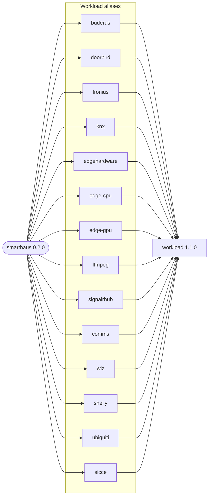

# smarthaus

Deploys SmartHaus as multiple single-responsibility workloads. Every alias consumes the public
`workload` chart and runs the same application image with feature-specific values.

## Dependency Graph

