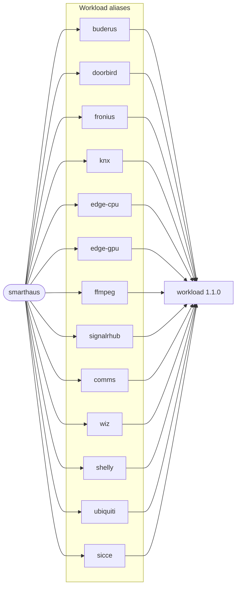

# smarthaus

Deploys SmartHaus as single-responsibility feature workloads. Every alias consumes the
[`workload`](https://github.com/f2calv/helm-charts/tree/main/charts/workload) chart and runs the
same application image, and `CasCap__FeatureConfig__EnabledFeatures` selects the feature each pod
runs.

Each application release publishes the chart to `oci://ghcr.io/f2calv/charts/smarthaus` under the
release version, the same version as the `ghcr.io/f2calv/smarthaus` image. The version in
`Chart.yaml` is a placeholder replaced at packaging.

## Dependency Graph



Every alias resolves to `workload` 1.1.0 from `oci://ghcr.io/f2calv/charts`.

## Install

### Helm

Install one release with the Comms feature enabled. Replace `<version>` with the application
release to deploy; the chart and the image share it:

```bash
helm install smarthaus oci://ghcr.io/f2calv/charts/smarthaus --version <version> \
  --namespace my-namespace --create-namespace \
  --set comms.replicaCount=1 \
  --set-string comms.image.repository=ghcr.io/f2calv/smarthaus \
  --set-string comms.image.tag=<version> \
  --set-string comms.envVars.CasCap__FeatureConfig__EnabledFeatures=Comms
```

Upgrade to the latest release published in GHCR:

```bash
helm upgrade --install smarthaus oci://ghcr.io/f2calv/charts/smarthaus \
  --namespace my-namespace --create-namespace \
  --set comms.replicaCount=1 \
  --set-string comms.image.repository=ghcr.io/f2calv/smarthaus \
  --set-string comms.image.tag=<version> \
  --set-string comms.envVars.CasCap__FeatureConfig__EnabledFeatures=Comms
```

### Argo CD Application

[Argo CD](https://argo-cd.readthedocs.io/) can consume the same OCI package. A YAML anchor in
`valuesObject` applies the image to every enabled alias:

```yaml
apiVersion: argoproj.io/v1alpha1
kind: Application
metadata:
  name: smarthaus
  namespace: argocd
spec:
  project: default
  destination:
    namespace: my-namespace
    server: https://kubernetes.default.svc
  source:
    repoURL: ghcr.io/f2calv
    chart: charts/smarthaus
    targetRevision: <version>
    helm:
      valuesObject:
        _shared: &shared
          image:
            repository: ghcr.io/f2calv/smarthaus
            tag: <version>
        comms:
          <<: *shared
          replicaCount: 1
          envVars:
            CasCap__FeatureConfig__EnabledFeatures: Comms
  syncPolicy:
    automated:
      prune: true
      selfHeal: true
```

The `_shared` anchor in the chart's own `values.yaml` does not reach the aliases once Helm has loaded
it, so an environment sets the image on each alias it enables, as above.

## Configuration

| Value | Default | Notes |
| --- | --- | --- |
| `<alias>.replicaCount` | `0` | Every alias renders nothing until an environment sets a replica count |
| `<alias>.image` | `nginx:1.31.0` | Placeholder; set the SmartHaus image and tag on every enabled alias |
| `<alias>.envVars.CasCap__FeatureConfig__EnabledFeatures` | unset | Selects the feature; see the table below |
| `<alias>.service` | port 80 to 8080 | REST, health endpoints and metrics |
| `<alias>.startupProbe`, `readinessProbe`, `livenessProbe` | `/healthz/startup`, `/healthz/ready`, `/healthz/live` | All on port 8080 |
| `edge-cpu.affinity` | one pod per node | Required pod anti-affinity on `kubernetes.io/hostname` |
| `edge-cpu.strategy` | `Recreate` | Old pods stop before new ones schedule, so anti-affinity never blocks a rollout |
| `edge-gpu.runtimeClassName` | `nvidia` | Requires the NVIDIA container runtime on the node |
| `edge-cpu.securityContext`, `edge-gpu.securityContext` | `privileged: true` | Hardware telemetry needs host device access |

### Feature Workloads

| Alias | Feature | Notes |
| --- | --- | --- |
| `buderus` | `Buderus` | Heating system |
| `doorbird` | `DoorBird` | Door station; commonly paired with `DDns` |
| `fronius` | `Fronius` | Solar inverter and battery |
| `knx` | `Knx` | KNX building automation |
| `edge-cpu` | `EdgeHardware` | Node hardware telemetry, one pod per node |
| `edge-gpu` | `EdgeHardware` | GPU node telemetry |
| `signalrhub` | `SignalRHub` | SignalR hub for live events |
| `comms` | `Comms` | Messaging and notifications |
| `wiz`, `shelly`, `ubiquiti`, `sicce` | `Wiz`, `Shelly`, `Ubiquiti`, `Sicce` | Device integrations |
| `ffmpeg` | none | RTSP recorder running `ffmpeg-record.sh`; configure it with `FFMPEG_*` variables |

### Deployment-Specific Values

Image pull secrets, certificates, secrets, shared configuration, node placement and ingress differ
per environment, so the chart sets none of them. Add them per alias:

```yaml
doorbird:
  imagePullSecrets:
    - name: my-registry-pull-secret
  volumes:
    - name: certs
      secret:
        secretName: my-cert-secret
  volumeMounts:
    - name: certs
      mountPath: /etc/certs
      readOnly: true
  envSecrets:
    MY_SECRET_VAR: my-secret-name
  envVarsFrom:
    - configMapRef:
        name: default-app-config
  nodeSelector:
    kubernetes.io/hostname: my-node
  ingress:
    enabled: true
    className: nginx
    hosts:
      - host: smarthaus.example.com
        paths:
          - path: /api/v1/doorbird
            pathType: Prefix
    tls:
      - secretName: smarthaus-example-tls
        hosts:
          - smarthaus.example.com
```

Set a single environment variable through the Helm CLI:

```bash
helm upgrade --install smarthaus oci://ghcr.io/f2calv/charts/smarthaus \
  --namespace my-namespace --create-namespace \
  --set-string 'doorbird.envVars.Serilog__MinimumLevel__Default=Debug'
```

### Default Values

```yaml
# Placeholder image; environments set the SmartHaus image and tag.
image: &image
  repository: nginx
  pullPolicy: IfNotPresent
  tag: "1.31.0"

# Defaults merged into every feature alias.
_shared: &shared
  image: *image
  service:
    enabled: true
    name: http
    type: ClusterIP
    port: 80
    containerPort: 8080
    protocol: TCP
    annotations: {}
  envFieldRef:
    AppConfig__NodeName: spec.nodeName
    AppConfig__PodName: metadata.name
    AppConfig__Namespace: metadata.namespace
    AppConfig__PodIp: status.podIP
    AppConfig__ServiceAccountName: spec.serviceAccountName
  startupProbe:
    httpGet:
      path: /healthz/startup
      port: 8080
    periodSeconds: 10
    initialDelaySeconds: 20
    failureThreshold: 5
  readinessProbe:
    httpGet:
      path: /healthz/ready
      port: 8080
    periodSeconds: 10
    initialDelaySeconds: 60
    failureThreshold: 10
  livenessProbe:
    httpGet:
      path: /healthz/live
      port: 8080
    periodSeconds: 10
    initialDelaySeconds: 60
    failureThreshold: 10
  resources:
    requests:
      cpu: 100m
      memory: 128Mi
    limits:
      cpu: 200m
      memory: 256Mi

# Feature workloads, dormant until an environment sets replicaCount.
doorbird:
  <<: *shared

buderus:
  <<: *shared

knx:
  <<: *shared

fronius:
  <<: *shared

edge-cpu:
  <<: *shared
  securityContext:
    privileged: true
  strategy:
    type: Recreate
  affinity:
    podAntiAffinity:
      requiredDuringSchedulingIgnoredDuringExecution:
        - labelSelector:
            matchLabels:
              app.kubernetes.io/name: edge-cpu
          topologyKey: kubernetes.io/hostname

edge-gpu:
  <<: *shared
  runtimeClassName: nvidia
  securityContext:
    privileged: true

signalrhub:
  <<: *shared

comms:
  <<: *shared

wiz:
  <<: *shared

shelly:
  <<: *shared

ubiquiti:
  <<: *shared

sicce:
  <<: *shared

# RTSP recorder, disabled by default.
ffmpeg:
  replicaCount: 0
```

## Related Projects

- [workload](https://github.com/f2calv/helm-charts/tree/main/charts/workload) renders every alias.
- [NVIDIA container runtime](https://github.com/NVIDIA/nvidia-container-toolkit) provides the
  `nvidia` runtime class used by `edge-gpu`.
- [SmartHaus Grafana dashboards](../smarthaus-dashboards/README.md) is the independent dashboard
  chart.