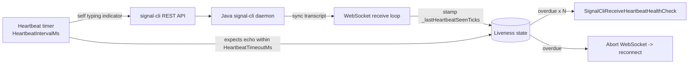

# SignalCli Receive Liveness — Active Heartbeat Design

> **Status**: Proposed — design only, no code beyond the passive watchdog (`ReceiveStalenessTimeoutMs`) has been written. This document weighs whether to build an active heartbeat and how.

## Overview

The [`CasCap.Api.SignalCli`](../../src/CasCap.Api.SignalCli) JSON-RPC transport ([`SignalCliJsonRpcClientService`](../../src/CasCap.Api.SignalCli/Services/SignalCliJsonRpcClientService.cs)) holds a long-lived WebSocket to the signal-cli REST API, which in turn bridges to the Java `signal-cli` daemon. A known failure mode (see [001](001-signalcli-audit-remediation.md) and the upstream issue drafts) leaves **outbound sending healthy while inbound delivery silently stops** — e.g. a poisoned `msg-cache` envelope kills only the daemon's receive thread. The WebSocket stays open, the process stays alive, and nothing detects the outage.

A **passive** watchdog (`ReceiveStalenessTimeoutMs`) was added as a cheap backstop: it forces a reconnect when no inbound frame arrives within a timeout. Its fatal limitation is that it cannot distinguish *"the receive path is dead"* from *"nobody has messaged this account."* For a low-traffic account (SmartHaus is queried every 3–5 days) the timeout would have to exceed the longest legitimate quiet period (~7 days), making detection so slow it is nearly worthless. An account with no inbound integration at all has no organic traffic, so the passive watchdog is permanently disabled there.

An **active heartbeat** removes this ambiguity by *generating* inbound traffic on a schedule and verifying it round-trips, giving minutes-level detection latency regardless of organic traffic — and working identically for quiet accounts and zero-inbound accounts.

## The Critical Constraint: No Visible Messages

> **Will my Android Signal app show a "hello world" ping every hour? — No. It must not, and it does not have to.**

This is the dealbreaker requirement: a heartbeat that posts a visible message to **Note to Self** (or any chat) every N minutes is unacceptable. Fortunately, Signal's protocol gives us several inbound-generating actions that produce **no chat artifact** on the primary (Android) device:

| Mechanism | Visible on Android? | Generates inbound frame? | Notes |
| --- | --- | --- | --- |
| Message to *Note to Self* | **Yes** (chat entry) | Yes (sync transcript) | ❌ Unacceptable — rejected |
| **Typing indicator to self** | No | Yes (sync transcript) | Ephemeral; never stored |
| **Receipt to self** ([`SendReceipt`](../../src/CasCap.Api.SignalCli/Services/SignalCliRestClientService.cs)) | No | Yes (sync transcript) | Already implemented |
| **Reaction add+remove** ([`SendReaction`](../../src/CasCap.Api.SignalCli/Services/SignalCliRestClientService.cs) / `RemoveReaction`) | Briefly | Yes (sync transcript) | Visible flicker — avoid |

### Why a self-action loops back as inbound

`signal-cli` is a **linked device**, not the primary. When *any* linked device sends *anything* (even an ephemeral typing indicator), the Signal server fans out a **sync transcript message** to all of the account's other linked devices — including `signal-cli` itself. That transcript arrives on the **same WebSocket receive stream** we are trying to prove is alive. So the heartbeat does not require a second account or a real recipient: signal-cli pinging *itself* via a non-visible action is sufficient to exercise the full inbound pipeline.

The recommended primitive is a **typing indicator addressed to our own number** (or to a self-owned group), because it is the only option that is guaranteed ephemeral end-to-end — never persisted, never rendered, never notified.

> **Open verification item**: confirm signal-cli/REST-API exposes a `sendTyping`/typing endpoint and that the resulting sync transcript is delivered back over `/v1/receive`. If typing indicators are not surfaced on the receive stream, fall back to a self-`SendReceipt`, which the codebase already supports. This must be validated against a live linked device before implementation (see Phase 0).

## Reasons to Build It (and Reasons Not To)

**For:**

- Detects the silent-inbound-failure symptom in minutes, not days — the only fault we currently cannot observe.
- Account-traffic-agnostic: works for quiet accounts and zero-inbound accounts alike.
- Reuses existing send primitives and the existing reconnect machinery.

**Against / cost:**

- Adds periodic outbound traffic and a self-message loop — small but non-zero load on the REST API and daemon.
- Requires careful non-visibility verification (Phase 0) to avoid the unacceptable Android-notification outcome.
- The passive watchdog already covers high-traffic accounts; the heartbeat only earns its keep on low/zero-traffic accounts.

**Recommendation:** Build it, but gate it behind config that is **off by default**, and ship Phase 0 (non-visibility proof) before any production rollout.

## Reusing Existing Health-Check Infrastructure

The heartbeat should mirror the established **staleness-health-check** pattern rather than inventing a new observability surface.

### 1. The staleness-health-check pattern — the closest precedent

The ideal shape is a stream-staleness health check that reports `Healthy`/`Degraded`/`Unhealthy` based on **how long since the last inbound item**, with severity modulated by whether traffic is *expected* right now. The SignalCli analogue:

- "last item received" timestamp → `_lastFrameTicks` (already stamped by the passive watchdog).
- "no traffic expected right now" → "heartbeat disabled / account legitimately idle."
- Severity tiers map cleanly: frames flowing → `Healthy`; heartbeat overdue but reconnect in progress → `Degraded`; heartbeat round-trip failed N times → `Unhealthy`.

This means the heartbeat's *result* should be surfaced as an `IHealthCheck` (e.g. `SignalCliReceiveHeartbeatHealthCheck`) using `TimeProvider`-driven elapsed-time logic, so it plugs into the existing `/healthz` endpoints and alerting with zero new plumbing.

### 2. `KubernetesProbeTypes` enum — config wiring

[`KubernetesProbeTypes`](../../../CasCap.Common/src/CasCap.Common.Abstractions/_Enums.cs) (`None`/`Readiness`/`Liveness`/`Startup`, `[Flags]`) plus the [`GetTags()`](../../../CasCap.Common/src/CasCap.Common.Extensions.Diagnostics.HealthChecks/Extensions/KubernetesExtensions.cs) extension is the established pattern every SmartHaus feature uses to register a health check (see [`BuderusServiceCollectionExtensions`](../../src/CasCap.Api.Buderus/Extensions/ServiceCollectionExtensions.cs)). The heartbeat health check registers identically:

```csharp
if (config.HeartbeatHealthCheck != KubernetesProbeTypes.None)
    services.AddHealthChecks()
        .AddCheck<SignalCliReceiveHeartbeatHealthCheck>(
            SignalCliReceiveHeartbeatHealthCheck.Name,
            tags: config.HeartbeatHealthCheck.GetTags());
```

A dead receive thread is a **liveness** failure (the pod should be restarted), so the recommended default tag once enabled is `Liveness` — but it stays `None` (disabled) until Phase 0 validation passes.

### 3. `SignalCliConnectionHealthCheck` / `HttpEndpointCheckBase` — not a fit

The existing [`SignalCliConnectionHealthCheck`](../../src/CasCap.Api.SignalCli/HealthChecks/SignalCliConnectionHealthCheck.cs) only probes the REST API's `/v1/about` endpoint via [`HttpEndpointCheckBase`](../../../CasCap.Common/src/CasCap.Common.Extensions.Diagnostics.HealthChecks/Diagnostics/HealthChecks/HttpEndpointCheckBase.cs). That proves the **Go REST API** is reachable — it says nothing about the **Java daemon's receive thread**, which is precisely the layer that fails silently. The heartbeat is complementary, not a replacement.

## Proposed Implementation

### Components



1. **Heartbeat sender** — a `PeriodicTimer` loop (mirroring the existing watchdog loop in `SignalCliJsonRpcClientService`) sends a self-addressed **typing indicator** every `HeartbeatIntervalMs`, tagging each ping with the send timestamp.
2. **Echo detector** — the receive loop already deserializes every inbound frame; extend it to recognise the self-sync transcript and stamp `_lastHeartbeatSeenTicks`. (If the transcript can't be correlated precisely, treat *any* inbound frame after a ping as proof of life — the goal is liveness, not exactly-once accounting.)
3. **Failure action** — if a ping is not echoed within `HeartbeatTimeoutMs`, log `LogError`, increment a consecutive-miss counter, and `Abort()` the WebSocket to force the existing reconnect path. A reconnect alone will **not** clear a poisoned `msg-cache`; the loud error is the actionable signal, and the health check escalates to `Unhealthy` after `HeartbeatFailureThreshold` consecutive misses so Kubernetes restarts the pod.
4. **Health check** — `SignalCliReceiveHeartbeatHealthCheck` reports status from the consecutive-miss counter and `_lastHeartbeatSeenTicks` elapsed time, using `TimeProvider` per the staleness-health-check precedent.

### Configuration (additions to `SignalCliConfig`)

| Property | Type | Default | Purpose |
| --- | --- | --- | --- |
| `HeartbeatIntervalMs` | `int` | `0` (disabled) | How often to send the self-ping. Suggested production value ~30 min. `0` disables the heartbeat entirely. |
| `HeartbeatTimeoutMs` | `int` | `300000` | Max wait for a ping to echo back before counting a miss (~5 min). |
| `HeartbeatFailureThreshold` | `int` | `3` | Consecutive missed echoes before the health check reports `Unhealthy`. |
| `HeartbeatHealthCheck` | `KubernetesProbeTypes` | `None` | Probe tags for the heartbeat health check; `None` until Phase 0 passes, then `Liveness`. |

All four follow the existing `IAppConfig` conventions (validation attributes, `<see cref>` deep links to the consuming service) and must be synced across the five config layers (`appsettings.json`, `appsettings.Development.json`, the gitignored Local tiers, and the prod ConfigMap [`haus-appsettings.yaml`](../../../KNX_K8S/src/workloads/configmaps/prd-k3s/haus-appsettings.yaml)). The existing `ReceiveStalenessTimeoutMs` passive watchdog remains and can coexist (belt-and-braces for high-traffic accounts).

### Recommended Settings by Account

| Account | `ReceiveStalenessTimeoutMs` | `HeartbeatIntervalMs` | Rationale |
| --- | --- | --- | --- |
| **SmartHaus** | `0` (passive watchdog useless at 3–5 day cadence) | ~`1800000` (30 min) once Phase 0 passes | Active heartbeat is the only viable detector for a quiet account. |
| **Zero-inbound account** | `0` | `0` for now (no inbound integration) → enable if/when inbound is added | Nothing receives inbound yet; revisit when integration lands. |
| **High-traffic account** (hypothetical) | non-zero (e.g. a few hours) | `0` | Organic traffic makes the cheap passive watchdog sufficient. |

## Phased Plan

- [ ] **`HB-0` (Blocking)** — *Non-visibility proof.* Manually send a self typing indicator (and a self receipt as fallback) via the REST API against a real linked device. Confirm: (a) **nothing** appears in the Android chat list or notifications, and (b) the action produces an inbound frame on `/v1/receive`. Do not proceed unless both hold. Record findings here.
- [ ] **`HB-1`** — Add the four config properties to `SignalCliConfig` + sync all config layers + README.
- [ ] **`HB-2`** — Implement the heartbeat sender loop and echo detection in `SignalCliJsonRpcClientService`, reusing the existing `PeriodicTimer`/abort-reconnect pattern.
- [ ] **`HB-3`** — Implement `SignalCliReceiveHeartbeatHealthCheck` (model on the staleness-health-check pattern) and wire it via `KubernetesProbeTypes`/`GetTags()`.
- [ ] **`HB-4`** — Unit tests (fake `TimeProvider`, simulated missed/late/on-time echoes) + a manually-run integration test against the live demo daemon.
- [ ] **`HB-5`** — Enable on SmartHaus (`HeartbeatIntervalMs` ~30 min, `HeartbeatHealthCheck = Liveness`); leave zero-inbound accounts disabled.

## Open Questions

1. Does signal-cli's REST API expose typing indicators, and do they round-trip on `/v1/receive`? (Phase 0 — if not, use self-`SendReceipt`.)
2. Can we correlate the echoed sync transcript back to a specific ping timestamp, or do we accept "any inbound after a ping = alive"? The latter is simpler and sufficient for liveness.
3. Should a sustained heartbeat failure (poisoned cache that survives reconnects) escalate beyond pod restart — e.g. an out-of-band alert via a *different* notification channel, since the Signal path itself is the thing that's broken?
