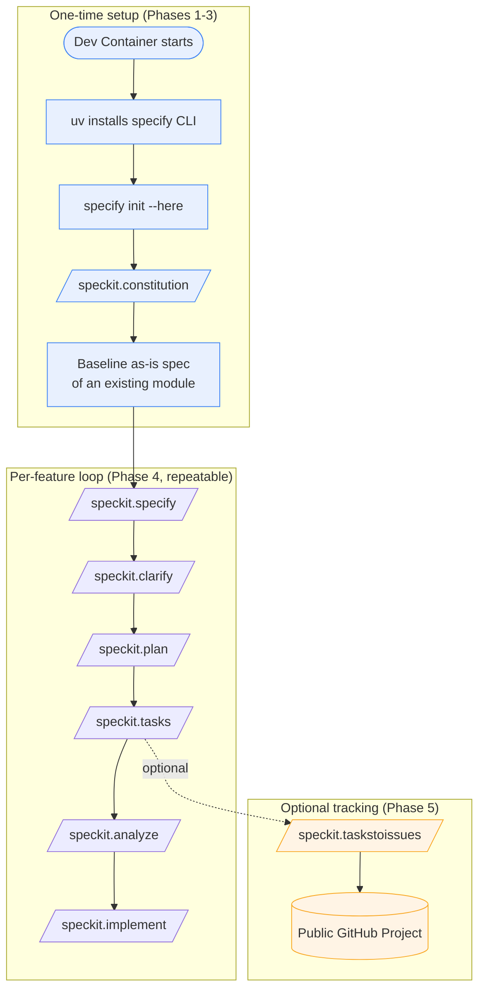

# Spec Kit Adoption — Brownfield Spec-Driven Development for SmartHaus

> **Status**: Proposed — no Spec Kit artefacts have been created yet. This document is the implementation plan; each task below carries a stable ID and a checkbox to tick as the work lands.

## Overview

[GitHub Spec Kit](https://github.com/github/spec-kit) is an open-source toolkit for **Spec-Driven Development (SDD)** — a workflow where executable specifications drive implementation rather than ad-hoc prompting. It ships as a Python CLI (`specify`, installed via [`uv`](https://docs.astral.sh/uv/)) that scaffolds a `.specify/` directory and a set of `/speckit.*` slash commands for a coding agent (here, [GitHub Copilot](https://github.com/features/copilot) in VS Code).

SmartHaus is a mature, feature-flag-driven .NET 10 codebase with 30+ projects (see the [root README](../../README.md)). This is a textbook **brownfield** scenario: the application already exists, so the goal is **not** to generate it from scratch but to:

1. Install and operate Spec Kit in a controlled, reproducible way (via the [VS Code dev container](../../.devcontainer/devcontainer.json)).
2. Establish a **constitution** that captures the conventions already enforced by [`.github/instructions/`](../../.github/instructions) and [`copilot-instructions.md`](../../.github/copilot-instructions.md).
3. **Reverse-engineer the existing application into a baseline spec** so future change is described as deltas against a known-good specification.
4. Drive a few example **"next steps"** (new features / enhancements) through the full `specify → clarify → plan → tasks → implement` loop.
5. (Optional) Wire `/speckit.taskstoissues` into a **public GitHub Project** so generated tasks become trackable issues.

### What Spec Kit adds vs. what already exists

| Concern | Today in SmartHaus | With Spec Kit |
| --- | --- | --- |
| Coding conventions | `.github/instructions/*.instructions.md` (auto-applied by file glob) | `.specify/memory/constitution.md` (referenced by every `/speckit.*` command) — complements, does not replace |
| Feature design | Ad-hoc `docs/design/NNN-*.md` (this folder) | Structured `specs/NNN-feature/spec.md` + `plan.md` + `tasks.md` |
| Task tracking | Manual checkboxes in design docs | `tasks.md` → optionally GitHub Issues via `/speckit.taskstoissues` |
| Agent context | `copilot-instructions.md` | Constitution + per-feature spec/plan, loaded on demand by slash commands |

Spec Kit is **additive**. The existing `docs/design/` design docs, instruction files, and `copilot-instructions.md` all remain the source of truth; the constitution distils them into the form Spec Kit's commands expect.

## How To Use This Document

Each task has:

- A **stable ID** (e.g. `SK-1`) for cross-referencing in commits and PRs.
- A **priority** (`High` / `Medium` / `Low`).
- A checkbox to tick when complete.

Work the phases top-to-bottom. Phases 0–2 are setup (do once); Phase 3 is the brownfield baseline; Phase 4 onwards are repeatable per feature.

---

## Prerequisites

Spec Kit's runtime requirements ([upstream prerequisites](https://github.com/github/spec-kit#-prerequisites)):

- **Python 3.11+**
- **[uv](https://docs.astral.sh/uv/)** (recommended) or `pipx` for a persistent install
- **Git**
- A supported coding agent — **GitHub Copilot** (already the team standard)

The dev container (Phase 1) provides all of these so nothing is installed on the host.

## Constraints & Decisions

- **No host pollution.** Spec Kit and its Python toolchain live **only** inside the dev container. The base image [`mcr.microsoft.com/devcontainers/dotnet:latest`](../../.devcontainer/devcontainer.json) does not ship `uv`, so it is added via a dev container feature.
- **Pin the version.** `specify init` and `uv tool install` both accept a release tag. Pin to a known Spec Kit release (replace `vX.Y.Z` below with the latest from [Releases](https://github.com/github/spec-kit/releases)) so container rebuilds are reproducible. Bump deliberately, never implicitly.
- **`--integration copilot`.** Generate Copilot slash-command prompt files, matching the team's agent.
- **`--here` on an existing repo.** Brownfield init must run *in place* and must **not** clobber tracked files. Use `specify init --here` and review the diff before committing.
- **Public-repo hygiene.** SmartHaus is a **public** repository. Per the cross-repo rules, nothing generated by Spec Kit (constitution, specs, plans, tasks, issues) may reference the private CAS repo, its classes, or its internals. Specs describe SmartHaus only.
- **Markdown lint.** Generated artefacts must pass the repo's `markdownlint` config (the dev container already installs `davidanson.vscode-markdownlint`). Spaced table separators (`| --- | --- |`) per the [documentation instructions](../../.github/instructions/documentation.instructions.md).

---

## Phase 0 — Spike & Validation (do first, throwaway)

- [ ] **`SK-0` (High)** — In a scratch container or branch, run `specify init --here --integration copilot --ignore-agent-tools` against a **copy** of the repo to confirm: (a) which directories Spec Kit creates (`.specify/`, `.github/prompts/` or `.github/copilot/`), (b) that it does not overwrite any tracked file, and (c) the exact set of `/speckit.*` commands that appear in Copilot. Record findings here, then discard the spike. This de-risks the in-place init on the real branch.

## Phase 1 — Dev Container Integration (controlled install)

Goal: make `specify` available automatically whenever the dev container starts, with zero host footprint.

- [ ] **`SK-1` (High)** — Add the **`uv`** dev container feature to [`devcontainer.json`](../../.devcontainer/devcontainer.json). Add to the `features` block:

  ```jsonc
  "ghcr.io/va-h/devcontainers-features/uv:1": {
      "version": "latest"
  }
  ```

  (Alternatively use `ghcr.io/devcontainers/features/python` + `pipx`, but `uv` is the upstream-recommended path and is faster.)

- [ ] **`SK-2` (High)** — Install the Spec Kit CLI in [`postCreateCommand.sh`](../../.devcontainer/postCreateCommand.sh) so it is present on container create, pinned to a release tag:

  ```sh
  # Spec Kit (Spec-Driven Development CLI) — pinned for reproducibility
  uv tool install specify-cli --from git+https://github.com/github/spec-kit.git@vX.Y.Z
  ```

- [ ] **`SK-3` (Medium)** — Add a readiness echo to [`postStartCommand.sh`](../../.devcontainer/postStartCommand.sh) so each session confirms the tool is on `PATH`:

  ```sh
  specify --version || echo "WARN: specify CLI not found — rebuild the dev container"
  ```

- [ ] **`SK-4` (Low)** — Recommend the relevant VS Code extensions in the `customizations.vscode.extensions` array (Copilot Chat is required for the slash commands; markdownlint is already present). Add `github.copilot` and `github.copilot-chat` if not already implied by the team's user settings.

- [ ] **`SK-5` (Low)** — Document the dev container workflow in this repo's contributor docs (a short subsection under the README "Quick Start", or a `docs/` page): "Open in Dev Container → `specify` is ready → use `/speckit.*` in Copilot Chat."

## Phase 2 — Initialise Spec Kit In-Place

- [ ] **`SK-6` (High)** — From inside the dev container, at the repo root, run:

  ```sh
  specify init --here --integration copilot
  ```

  Review the resulting diff carefully. Expected new paths: `.specify/` (templates, scripts, memory), and Copilot command/prompt files under `.github/`. **Commit in a dedicated commit** ("chore: scaffold Spec Kit") with nothing else mixed in, so the scaffold is easy to audit and revert.

- [ ] **`SK-7` (Medium)** — Reconcile `.gitignore`. Decide what is tracked vs. ignored:
  - **Track**: `.specify/` templates and `specs/` artefacts (these are the value).
  - **Ignore**: any per-user scratch or cache Spec Kit emits (confirm during `SK-0`).

- [ ] **`SK-8` (Medium)** — Add a `.github/instructions/` note (or extend `copilot-instructions.md`) pointing future agents at the new SDD workflow: "Feature work flows through `/speckit.*`; the constitution lives in `.specify/memory/constitution.md`." This keeps the two instruction systems coherent.

## Phase 3 — Constitution & Brownfield Baseline Spec

This is the heart of brownfield adoption: teach Spec Kit the rules, then capture the existing system as a spec.

### 3a. Constitution

- [ ] **`SK-9` (High)** — Generate the project constitution with `/speckit.constitution`, seeding it from the conventions **already documented** in the repo so the two never drift:
  - Code quality & style → [`csharp.instructions.md`](../../.github/instructions/csharp.instructions.md)
  - Testing standards → [`csharp.testing.instructions.md`](../../.github/instructions/csharp.testing.instructions.md)
  - Configuration / `IAppConfig` rules → [`configuration.instructions.md`](../../.github/instructions/configuration.instructions.md)
  - Documentation / README / Mermaid → [`documentation.instructions.md`](../../.github/instructions/documentation.instructions.md)
  - Cross-cutting workflow (test-execution gate, git-history-preserving renames, build-whole-solution) → [`copilot-instructions.md`](../../.github/copilot-instructions.md)

  Example prompt:

  > `/speckit.constitution` Create principles for a .NET 10 edge IoT platform: feature-flag-driven modular architecture, ILogger+Serilog logging, ConfigureAwait(false) in libraries, xUnit test structure with Unit/Integration separation, IAppConfig four-tier appsettings strategy, README-must-stay-in-sync, no legacy/back-compat code, public-repo hygiene (no PII, no private-repo references).

- [ ] **`SK-10` (Medium)** — Cross-check the generated constitution against the instruction files; remove anything Spec Kit invented that contradicts existing conventions, and add any rule the prompt missed. The constitution must be a **faithful distillation**, not a competing source of truth.

### 3b. Baseline "as-is" spec

The brownfield insight: write **one baseline spec describing the system as it exists today**, so subsequent features are expressed as deltas. Two viable granularities — start narrow.

- [ ] **`SK-11` (High)** — Choose the **first slice to reverse-engineer**. Recommended: a single, well-bounded feature module rather than the whole app. Good candidates (each is already a self-contained, README-documented module):
  - [`Comms`](../../src/CasCap.SmartHaus/README.md) — the Signal messaging + agent pipeline (rich behaviour, already has design docs [001](001-signalcli-audit-remediation.md)/[002](002-signalcli-receive-heartbeat.md)).
  - [`EdgeHardware`](../../src/CasCap.Api.EdgeHardware/README.md) — CPU/GPU telemetry (small, self-contained, demo-enabled).

- [ ] **`SK-12` (High)** — Run `/speckit.specify` to capture the chosen module's **current** behaviour (the *what* and *why*), feeding the agent the module README and source. Example:

  > `/speckit.specify` Document the existing EdgeHardware feature: it monitors edge hardware telemetry (GPU via nvidia-smi, CPU temperature, Raspberry Pi GPIO), is feature-flag gated by `EdgeHardware`, exposes a REST snapshot endpoint and MCP tools, and writes to configurable sinks. This is a baseline spec of current behaviour — do not invent new requirements.

- [ ] **`SK-13` (Medium)** — Run `/speckit.plan` to record the **actual** tech stack/architecture for that module (.NET 10, DI registration extension, `IBgFeature`, sinks, MCP tool service). This produces a `plan.md` that reflects reality — useful as living architecture documentation.

- [ ] **`SK-14` (Low)** — Do **not** run `/speckit.implement` on the baseline spec (the code already exists). The baseline `spec.md` + `plan.md` are the deliverable. Optionally cross-link them from the module README under a "Specification" heading.

## Phase 4 — Example "Next Steps" (the repeatable loop)

Demonstrate the full SDD loop on genuine, small enhancements so the team builds muscle memory. Pick low-risk, well-scoped changes.

- [ ] **`SK-15` (Medium)** — **Example A (enhancement to existing module).** Drive a real improvement through the loop, e.g. a new EdgeHardware threshold-alert or an additional MCP tool:

  ```text
  /speckit.specify   <describe the new capability — what & why>
  /speckit.clarify    <answer the agent's underspecified-area questions>
  /speckit.plan       <confirm it reuses the existing module's patterns>
  /speckit.tasks      <generate the task list>
  /speckit.analyze    <cross-artefact consistency check>
  /speckit.implement  <execute>
  ```

  Gate `/speckit.implement` behind the repo's **"never run tests automatically"** rule — review generated tasks before any test execution.

- [ ] **`SK-16` (Low)** — **Example B (new greenfield-within-brownfield module).** Spec a brand-new small feature module from scratch (e.g. a new device integration stub) to show Spec Kit's 0-to-1 flow inside the existing solution, respecting the established module layout (`CasCap.Api.<Name>` + `.Sinks` + `.Tests`, feature flag in [`FeatureNames`](../../src/CasCap.SmartHaus/Models/FeatureNames.cs)).

- [ ] **`SK-17` (Low)** — Capture lessons in a short retrospective appended here (what the agent got right/wrong, which constitution rules needed tightening), and fold any reusable rule back into `.specify/memory/constitution.md` and the relevant `.github/instructions/` file.

## Phase 5 — (Optional) Task Tracking via GitHub Issues & Projects

> Addresses the follow-up question: *"a new public SmartHaus GitHub project to handle task creation for Spec Kit stages/tasks/issues."* This is a recognised, supported pattern — Spec Kit ships `/speckit.taskstoissues` precisely for it.

The mechanism has two distinct GitHub concepts — don't conflate them:

| Concept | What it is | Role here |
| --- | --- | --- |
| **GitHub Issues** | Individual work items in the repo | Spec Kit's `/speckit.taskstoissues` converts each entry in `tasks.md` into an issue |
| **GitHub Project** (Projects v2) | A board/table view that *aggregates* issues across a repo or org | A **tracking surface** for the generated issues — kanban/table, status columns, iteration fields |

- [ ] **`SK-18` (Medium)** — Confirm `/speckit.taskstoissues` is available in the installed Spec Kit version (`specify integration list` / check the command palette in Copilot). It uses the [`gh` CLI](https://cli.github.com/), already installed via the `github-cli` dev container feature — so issue creation works from inside the container after `gh auth login`.

- [ ] **`SK-19` (Medium)** — Create a **public GitHub Project** ("SmartHaus — Spec-Driven Development") at the repo or `f2calv` org level with columns/status: `Todo → In Progress → In Review → Done`, plus a `Spec` field linking each issue back to its `specs/NNN-feature/`. Add a workflow (Project automation) to auto-add issues labelled `speckit` to the board.

- [ ] **`SK-20` (Low)** — Standardise an issue **label** (e.g. `speckit`) applied by `/speckit.taskstoissues` so the Project's auto-add filter is reliable, and so generated issues are distinguishable from hand-written ones.

- [ ] **`SK-21` (Low)** — Decide the **traceability convention**: each generated issue title/body should reference its task ID and originating spec path, and PRs that close them should mention both the issue and the spec. This keeps `spec.md ↔ tasks.md ↔ issue ↔ PR` linked end-to-end.

> **Caveat / honest framing (you said you're still learning):** the issues/Project layer is **optional and last**. Get value from Phases 1–4 first (local `tasks.md` checklists are perfectly sufficient to start). Only graduate to GitHub Issues + a Project once the per-feature loop feels natural and you actually want cross-feature visibility or multi-contributor tracking. Adding the Project too early adds ceremony without payoff.

---

## Workflow Summary



## Open Questions / Risks

- **`OQ-1`** — Exact directory layout `specify init --here` produces for the `copilot` integration (resolved by `SK-0`).
- **`OQ-2`** — Whether `.specify/` scripts assume `bash` (the dev container is Debian-based, so fine) vs. the host's PowerShell. Operate Spec Kit **only** inside the container to sidestep this.
- **`OQ-3`** — Version-pin drift: Spec Kit moves fast (frequent releases). The pinned tag in `postCreateCommand.sh` must be bumped deliberately; `specify self check` can surface available upgrades without applying them.
- **`OQ-4`** — Constitution vs. instruction-file duplication: risk of two sources of truth diverging. Mitigation: treat `.github/instructions/` as canonical and the constitution as a generated distillation; re-sync on any convention change (`SK-10`, `SK-17`).
- **`OQ-5`** — Public-repo hygiene: every generated artefact must be scanned for accidental PII or private-repo references before commit (same rule already applied to `appsettings*.json` and docs).

## References

- [Spec Kit repository](https://github.com/github/spec-kit) · [Documentation site](https://github.github.io/spec-kit/) · [`spec-driven.md` methodology](https://github.com/github/spec-kit/blob/main/spec-driven.md)
- [Installation Guide](https://github.com/github/spec-kit/blob/main/docs/installation.md) · [uv](https://docs.astral.sh/uv/)
- Local context: [`copilot-instructions.md`](../../.github/copilot-instructions.md), [`.github/instructions/`](../../.github/instructions), [dev container](../../.devcontainer/devcontainer.json)
- Related design docs: [001 — SignalCli Audit Remediation](001-signalcli-audit-remediation.md), [002 — SignalCli Receive Heartbeat](002-signalcli-receive-heartbeat.md)
