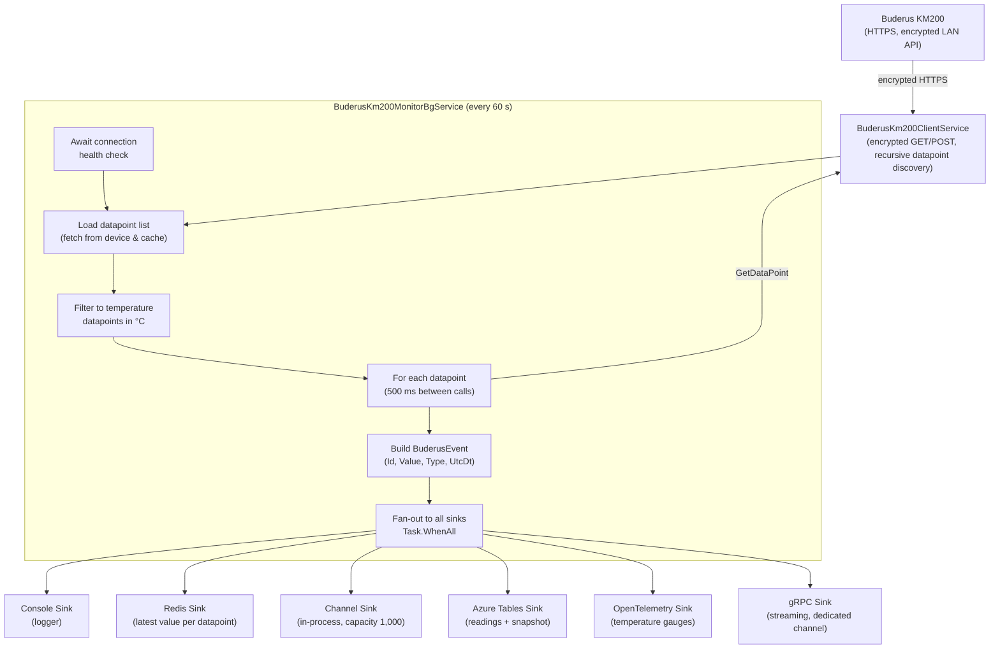

# CasCap.Api.Buderus

A .NET library that integrates with a [Buderus](https://www.buderus.com) KM200 heat-pump controller via its encrypted HTTPS local API, polls temperature datapoints every 60 seconds, and fans each reading out to a configurable set of sinks for persistence, streaming, and observability.

## Purpose

The library is built around one background service that forms the core pipeline:

**`BuderusKm200MonitorBgService`** – Waits for the device health check to pass, then fetches the full datapoint tree recursively from the device (caching the result locally for subsequent startups). The list is filtered to only the datapoints that carry a temperature reading in °C (excluding `/application`, `/gateway`, and most of `/system` except the outside-temperature path `/system/.../t1`). For each qualifying datapoint the service calls `GetDataPoint` (with a 500 ms pause between calls), wraps the response in a `BuderusEvent`, and dispatches it in parallel to every registered `IEventSink<BuderusEvent>` implementation.

A REST API (`BuderusController`) exposes endpoints for listing all current datapoint values, querying events by datapoint ID, and retrieving the latest snapshot.

### Sinks

| Sink | Description |
| --- | --- |
| **Console** | Logs every event via the .NET logger (Debug level) |
| **Redis** | Persists the latest value for each datapoint ID to a Redis hash |
| **Channel** | Exposes events on an in-process `Channel<BuderusEvent>` (capacity 1,000) for MCP/AI tooling |
| **Azure Tables** | Writes detailed readings and a rolling snapshot to Azure Table Storage |
| **OpenTelemetry** | Emits temperature gauges via OpenTelemetry metrics |
| **gRPC** | Streams events to connected gRPC clients (backed by a dedicated channel) |

## Event Flow



## Configuration Examples

### Minimal

```json
{
  "CasCap": {
    "BuderusConfig": {
      "BaseAddress": "http://192.168.1.248",
      "GatewayPassword": "<gateway-password>",
      "PrivatePassword": "<private-password>",
      "AzureTableStorageConnectionString": "https://<account>.table.core.windows.net",
      "Sinks": {
        "AvailableSinks": {
          "Console": { "Enabled": true },
          "Metrics": { "Enabled": true }
        }
      }
    }
  }
}
```

### Fully configured

```json
{
  "CasCap": {
    "BuderusConfig": {
      "BaseAddress": "http://192.168.1.248",
      "Port": 80,
      "HealthCheckUri": "system",
      "HealthCheck": "Readiness",
      "GatewayPassword": "<gateway-password>",
      "PrivatePassword": "<private-password>",
      "PollingIntervalMs": 60000,
      "DatapointDelayMs": 500,
      "ConnectionPollingDelayMs": 1000,
      "ConnectionLogEscalationInterval": 10,
      "AzureTableStorageConnectionString": "https://<account>.table.core.windows.net",
      "HealthCheckAzureTableStorage": "None",
      "DatapointMappings": {
        "/dhwCircuits/dhw1/actualTemp": {
          "ColumnName": "Dhw1ActualTemp",
          "MetricName": "haus.hvac.temperature",
          "MetricUnit": "Cel",
          "MetricDescription": "DHW circuit 1 actual temperature"
        },
        "/system/sensors/outdoorTemperatures/t1": {
          "ColumnName": "OutdoorTemperature",
          "MetricName": "haus.hvac.temperature",
          "MetricUnit": "Cel",
          "MetricDescription": "Outdoor temperature"
        }
      },
      "Sinks": {
        "AvailableSinks": {
          "Console": { "Enabled": true },
          "Memory": { "Enabled": true },
          "Metrics": { "Enabled": true },
          "AzureTables": { "Enabled": true },
          "Redis": {
            "Enabled": true,
            "Settings": {
              "SnapshotValues": "Dhw1ActualTemp,OutdoorTemperature"
            }
          },
          "CommsStream": { "Enabled": true },
          "SignalR": { "Enabled": true }
        }
      }
    }
  }
}
```


## License

This project is released under [The Unlicense](../../LICENSE). See the [LICENSE](../../LICENSE) file for details.
