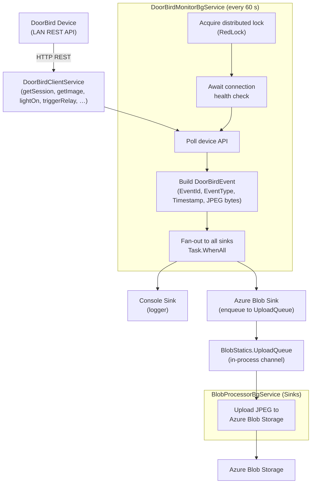

# CasCap.Api.DoorBird

A .NET library that integrates with a [DoorBird](https://www.doorbird.com) IP door station via its local LAN API, captures door events (doorbell, motion, RFID), and fans them out to a configurable set of sinks for storage and streaming.

## Purpose

The library is built around one background service that forms the core pipeline:

**`DoorBirdMonitorBgService`** – Acquires a distributed lock, waits for the device health check to pass, then polls the DoorBird LAN API every 60 seconds. Each door event (doorbell press, motion detection, RFID scan) is captured as a `DoorBirdEvent` containing the event type, timestamp, and optionally an associated JPEG image snapshot. The event is then dispatched in parallel to every registered `IEventSink<DoorBirdEvent>` implementation.

A REST API (`DoorBirdController`) exposes real-time photo, MJPEG video stream, relay trigger, and light-on endpoints, as well as event callbacks for push notifications from the device.

Blob upload is handled by `BlobProcessorBgService` in the [CasCap.Api.DoorBird.Sinks](../CasCap.Api.DoorBird.Sinks) project, which reads from the internal `BlobStatics.UploadQueue` channel and uploads each image blob to Azure Blob Storage via `IDoorBirdAzBlobStorageService`.

### Sinks

| Sink | Description |
| --- | --- |
| **Console** | Logs every event via the .NET logger (Debug level) |
| **Azure Blob Storage** | Enqueues JPEG image bytes to `BlobStatics.UploadQueue` for asynchronous upload |

## Event Flow



## Configuration Examples

### Minimal

```json
{
  "CasCap": {
    "DoorBirdConfig": {
      "BaseAddress": "http://192.168.1.248",
      "Username": "<device-username>",
      "Password": "<device-password>",
      "DoorControllerID": "<controller-id>",
      "DoorControllerRelayID": "<relay-id>",
      "AzureBlobStorageConnectionString": "https://<account>.blob.core.windows.net",
      "AzureBlobStorageContainerName": "doorbird",
      "AzureTableStorageConnectionString": "https://<account>.table.core.windows.net",
      "Sinks": {
        "AvailableSinks": {
          "Console": { "Enabled": true },
          "AzBlob": { "Enabled": true }
        }
      }
    }
  }
}
```

### Fully configured

```json
{
  "CasCap": {
    "DoorBirdConfig": {
      "IsEnabled": true,
      "BaseAddress": "http://192.168.1.248",
      "Username": "<device-username>",
      "Password": "<device-password>",
      "DoorControllerID": "<controller-id>",
      "DoorControllerRelayID": "<relay-id>",
      "HealthCheckUri": "bha-api/info.cgi",
      "HealthCheck": "Readiness",
      "PollingIntervalMs": 60000,
      "ConnectionPollingDelayMs": 1000,
      "ConnectionLogEscalationInterval": 10,
      "AzureBlobStorageConnectionString": "https://<account>.blob.core.windows.net",
      "AzureBlobStorageContainerName": "doorbird",
      "HealthCheckAzureBlobStorage": "None",
      "AzureTableStorageConnectionString": "https://<account>.table.core.windows.net",
      "HealthCheckAzureTableStorage": "None",
      "Sinks": {
        "AvailableSinks": {
          "Console": { "Enabled": true },
          "Memory": { "Enabled": true },
          "Metrics": { "Enabled": true },
          "AzureTables": { "Enabled": true },
          "AzBlob": { "Enabled": true },
          "Redis": {
            "Enabled": true,
            "Settings": {
              "SnapshotValues": "doorbell,motionsensor,rfid"
            }
          },
          "SignalR": { "Enabled": true }
        }
      }
    }
  }
}
```


## License

This project is released under [The Unlicense](../../LICENSE). See the [LICENSE](../../LICENSE) file for details.
