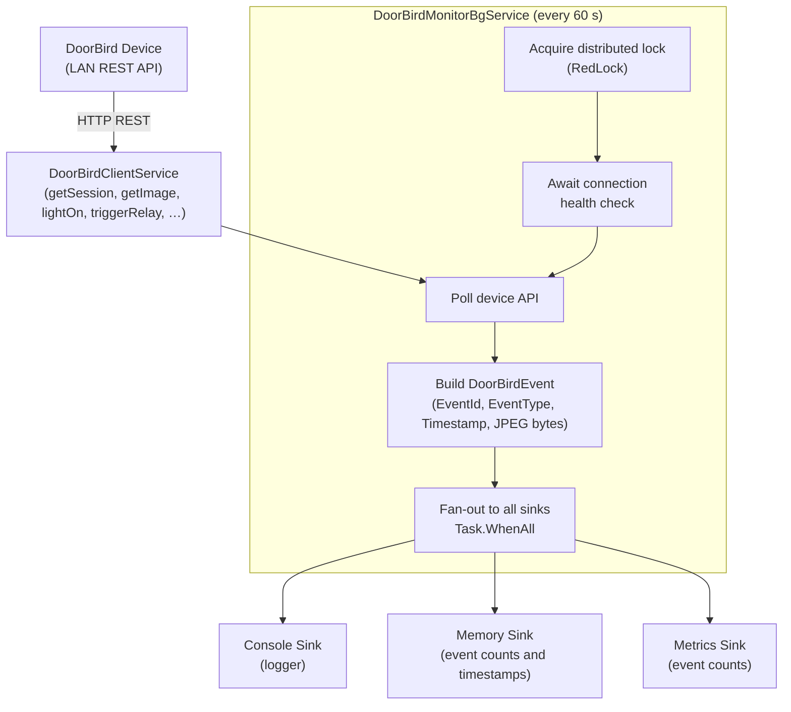

# CasCap.Api.DoorBird

A .NET library that integrates with a [DoorBird](https://www.doorbird.com) IP door station via its local LAN API, captures door events (doorbell, motion, RFID), and dispatches them to configurable sinks.

The integration is validated against a DoorBird D2100E and uses only the model-independent surfaces exposed by the DoorBird LAN API.

## Installation

```bash
dotnet add package CasCap.Api.DoorBird
```

## Purpose

The library is built around one background service that forms the core pipeline:

**`DoorBirdMonitorBgService`** – Acquires a distributed lock, waits for the device health check to pass, then polls the DoorBird LAN API every 60 seconds. Each door event (doorbell press, motion detection, RFID scan) is captured as a `DoorBirdEvent` containing the event type, timestamp, and optionally an associated JPEG image snapshot. The event is then dispatched in parallel to every registered `IEventSink<DoorBirdEvent>` implementation.

A REST API (`DoorBirdController`) exposes real-time photo, MJPEG video stream, relay trigger, and light-on endpoints, as well as event callbacks for push notifications from the device.

`DoorBirdQueryService.CaptureAudio` provides bounded receive-only microphone capture through the
official `bha-api/audio-receive.cgi` endpoint. DoorBird returns raw 8 kHz mono G.711 μ-law audio;
the library frames it as `audio/wav` without transcoding so downstream callers can validate,
normalize, and transcribe it. Capture duration, byte count, and timeout are bounded by
`DoorBirdConfig`.

### Sinks

| Sink | Description |
| --- | --- |
| **Console** | Logs every event via the .NET logger (Debug level) |
| **Memory** | Tracks event counts and timestamps in memory for snapshot queries |
| **Metrics** | Emits event counts via OpenTelemetry metrics |

Optional Redis, Azure Tables, and Azure Blob Storage implementations are provided by
[`CasCap.Api.DoorBird.Sinks`](../CasCap.Api.DoorBird.Sinks).

### Receive-only audio

| Setting | Default | Purpose |
| --- | ---: | --- |
| `AudioReceiveUri` | `bha-api/audio-receive.cgi` | Relative DoorBird microphone endpoint |
| `AudioCaptureMaxDurationSeconds` | `30` | Maximum requested capture duration |
| `AudioCaptureMaxBytes` | `524288` | Maximum returned WAV size |
| `AudioCaptureTimeoutMs` | `45000` | End-to-end capture timeout |

## Event Flow


```mermaid
flowchart TD
    DEVICE["DoorBird Device\n(LAN REST API)"]

    subgraph Monitor["DoorBirdMonitorBgService (every 60 s)"]
        LOCK["Acquire distributed lock\n(RedLock)"]
        HEALTH["Await connection\nhealth check"]
        POLL["Poll device API"]
        BUILD["Build DoorBirdEvent\n(EventId, EventType, Timestamp, JPEG bytes)"]
        DISPATCH["Fan-out to all sinks\nTask.WhenAll"]
    end

    SINK_CONSOLE["Console Sink\n(logger)"]
    SINK_MEMORY["Memory Sink\n(event counts and timestamps)"]
    SINK_METRICS["Metrics Sink\n(event counts)"]

    CLIENT["DoorBirdClientService\n(getSession, getImage, lightOn, triggerRelay, …)"]

    DEVICE -->|HTTP REST| CLIENT
    CLIENT --> POLL
    LOCK --> HEALTH --> POLL --> BUILD --> DISPATCH
    DISPATCH --> SINK_CONSOLE
    DISPATCH --> SINK_MEMORY
    DISPATCH --> SINK_METRICS
```

## Configuration Examples

### Minimal

```json
{
  "CasCap": {
    "DoorBirdConfig": {
      "BaseAddress": "http://192.168.1.248",
      "Username": "<device-username>",
      "Password": "<device-password>",
      "DoorControllerID": "<controller-id>",
      "DoorControllerRelayID": "<relay-id>",
      "Sinks": {
        "AvailableSinks": {
          "Console": { "Enabled": true }
        }
      }
    }
  }
}
```

### Fully configured

```json
{
  "CasCap": {
    "DoorBirdConfig": {
      "IsEnabled": true,
      "BaseAddress": "http://192.168.1.248",
      "Username": "<device-username>",
      "Password": "<device-password>",
      "DoorControllerID": "<controller-id>",
      "DoorControllerRelayID": "<relay-id>",
      "HealthCheckUri": "bha-api/info.cgi",
      "HealthCheck": "Readiness",
      "PollingIntervalMs": 60000,
      "ConnectionPollingDelayMs": 1000,
      "ConnectionLogEscalationInterval": 10,
      "Sinks": {
        "AvailableSinks": {
          "Console": { "Enabled": true },
          "Memory": { "Enabled": true },
          "Metrics": { "Enabled": true }
        }
      }
    }
  }
}
```

## License

This project is released under [The Unlicense](../../LICENSE). See the [LICENSE](../../LICENSE) file for details.
