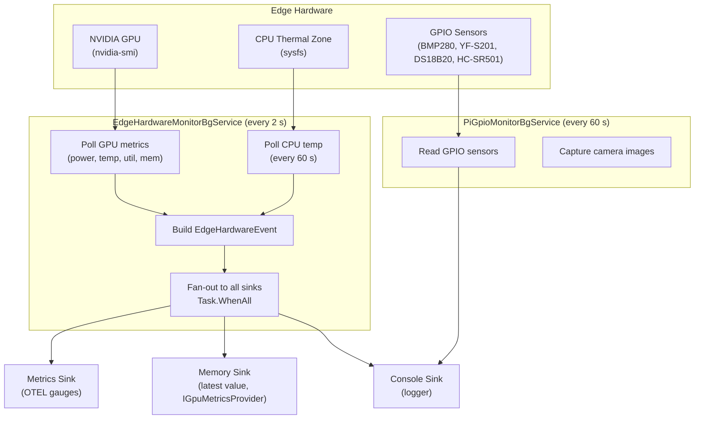

# CasCap.Api.EdgeHardware

Shared edge hardware monitoring library — consolidates GPU telemetry, CPU monitoring and Raspberry Pi GPIO sensor integration into a single project for Linux-based edge inference hosts.

## Purpose

### Unified Monitor (`EdgeHardwareMonitorBgService`)

- Periodically invokes `nvidia-smi` to read GPU power draw (W), temperature (°C), compute utilization (%), memory utilization (%) and memory usage (MiB).
- Reads CPU temperature via `Iot.Device.CpuTemperature` (Linux thermal zone) when available.
- Emits `EdgeHardwareEvent` instances to all registered `IEventSink<EdgeHardwareEvent>` implementations.
- Publishes OpenTelemetry observable gauges via `EdgeHardwareSinkMetricsService`.
- Exposes latest `GpuSnapshot` in-memory via `IGpuMetricsProvider` for per-query energy estimation.
- Gated behind the `EdgeHardware` feature flag. GPU is auto-detected via ILGPU at startup; CPU monitoring is always enabled.

### Event Sinks

| Sink | Description |
| --- | --- |
| `EdgeHardwareSinkConsoleService` | Logs each reading at debug level |
| `EdgeHardwareSinkMemoryService` | In-memory latest-value store, also implements `IGpuMetricsProvider` |
| `EdgeHardwareSinkMetricsService` | Publishes OTEL gauges (`gpu.power`, `gpu.temperature`, `gpu.utilization`, `gpu.memory.used`, `hw.temperature`) |

### GPIO Sensors (`PiGpioMonitorBgService`)

- Manages GPIO-attached sensor devices on Raspberry Pi hardware.
- **`GpioBmp280SensorService`** – Reads temperature and barometric pressure from a BMP280 sensor over I²C.
- **`GpioYfS201SensorService`** – Counts pulses from a YF-S201 water-flow sensor to derive flow rate.
- Gated behind the `EdgeHardware` feature flag.

### Supported Devices

| Device service | Hardware | Interface |
| --- | --- | --- |
| `CpuTemperatureService` | Built-in CPU thermal sensor | sysfs via `Iot.Device.CpuTemperature` |
| `GpioBmp280SensorService` | BMP280 temperature & pressure | I²C |
| `GpioYfS201SensorService` | YF-S201 water-flow sensor | GPIO pulse counting |
| `GpioDs18B20SensorService` | DS18B20 waterproof temperature | 1-Wire |
| `GpioHcsr501SensorService` | HC-SR501 PIR motion sensor | GPIO |
| `GpioLedControllerService` | LED indicator | GPIO |
| `PiCameraDeviceService` | Raspberry Pi Camera Module | MMAL / MMALSharp |

## Event Flow



## Registration

```csharp
// Unified edge hardware monitoring — GPU + CPU telemetry via sinks
if (enabledFeatures.Contains("EdgeHardware"))
{
    var gpuEnabled = DetectNvidiaGpu(); // ILGPU auto-detection
    builder.Services.AddEdgeHardware(builder.Configuration, gpuEnabled, cpuEnabled: true);
}

// GPIO sensors & Pi peripherals
if (enabledFeatures.Contains("EdgeHardware"))
    builder.Services.AddEdgeHardwarePi(builder.Configuration);
```

## Configuration

Edge hardware monitoring reads from the `CasCap:EdgeHardwareConfig` configuration section:

| Setting | Type | Default | Description |
| --- | --- | --- | --- |
| `PollIntervalMs` | `int` | `2000` | Milliseconds between nvidia-smi GPU metric reads |
| `CpuPollIntervalMs` | `int` | `60000` | Milliseconds between CPU temperature reads |
| `EnergyPerKiloTokenWh` | `double` | `0.003` | Fallback Wh per 1 000 tokens when live GPU data unavailable |
| `KettleBoilWh` | `double` | `100` | Reference energy for a kettle boil |
| `PhoneChargeWh` | `double` | `15` | Reference energy for a phone charge |
| `LedBulbHourWh` | `double` | `10` | Reference energy for one LED-bulb hour |
| `Sinks` | `SinkConfig` | *(required)* | Event sink configuration (Console, Memory, Metrics, etc.) |

Raspberry Pi reads from `CasCap:EdgeHardwareConfig`:

| Setting | Type | Default | Description |
| --- | --- | --- | --- |
| `LocalPath` | `string` | *(required)* | Filesystem path for camera captures |
| `PollingIntervalMs` | `int` | `60000` | Milliseconds between CPU temperature readings |
| `Sensors.HcSr501.OutPin` | `int` | `0` | GPIO pin for HC-SR501 motion sensor |

## Configuration Examples

### Minimal

```json
{
  "CasCap": {
    "EdgeHardwareConfig": {
      "AzureTableStorageConnectionString": "https://<account>.table.core.windows.net",
      "Sinks": {
        "AvailableSinks": {
          "Console": { "Enabled": true },
          "Metrics": { "Enabled": true }
        }
      }
    }
  }
}
```

### Fully configured

```json
{
  "CasCap": {
    "EdgeHardwareConfig": {
      "PollIntervalMs": 2000,
      "CpuPollIntervalMs": 60000,
      "LocalPath": "//mnt/pi",
      "EnergyPerKiloTokenWh": 0.003,
      "KettleBoilWh": 100,
      "PhoneChargeWh": 15,
      "LedBulbHourWh": 10,
      "AzureTableStorageConnectionString": "https://<account>.table.core.windows.net",
      "HealthCheckAzureTableStorage": "None",
      "Sensors": {
        "HcSr501": { "OutPin": 16 }
      },
      "Sinks": {
        "AvailableSinks": {
          "Console": { "Enabled": true },
          "Memory": { "Enabled": true },
          "Metrics": { "Enabled": true },
          "AzureTables": { "Enabled": true },
          "Redis": {
            "Enabled": true,
            "Settings": {
              "SnapshotValues": "gpu_power_w,gpu_temp_c,gpu_util_pct,gpu_mem_used_mib,cpu_temp_c"
            }
          }
        }
      }
    }
  }
}
```

## Dependencies

### NuGet packages

| Package | Purpose |
| --- | --- |
| [Iot.Device.Bindings](https://www.nuget.org/packages/iot.device.bindings) | GPIO, I²C, 1-Wire, CPU temperature bindings |
| [ILGPU](https://www.nuget.org/packages/ilgpu) | GPU compute (experimental) |
| [LibreHardwareMonitorLib](https://www.nuget.org/packages/librehardwaremonitorlib) | Hardware sensor monitoring (Windows) |
| [MMALSharp](https://www.nuget.org/packages/mmalsharp) | Raspberry Pi camera capture |
| [MMALSharp.FFmpeg](https://www.nuget.org/packages/mmalsharp.ffmpeg) | FFmpeg helpers for MMALSharp |
| [Asp.Versioning.Mvc](https://www.nuget.org/packages/asp.versioning.mvc) | API versioning |
| [Microsoft.AspNetCore.Mvc.Core](https://www.nuget.org/packages/microsoft.aspnetcore.mvc.core) | MVC core for REST controllers |
| [Microsoft.Extensions.Http](https://www.nuget.org/packages/microsoft.extensions.http) | `HttpClient` factory |
| [Microsoft.Extensions.Diagnostics.HealthChecks](https://www.nuget.org/packages/microsoft.extensions.diagnostics.healthchecks) | Health check abstractions |
| [CasCap.Common.Extensions](https://www.nuget.org/packages/cascap.common.extensions) | Shared extension helpers |
| [CasCap.Common.Logging](https://www.nuget.org/packages/cascap.common.logging) | Structured logging helpers |
| [CasCap.Common.Net](https://www.nuget.org/packages/cascap.common.net) | HTTP client helpers |
| [CasCap.Common.Serialization.Json](https://www.nuget.org/packages/cascap.common.serialization.json) | JSON serialisation helpers |
| [CasCap.Common.Configuration](https://www.nuget.org/packages/cascap.common.configuration) | Configuration binding helpers |
| [CasCap.Common.Extensions.Diagnostics.HealthChecks](https://www.nuget.org/packages/cascap.common.extensions.diagnostics.healthchecks) | Kubernetes probe tag helpers |

### Project references

| Project | Purpose |
| --- | --- |


## License

This project is released under [The Unlicense](../../LICENSE). See the [LICENSE](../../LICENSE) file for details.
