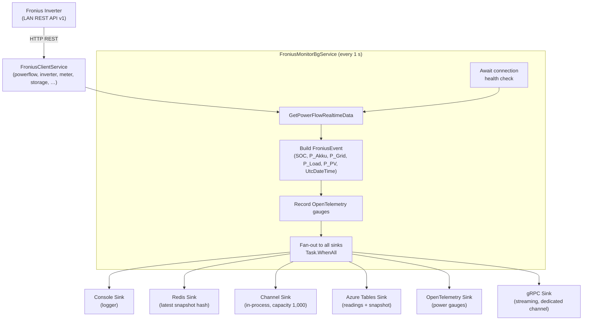

# CasCap.Api.Fronius

A .NET library that integrates with a [Fronius](https://www.fronius.com) solar inverter (Symo Gen24) via its local Solar API v1, samples power-flow data every second, and fans each reading out to a configurable set of sinks for persistence, streaming, and observability.

## Installation

```bash
dotnet add package CasCap.Api.Fronius
```

## Purpose

The library is built around one background service that forms the core pipeline:

**`FroniusMonitorBgService`** – Waits for the device health check to pass, then polls `GetPowerFlowRealtimeData` every second. Each response is wrapped in a `FroniusEvent` containing the five key power metrics (SOC, P_Akku, P_Grid, P_Load, P_PV) and a UTC timestamp. OpenTelemetry gauges are recorded for each metric before the event is dispatched in parallel to every registered `IEventSink<FroniusEvent>` implementation.

A REST API (`FroniusController`) exposes endpoints for real-time power flow, inverter data, meter readings, storage state, and historical line items.

### Sinks

| Sink | Description |
| --- | --- |
| **Console** | Logs every event via the .NET logger (Debug level) |
| **Redis** | Persists the latest five power metrics to a Redis hash (`SOC`, `P_Akku`, `P_Grid`, `P_Load`, `P_PV`) |
| **Channel** | Exposes events on an in-process `Channel<FroniusEvent>` (capacity 1,000) for MCP/AI tooling |
| **Azure Tables** | Writes detailed readings and a rolling snapshot to Azure Table Storage |
| **OpenTelemetry** | Emits power and percentage gauges via OpenTelemetry metrics |
| **gRPC** | Streams events to connected gRPC clients (backed by a dedicated channel) |

## Event Flow



## Configuration Examples

### Minimal

```json
{
  "CasCap": {
    "FroniusConfig": {
      "BaseAddress": "http://192.168.1.248",
      "AzureTableStorageConnectionString": "https://<account>.table.core.windows.net",
      "Sinks": {
        "AvailableSinks": {
          "Console": { "Enabled": true },
          "Metrics": { "Enabled": true }
        }
      }
    }
  }
}
```

### Fully configured

```json
{
  "CasCap": {
    "FroniusConfig": {
      "BaseAddress": "http://192.168.1.248",
      "HealthCheckUri": "solar_api/v1/GetPowerFlowRealtimeData.fcgi",
      "HealthCheck": "Readiness",
      "PollingIntervalMs": 1000,
      "ConnectionPollingDelayMs": 1000,
      "ConnectionLogEscalationInterval": 10,
      "SocAlertThreshold": 0.95,
      "SocAlertHysteresis": 0.05,
      "SocAlertCooldownMs": 300000,
      "AzureTableStorageConnectionString": "https://<account>.table.core.windows.net",
      "HealthCheckAzureTableStorage": "None",
      "Sinks": {
        "AvailableSinks": {
          "Console": { "Enabled": true },
          "Memory": { "Enabled": true },
          "Metrics": { "Enabled": true },
          "AzureTables": { "Enabled": true },
          "Redis": {
            "Enabled": true,
            "Settings": {
              "SnapshotValues": "SOC,P_Akku,P_Grid,P_Load,P_PV"
            }
          },
          "CommsStream": { "Enabled": true },
          "SignalR": { "Enabled": true }
        }
      }
    }
  }
}
```

## License

This project is released under [The Unlicense](../../LICENSE). See the [LICENSE](../../LICENSE) file for details.
