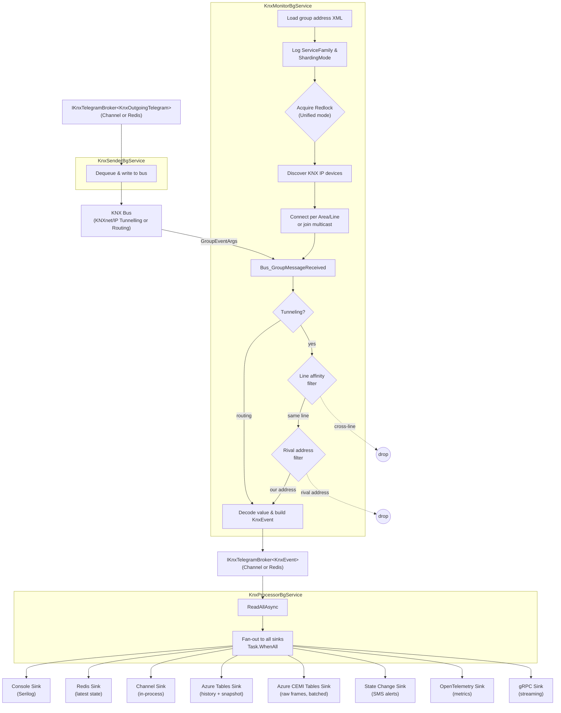

# CasCap.Api.Knx

A .NET library that connects to a [KNX](https://www.knx.org) bus via KNXnet/IP tunnelling or routing (multicast), monitors all group-address telegrams, and fans them out to a configurable set of sinks for persistence, alerting and streaming.

## Purpose

The library is built around three background services that together form a pipeline:

1. **`KnxMonitorBgService`** – Loads the ETS group-address metadata, waits for it to become healthy, logs the active `ServiceFamily` and `ShardingMode`, then enters a Redlock-based leadership election (in Unified sharding mode). The elected leader discovers KNX IP devices on the local network and connects to the bus using the configured service family. In **Tunneling** mode it establishes one `KnxBus` connection per configured area/line combination; in **Routing** mode it joins the multicast group advertised by the KNX IP router (and `ShardingMode` is forced to `Unified`). Incoming telegrams pass through service-family-specific deduplication filters before being decoded and published via the `IKnxTelegramBroker<KnxEvent>`.

2. **`KnxProcessorBgService`** – Reads from that broker and fans each `KnxEvent` out to every registered `IEventSink<KnxEvent>` implementation in parallel, waiting for all sinks to complete before processing the next event.

3. **`KnxSenderBgService`** – Dequeues outbound write requests from a separate outgoing broker and sends them to the bus, enabling bidirectional control.

Supporting services include `KnxAutomationBgService` (queue processing and day/night signalling). A REST API (`KnxController`) and a gRPC endpoint (`RpcTelegramService`) allow external callers to read state and send commands.

## Group Address Naming Convention

The library parses KNX group address **names** (as exported from ETS) into strongly-typed DTOs. For parsing to succeed, every group address must follow a **hyphen-separated segment pattern** where each segment maps to a known enum value. During construction every recognised segment is consumed from a list; after a successful parse the list should be empty — any leftover segments indicate an unrecognised token.

### Segment Pattern

```
[Floor]-Category-[Room[(Location)]]-[Orientation]-[HorizontalPos]-[VerticalPos]-[LightStyle]-Function-[Outdoor|Indoor]-[[Identifier]]
```

Segments in square brackets are optional. The parser is **order-independent** — it matches each segment against frozen dictionaries of known values and removes it from the list, so segments can appear in any order. `Category` is the only mandatory segment (addresses without a recognised category are skipped entirely).

### Segment Reference

| Segment | Values | Notes |
| --- | --- | --- |
| **Floor** | `KG` (basement), `EG` (ground), `OG` (upper), `DG` (top) | German abbreviations from the KNX standard. |
| **Category** | `SYS`, `ENV`, `BI`, `BL`, `HZ`, `PM`, `LI`, `SD` | Determines which function enum is used. See table below. |
| **Room** | `Office`, `StorageRoom`, `Loggia`, `Entrance`, `MasterBedroom`, `MasterBathroom`, `FamilyBathroom`, `ChildRoom`, `ChildRoom1`, `ChildRoom2`, `Bedroom`, `Kitchen`, `LivingRoom`, `GuestWC`, `OpenPlanLiving`, `Study`, `Hallway`, `GuestRoom`, `GuestBathroom`, `BoilerRoom`, `LaundryRoom`, `Garage` | Appending text in parentheses adds a free-text location, e.g. `Entrance(FrontDoor)`. |
| **Orientation** | `North`, `East`, `South`, `West` | Compass direction of the device. |
| **HorizontalPos** | `Left` / `L`, `Middle`, `Right` / `R`, `Corner` | `L` and `R` are accepted as aliases. |
| **VerticalPos** | `Top`, `Middle`, `Bottom` | Vertical qualifier for multi-level fixtures. |
| **LightStyle** | `L` (generic), `DL` (downlighter), `WL` (wall light), `PL` (pendulum), `LED` (LED stripe) | Only recognised for `LI` (lighting) addresses. |
| **Function** | Category-specific — see below | Segments ending in `_FB` mark the address as a feedback value. |
| **Outdoor / Indoor** | `Outdoor`, `Indoor` | Sets the `IsOutside` flag. Defaults to indoor when absent. |
| **Identifier** | Text in `[square brackets]` | e.g. `SYS-[DateTime]` → `Identifier = DateTime`. |

### Category → Function Mapping

| Category | Enum | Functions |
| --- | --- | --- |
| `BL` (shutter/blind) | `ShutterFunction` | `POS`, `POS_FB`, `POSSLATS`, `POSSLATS_FB`, `DIRECTION`, `MOVE`, `SCENE`, `STEP`, `WIND`, `RAIN`, `DIAG`, `TT` |
| `BI` (binary contact) | `ContactFunction` | `STATE` |
| `LI` (lighting) | `LightingFunction` | `SW`, `SW_FB`, `DIM`, `VAL`, `VFB`, `STAIRWAY`, `SEQ1`, `SEQ1_FB`, `BITSCENE1`, `RGB`, `RGB_FB`, `RGB_DIM`, `HSV`, `HSV_FB`, `SCENE`, `LUX`, `LOCK` |
| `SD` (power outlet) | `PowerOutletFunction` | `SD_SW`, `SD_FB` |
| `HZ` (heating/HVAC) | `HvacFunction` | `SETP`, `SETP_UPDATE`, `FB`, `OFFSET`, `WINDOW`, `TEMP`, `OUTPUT`, `DIAG`, `HUMIDITY` |
| `SYS` (system) | `SystemFunction` | *(none — identifier-based)* |
| `ENV` (environment) | `EnvironmentFunction` | *(none — identifier-based)* |
| `PM` (presence/motion) | `PresenceFunction` | `INVERT` |

### Examples

| Group Address Name | Floor | Category | Room | Orientation | LightStyle | Function | Feedback | Notes |
| --- | --- | --- | --- | --- | --- | --- | --- | --- |
| `DG-LI-Office-SW` | DG | LI | Office | | | SW | | Simple light switch |
| `EG-LI-Entrance-DL-SW_FB` | EG | LI | Entrance | | DL | SW_FB | yes | Downlighter switch feedback |
| `OG-BL-FamilyBathroom-West-POS` | OG | BL | FamilyBathroom | West | | POS | | Blind position, west-facing |
| `EG-BI-Entrance(FrontDoor)-East-STATE` | EG | BI | Entrance | East | | STATE | | Door contact with location |
| `DG-HZ-StorageRoom-SETP` | DG | HZ | StorageRoom | | | SETP | | Heating setpoint |
| `DG-BI-STATE` | DG | BI | | | | STATE | | Binary contact, no room |
| `SYS-[DateTime]` | | SYS | | | | | | System identifier |
| `EG-PM-Kitchen-South` | EG | PM | Kitchen | South | | | | Presence sensor, no function |
| `EG-LI-Kitchen-LED-Left-SW` | EG | LI | Kitchen | | LED | SW | | LED strip, left position |
| `OG-BL-MasterBedroom-South-Left-MOVE` | OG | BL | MasterBedroom | South | | MOVE | | Blind move, south-left |

### Grouping

Addresses that share all segments except the function suffix are automatically grouped into `KnxGroupAddressGroup` records. For example, `OG-BL-FamilyBathroom-West-MOVE`, `OG-BL-FamilyBathroom-West-POS` and `OG-BL-FamilyBathroom-West-SCENE` all belong to the group `OG-BL-FamilyBathroom-West`.

### ETS Setup Requirements

1. **Export format** — Export group addresses from ETS as XML (the library deserialises `KnxGroupAddressXmlExport`).
2. **DPT assignment** — Every group address must have a KNX Datapoint Type assigned in ETS (format `DPST-x-y`). Addresses without a DPT are skipped during parsing.
3. **Unique names** — Each group address name must be unique across the entire project. Duplicate names cause a startup exception.
4. **Placeholder filtering** — Addresses whose name contains a `?` character are treated as ETS placeholders and excluded from the loaded lookup.
5. **Validation** — Run `GroupAddressTests.ParseGroupAddressNamingConvention()` after modifying ETS names. The test asserts that every address is fully parsed (zero leftover segments).

## Configuration

All site-specific values are configured in `appsettings.json` under `CasCap:KnxConfig`. The C# defaults are intentionally left empty/placeholder so that the library works out-of-the-box for any KNX installation — simply fill in your own values.

### Site-Specific Settings

| Setting | Description | Example |
| --- | --- | --- |
| `TunnelingAreaLineFilter` | Area/line combinations to monitor (tunneling only) | `["1.1", "1.2", "1.3"]` |
| `StateChangeAlerts` | Group address names mapped to LLM-friendly descriptions for state change alerts | `{"SYS-[RM_Alarm_FB]": "Smoke detector alarm", ...}` |
| `DayNightTimeZoneLocation` | IANA time zone for sunrise/sunset | `"Berlin"` |
| `DayNightLatitude` | Latitude for day/night calculation | `52.520008` |
| `DayNightLongitude` | Longitude for day/night calculation | `13.404954` |

### Translation / LLM Glossary

The `Translations` section in `KnxConfig` maps English enum values to localised equivalents. At agent startup the `TranslationExtensions.BuildTranslationGlossary()` method generates a Markdown glossary table that can be injected into the LLM system prompt, allowing end users to query in German (or any configured language) while MCP tools use English internally.

```json
"Translations": {
  "de": {
    "Floors": { "DG": "Dachgeschoss", "OG": "Obergeschoss", ... },
    "Rooms": { "Kitchen": "Küche", "Office": "Büro", ... },
    "Orientations": { "North": "Nord", "East": "Ost", ... },
    "Categories": { "LI": "Beleuchtung", "HZ": "Heizung", ... }
  },
  "es": {
    "Floors": { "DG": "Ático", "OG": "Planta alta", "EG": "Planta baja", "KG": "Sótano" },
    "Rooms": { "Kitchen": "Cocina", "Office": "Oficina", "LivingRoom": "Salón", ... },
    "Orientations": { "North": "Norte", "East": "Este", "South": "Sur", "West": "Oeste" },
    "Categories": { "LI": "Iluminación", "HZ": "Calefacción", "BL": "Persianas", "SD": "Enchufe" }
  }
}
```

### Sinks

| Sink | Description |
| --- | --- |
| **Console** | Logs every telegram via Serilog (configurable verbosity filter) |
| **Redis** | Persists the latest decoded value for each group address to Redis |
| **Channel** | Exposes telegrams on an in-process `Channel<KnxTelegram>` for MCP/AI tooling |
| **Azure Tables** | Writes historical readings and a rolling snapshot to Azure Table Storage |
| **Azure CEMI Tables** | Stores raw CEMI L-Data frames (batched) to a separate Azure Table |
| **State Change** | Tracks last-known state per group address and sends SMS alerts on transitions |
| **OpenTelemetry** | Emits OpenTelemetry metrics |
| **gRPC** | Streams telegrams to connected gRPC clients |

### Deployment Matrix

The three key configuration properties — `ServiceFamily`, `ShardingMode` and `TelegramBrokerMode` — are interdependent. The table below shows every valid combination, what it means for Kubernetes resources, and whether external callers (MCP tools / Agents) can send commands to the KNX bus.

| `ServiceFamily` | `ShardingMode` | `TelegramBrokerMode` | K8s resource | External access | Notes |
| --- | --- | --- | --- | --- | --- |
| Tunneling | Unified | **Redis** (default) | Deployment (1+ replicas) | ✅ Any pod or external service publishes to the Redis outgoing stream; the leader's `KnxSenderBgService` consumes it. | Recommended production configuration. Redlock elects the active pod; standbys are warm. |
| Tunneling | Unified | Channel | — (local dev) | ❌ `Channel<T>` is in-process only — callers in other pods cannot reach it. | Local development only. Override via `CasCap__KnxConfig__TelegramBrokerMode=Channel`. |
| Tunneling | Partitioned | **Redis** (required) | StatefulSet | ✅ Same Redis stream mechanism. Each pod owns one KNX line. | ⚠️ Not yet implemented. Redis is mandatory — each pod must share telegrams across the cluster. |
| Tunneling | Partitioned | Channel | — | ❌ Invalid | Partitioned mode requires cross-pod communication; Channel cannot provide it. |
| Routing | Unified (forced) | **Redis** (default) | Deployment (1+ replicas) | ✅ Same as Tunneling + Unified + Redis. | `ShardingMode` is forced to Unified at startup (with a warning if configured otherwise). |
| Routing | Unified (forced) | Channel | — (local dev) | ❌ Same limitation as above. | Local development only. |
| Routing | Partitioned | — | — | ❌ Invalid | Routing receives all backbone traffic on one multicast connection — partitioning is meaningless. Forced to Unified at startup. |

> **Why is Redis the default?** The .NET application has no knowledge of its replica count — that is a Kubernetes concern. By defaulting to `Redis`, the application works correctly in any deployment topology (single-replica, multi-replica, external Agents). The Helm chart or `appsettings.json` can override to `Channel` for local development where Redis is not available.

### Sharding Modes

The `ShardingMode` property on `KnxConfig` controls how `KnxMonitorBgService` pods are distributed across KNX lines. The mode is set via `appsettings.json` under `CasCap:KnxConfig:ShardingMode`.

| Mode | Kubernetes Resource | Description |
| --- | --- | --- |
| **Unified** (default) | `Deployment` (1+ replicas) | A single active pod processes telegrams from **all** configured lines. Additional replicas remain on standby via a Redlock-based leadership election and take over immediately if the active pod crashes. This is the only mode that works during local development. **Forced** when `ServiceFamily` is `Routing`. |
| **Partitioned** | `StatefulSet` | Each pod connects to exactly **one** KNX line, determined by mapping the pod ordinal to an entry in `TunnelingAreaLineFilter` (e.g. `haus-knx-0` → `1.1`, `haus-knx-1` → `1.2`). The replica count must equal the number of configured lines. Only valid when `ServiceFamily` is `Tunneling`. ⚠️ *Not yet implemented — selecting this mode throws `NotSupportedException`.* |

#### Unified Mode Startup Sequence

1. **Group address lookup** — all replicas load the ETS XML metadata concurrently (stateless, no lock required).
2. **Configuration logged** — after the lookup completes, `ServiceFamily` and `ShardingMode` are emitted at `Information` level so the active configuration is visible in every pod's log stream. If `ServiceFamily` is `Routing` and `ShardingMode` was set to `Partitioned`, it is overridden to `Unified` with a warning.
3. **Leadership election** — each replica attempts to acquire a Redlock on the resource `knx:monitor`. Timing is governed by the shared `RedlockConfig` (`RedlockExpiryMs`, `RedlockWaitMs`, `RedlockRetryMs`).
4. **Leader runs** — the elected leader discovers KNX IP devices, connects to the bus, and enters the monitoring loop. Standby replicas are warm (lookup already cached) and retry the lock until they acquire it.
5. **Leader crashes** — the Redlock expires (worst-case `RedlockExpiryMs`, default 15 s), and a standby replica acquires the lock and connects.

#### Standby Health Check

The `KnxConnectionHealthCheck` tracks an `IsLeader` flag alongside the existing `ConnectionActive` flag. This prevents standby replicas from being marked unhealthy (and restarted by Kubernetes) while they are legitimately waiting for the distributed lock:

| `IsLeader` | `ConnectionActive` | Health status |
| --- | --- | --- |
| `false` | — | **Healthy** — standby, waiting for distributed lock |
| `true` | `true` | **Healthy** — bus connection online |
| `true` | `false` | **Unhealthy** — leader has lost bus connectivity |

When the leader's lock is released (e.g. `RunServiceAsync` returns or the pod is shutting down), both `IsLeader` and `ConnectionActive` are reset to `false`, returning the replica to standby-healthy status.

### Telegram Filtering

The filters applied in `Bus_GroupMessageReceived` depend on the configured `ServiceFamily`.

#### Tunneling mode

When running with multiple bus connections, two filters are applied before processing a telegram:

1. **Line affinity** — only process a telegram if the source device's area/line matches the receiving bus connection's area/line. KNX line couplers route telegrams across lines, which means every connection receives cross-line traffic. This cheap integer comparison prevents N−1 duplicate publishes per routed telegram.

2. **Rival tunneling address** — during discovery, all tunneling slot individual addresses are recorded. When a telegram arrives whose source is a discovered tunneling address but *not* one of our active connections, it originated from another deployment sharing the same KNX interfaces (e.g. production on slot 1, dev on slot 2) and is dropped.

#### Routing mode

In routing mode a single multicast connection receives all group telegrams from the entire KNX backbone. Neither the line-affinity nor the rival-tunneling-address filter applies — the bus connection's individual address is the router's backbone address, not a TP device, so source area/line comparisons would incorrectly drop every incoming telegram. Both filters are therefore skipped when `ServiceFamily` is `Routing`.

## Event Flow



## Configuration Examples

### Minimal

```json
{
  "CasCap": {
    "KnxConfig": {
      "ServiceFamily": "Tunneling",
      "GroupAddressXmlFilePath": "/etc/knx/knxgroupaddresses.xml",
      "TunnelingAreaLineFilter": ["1.1"],
      "DayNightTimeZoneLocation": "Berlin",
      "DayNightLatitude": 52.520008,
      "DayNightLongitude": 13.404954,
      "AzureTableStorageConnectionString": "https://<account>.table.core.windows.net",
      "Sinks": {
        "AvailableSinks": {
          "Console": { "Enabled": true },
          "Metrics": { "Enabled": true }
        }
      }
    }
  }
}
```

### Fully configured

```json
{
  "CasCap": {
    "KnxConfig": {
      "ServiceFamily": "Tunneling",
      "ShardingMode": "Unified",
      "HealthCheck": "Readiness",
      "GroupAddressXmlFilePath": "/etc/knx/knxgroupaddresses.xml",
      "TunnelingAreaLineFilter": ["1.1", "1.2", "1.3"],
      "StateChangeAlerts": {"SYS-[RM_Alarm_FB]": "Smoke detector alarm"},
      "DayNightEnabled": true,
      "DayNightTimeZoneLocation": "Berlin",
      "DayNightLatitude": 52.520008,
      "DayNightLongitude": 13.404954,
      "DayNightGroupAddressName": "SYS-[Night_Day]",
      "DayNightSunriseHourOverrideWeekday": 6,
      "DayNightSunriseHourOverrideWeekend": 7,
      "BusSenderLoggingEnabled": true,
      "StateChangePollingDelayMs": 100,
      "StateChangeMaxPollIterations": 20,
      "QueuePollingDelayMs": 50,
      "QueueMaxConcurrency": 5,
      "DiscoveryRetryDelayMs": 10000,
      "ConnectionPollingDelayMs": 1000,
      "ConnectionLogEscalationInterval": 10,
      "ConnectionHealthPollingDelayMs": 1000,
      "ReconnectBackoffMs": 1000,
      "ReconnectMaxBackoffMs": 60000,
      "TelegramBrokerMode": "Redis",
      "TelegramConsumerGroupStartId": "0",
      "AzureTableStorageConnectionString": "https://<account>.table.core.windows.net",
      "HealthCheckAzureTableStorage": "None",
      "Sinks": {
        "AvailableSinks": {
          "Console": { "Enabled": true },
          "Memory": { "Enabled": true },
          "Metrics": { "Enabled": true },
          "AzureTables": { "Enabled": true },
          "AzureTablesCemi": { "Enabled": true },
          "Redis": {
            "Enabled": true,
            "Settings": {
              "SnapshotValues": "all"
            }
          },
          "CommsStream": { "Enabled": true },
          "SignalR": { "Enabled": true }
        }
      },
      "Translations": {
        "de": {
          "Floors": { "DG": "Dachgeschoss", "OG": "Obergeschoss", "EG": "Erdgeschoss", "KG": "Keller" },
          "Rooms": { "Kitchen": "Küche", "Office": "Büro", "LivingRoom": "Wohnzimmer" },
          "Orientations": { "North": "Nord", "East": "Ost", "South": "Süd", "West": "West" },
          "Categories": { "LI": "Beleuchtung", "HZ": "Heizung", "BL": "Rollladen", "SD": "Steckdose" }
        }
      }
    }
  }
}
```


## License

This project is released under [The Unlicense](../../LICENSE). See the [LICENSE](../../LICENSE) file for details.
