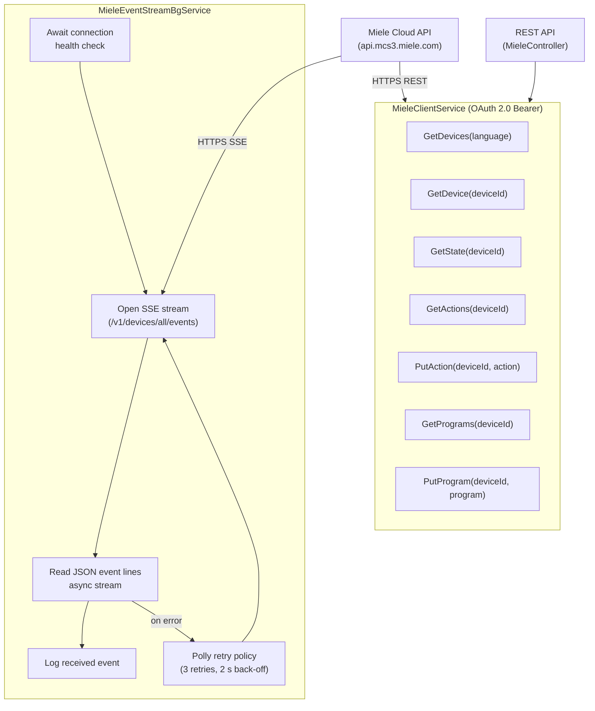

# CasCap.Api.Miele

A .NET library that integrates with the [Miele](https://www.miele.com) 3rd Party Cloud API v1 via OAuth 2.0, consumes a server-sent event stream for real-time appliance state changes, and exposes REST endpoints for querying and controlling individual devices.

## Purpose

The library is built around one background service that forms the core pipeline:

**`MieleEventStreamBgService`** – Waits for the health check to pass, then opens a long-polling HTTPS server-sent event stream at the configured `EventStreamUrl` (defaults to `https://api.mcs3.miele.com/v1/devices/all/events`). Each JSON event line received on the stream is logged. A Polly retry policy (up to 3 retries with a 2-second pause between failures) ensures the stream is re-established automatically after transient errors.

A REST API (`MieleController`) delegates to `MieleClientService` to list all appliances, retrieve individual device details (identity, state, available actions, programs), and issue control commands (invoke an action, start a program).

### Authentication

All requests to the Miele cloud are authenticated with an OAuth 2.0 Bearer token obtained and refreshed automatically by the HTTP client configuration.

## Event Flow



## Configuration

Registered via `IServiceCollection.AddMiele()`. Configuration section: `CasCap:MieleConfig`.

| Setting | Type | Default | Required | Description |
| --- | --- | --- | --- | --- |
| `OAuthToken` | `string` | — | ✓ | OAuth 2.0 bearer token for the Miele cloud API |
| `HealthCheckUri` | `string` | `"https://api.mcs3.miele.com/v1/"` | ✓ | URI used to verify API connectivity |
| `HealthCheckExpectedHttpStatusCodes` | `IReadOnlyList<int>` | `[404]` | — | HTTP status codes treated as healthy |
| `HealthCheck` | `KubernetesProbeTypes` | `Readiness` | ✓ | Kubernetes probe type for the health check tag |
| `ConnectionPollingDelayMs` | `int` | `1000` | — | Milliseconds between connection readiness probes |
| `ConnectionLogEscalationInterval` | `int` | `10` | — | Interval at which connection wait logging escalates from Trace to Warning |
| `EventStreamUrl` | `string` | `"https://api.mcs3.miele.com/v1/devices/all/events"` | ✓ | Full URL of the Miele SSE stream endpoint |
| `EventStreamReconnectDelayMs` | `int` | `60000` | — | Milliseconds to wait before reconnecting to the SSE stream after it completes |

## Configuration Examples

### Minimal

```json
{
  "CasCap": {
    "MieleConfig": {
      "OAuthToken": "<your-oauth-token>"
    }
  }
}
```

### Fully configured

```json
{
  "CasCap": {
    "MieleConfig": {
      "OAuthToken": "<your-oauth-token>",
      "HealthCheckUri": "https://api.mcs3.miele.com/v1/",
      "HealthCheckExpectedHttpStatusCodes": [404],
      "HealthCheck": "Readiness",
      "ConnectionPollingDelayMs": 1000,
      "ConnectionLogEscalationInterval": 10,
      "EventStreamUrl": "https://api.mcs3.miele.com/v1/devices/all/events",
      "EventStreamReconnectDelayMs": 60000
    }
  }
}
```

## License

This project is released under [The Unlicense](../../LICENSE). See the [LICENSE](../../LICENSE) file for details.
