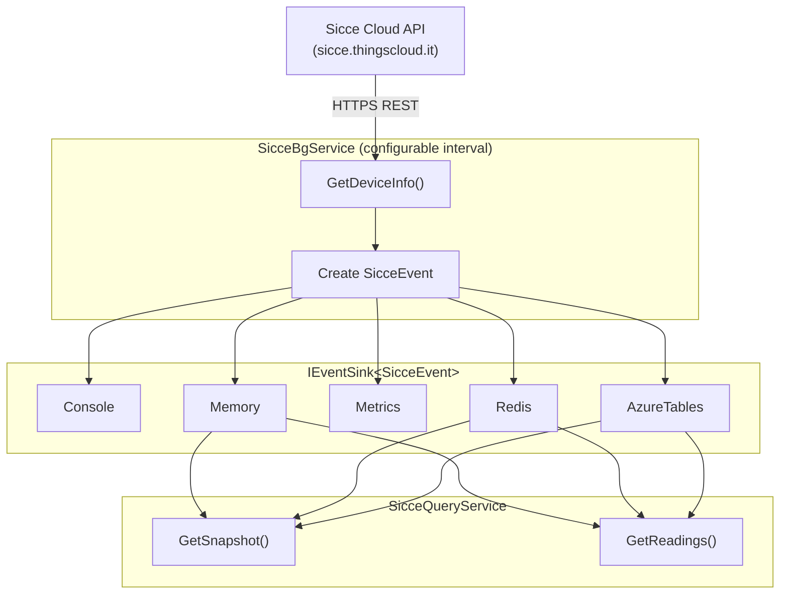

# CasCap.Api.Sicce

A .NET library that integrates with the [Sicce](https://www.sicce.com) smart water pump system via its cloud API (`sicce.thingscloud.it`), polling device status, exposing control endpoints, and dispatching events to pluggable sinks.

## Purpose

The library is built around two core services:

**`SicceBgService`** – Background service that polls `GetDeviceInfo` at a configurable interval and dispatches `SicceEvent` instances to all registered `IEventSink<SicceEvent>` implementations. Waits for the health check readiness probe before starting the polling loop.

**`SicceQueryService`** – Provides query access to Sicce data, delegating to the primary event sink for snapshot and line item retrieval. Also exposes the full `SicceClientService` API surface for direct device queries.

A client service (`SicceClientService`) provides the full programmatic API surface for querying and controlling the pump:

| Method | Description |
| --- | --- |
| `GetDeviceInfo()` | Retrieves current device status and sensor readings |
| `UpdateStatus(UpdateStatus)` | Updates device operating parameters |
| `SetPowerSwitch(bool)` | Turns the pump on or off |

### Built-in Sinks

| Sink class | `SinkType` | Description |
| --- | --- | --- |
| `SicceSinkConsoleService` | `"Console"` | Logs events at debug level |
| `SicceSinkMemoryService` | `"Memory"` | Stores the latest event in memory, implements `ISicceQuery` |
| `SicceSinkMetricsService` | `"Metrics"` | Publishes OpenTelemetry gauge metrics per `SicceFunction` |

## Configuration

Registered via `IServiceCollection.AddSicce()`. Configuration section: `CasCap:SicceConfig`.

| Setting | Type | Default | Required | Description |
| --- | --- | --- | --- | --- |
| `BaseAddress` | `string` | `"https://sicce.thingscloud.it"` | ✓ | Base URL of the Sicce cloud API |
| `HealthCheckUri` | `string` | `"/api/v3"` | ✓ | Path used to verify API connectivity |
| `HealthCheck` | `KubernetesProbeTypes` | `Readiness` | ✓ | Kubernetes probe type for the health check tag |
| `DeviceToken` | `string` | — | ✓ | Device authentication token |
| `VendorKey` | `string` | — | ✓ | Vendor API key (sent as `Vendor-Key` request header) |
| `PollingIntervalMs` | `int` | `30000` | | Polling interval in milliseconds |
| `ConnectionPollingDelayMs` | `int` | `5000` | ✓ | Delay between health check polls at startup |
| `ConnectionLogEscalationInterval` | `int` | `10` | ✓ | Log escalation interval during connection polling |
| `AzureTableStorageConnectionString` | `string` | — | ✓ | Azure Table Storage connection string or endpoint |
| `Sinks` | `SinkConfig` | — | ✓ | Event data sink configuration |
| `RedisSeriesExpiryDays` | `int` | `7` | | Redis series sorted set key expiry in days |
| `MetricNamePrefix` | `string` | `"haus"` | ✓ | OpenTelemetry metric name prefix |
| `OtelServiceName` | `string` | `"CasCap.App"` | ✓ | OpenTelemetry service name |

## Configuration Examples

### Minimal

```json
{
  "CasCap": {
    "SicceConfig": {
      "DeviceToken": "<your-device-token>",
      "VendorKey": "<your-vendor-key>",
      "AzureTableStorageConnectionString": "https://<account>.table.core.windows.net",
      "Sinks": {
        "AvailableSinks": {
          "Console": { "Enabled": true }
        }
      }
    }
  }
}
```

### Fully configured

```json
{
  "CasCap": {
    "SicceConfig": {
      "BaseAddress": "https://sicce.thingscloud.it",
      "HealthCheckUri": "/api/v3",
      "HealthCheck": "Readiness",
      "DeviceToken": "<your-device-token>",
      "VendorKey": "<your-vendor-key>",
      "PollingIntervalMs": 30000,
      "ConnectionPollingDelayMs": 5000,
      "ConnectionLogEscalationInterval": 10,
      "AzureTableStorageConnectionString": "https://<account>.table.core.windows.net",
      "RedisSeriesExpiryDays": 7,
      "MetricNamePrefix": "haus",
      "OtelServiceName": "CasCap.App",
      "Sinks": {
        "AvailableSinks": {
          "Memory": { "Enabled": false },
          "Console": { "Enabled": true },
          "Metrics": { "Enabled": true },
          "Redis": {
            "Enabled": true,
            "Settings": {
              "SnapshotValues": "sicce:snapshot:values",
              "SeriesValues": "sicce:series"
            }
          },
          "AzureTables": {
            "Enabled": true,
            "Settings": {
              "LineItemTableName": "siccelineitemsv1",
              "SnapshotTableName": "siccesnapshotv1"
            }
          }
        }
      }
    }
  }
}
```

## Health Check

**`SicceConnectionHealthCheck`** – Verifies that the Sicce API is reachable by issuing an HTTP request to `{BaseAddress}{HealthCheckUri}`.

## Event Flow



## Dependencies

### NuGet packages

| Package | Purpose |
| --- | --- |
| [Asp.Versioning.Mvc](https://www.nuget.org/packages/asp.versioning.mvc) | API versioning for REST controllers |
| [Microsoft.AspNetCore.Http.Abstractions](https://www.nuget.org/packages/microsoft.aspnetcore.http.abstractions) | HTTP abstractions |
| [Microsoft.Extensions.Http](https://www.nuget.org/packages/microsoft.extensions.http) | `HttpClient` factory |
| [Microsoft.Extensions.Diagnostics.HealthChecks](https://www.nuget.org/packages/microsoft.extensions.diagnostics.healthchecks) | Health check abstractions |
| [CasCap.Common.Extensions](https://www.nuget.org/packages/cascap.common.extensions) | Shared extension helpers |
| [CasCap.Common.Logging](https://www.nuget.org/packages/cascap.common.logging) | Structured logging helpers |
| [CasCap.Common.Net](https://www.nuget.org/packages/cascap.common.net) | HTTP client helpers |
| [CasCap.Common.Serialization.Json](https://www.nuget.org/packages/cascap.common.serialization.json) | JSON serialisation helpers |
| [CasCap.Common.Extensions.Diagnostics.HealthChecks](https://www.nuget.org/packages/cascap.common.extensions.diagnostics.healthchecks) | Kubernetes probe tag helpers |
| [CasCap.Common.Configuration](https://www.nuget.org/packages/cascap.common.configuration) | Configuration binding helpers |


## License

This project is released under [The Unlicense](../../LICENSE). See the [LICENSE](../../LICENSE) file for details.
