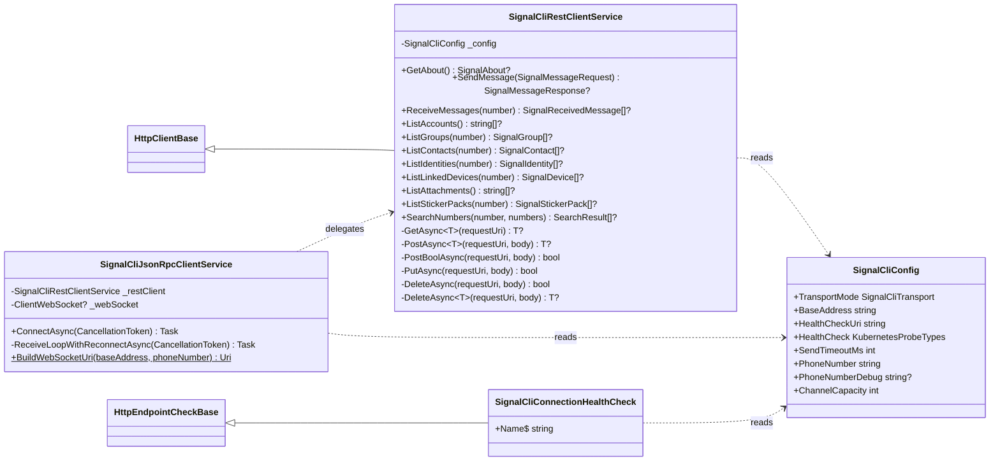
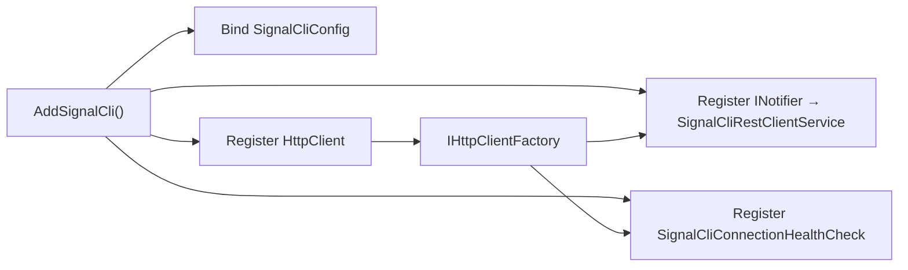

# CasCap.Api.SignalCli

A .NET library that wraps the [signal-cli REST API](https://bbernhard.github.io/signal-cli-rest-api/) (generated against **v0.98**), providing a typed `SignalCliRestClientService` for sending and managing [Signal](https://signal.org) encrypted messages, together with a health check and DI registration.

## Installation

```bash
dotnet add package CasCap.Api.SignalCli
```

## Transport Modes

The library supports two transport modes, controlled by the `TransportMode` configuration setting:

| Mode | Service | Message reception | Description |
| --- | --- | --- | --- |
| `Rest` | `SignalCliRestClientService` | HTTP polling (`GET /v1/receive/{number}`) | Traditional REST-based polling. All endpoints work via standard HTTP calls. |
| `JsonRpc` | `SignalCliJsonRpcClientService` | WebSocket push (`ws://host/v1/receive/{number}`) | Persistent WebSocket connection for real-time message delivery. All non-receive operations delegate to the underlying `SignalCliRestClientService`. Requires the signal-cli server to run in `json-rpc` or `json-rpc-native` mode. Features automatic reconnection with exponential backoff (2 s → 2 min, up to 10 attempts). |

## Controller

`SignalCliController` exposes read-only query endpoints for the signal-cli service via the Haus internal Web API:

| Method | Route | Description |
| --- | --- | --- |
| `GetAbout` | `GET /api/v1/signalcli/about` | Returns signal-cli version and build info |
| `GetConfiguration` | `GET /api/v1/signalcli/configuration` | Retrieves the signal-cli configuration |
| `ListAccounts` | `GET /api/v1/signalcli/accounts` | Lists all registered accounts |
| `ListContacts` | `GET /api/v1/signalcli/contacts?number=` | Lists contacts for an account |
| `ListGroups` | `GET /api/v1/signalcli/groups?number=` | Lists groups for an account |
| `ListLinkedDevices` | `GET /api/v1/signalcli/devices?number=` | Lists linked devices for an account |
| `ListIdentities` | `GET /api/v1/signalcli/identities?number=` | Lists known identities for an account |
| `ListAttachments` | `GET /api/v1/signalcli/attachments` | Lists all stored attachment identifiers |
| `ListStickerPacks` | `GET /api/v1/signalcli/sticker-packs?number=` | Lists installed sticker packs for an account |

## Purpose

`SignalCliRestClientService` is an `HttpClient`-backed service that covers the full signal-cli REST API surface:

### General

| Method | Endpoint | Description |
| --- | --- | --- |
| `GetAbout()` | `GET /v1/about` | Returns version and build information |
| `GetConfiguration()` | `GET /v1/configuration` | Retrieves the signal-cli configuration |
| `SetConfiguration(config)` | `POST /v1/configuration` | Updates the signal-cli configuration |

### Messaging

| Method | Endpoint | Description |
| --- | --- | --- |
| `SendMessage(SignalMessageRequest)` | `POST /v2/send` | Sends a message to one or more recipients |
| `ReceiveMessages(number)` | `GET /v1/receive/{number}` | Receives pending messages for the specified account |
| `ShowTypingIndicator(number, recipient)` | `PUT /v1/typing-indicator/{number}` | Shows a typing indicator |
| `HideTypingIndicator(number, recipient)` | `DELETE /v1/typing-indicator/{number}` | Hides a typing indicator |
| `SendReaction(number, recipient, reaction, targetAuthor, timestamp)` | `POST /v1/reactions/{number}` | Sends a reaction to a message |
| `RemoveReaction(number, recipient, reaction, targetAuthor, timestamp)` | `DELETE /v1/reactions/{number}` | Removes a reaction from a message |
| `SendReceipt(number, recipient, receiptType, timestamp)` | `POST /v1/receipts/{number}` | Sends a read/viewed receipt |
| `RemoteDelete(number, recipient, timestamp)` | `DELETE /v1/remote-delete/{number}` | Remotely deletes a sent message |

### Registration

| Method | Endpoint | Description |
| --- | --- | --- |
| `RegisterNumber(number)` | `POST /v1/register/{number}` | Registers a phone number |
| `VerifyNumber(number, token)` | `POST /v1/register/{number}/verify/{token}` | Verifies registration |
| `UnregisterNumber(number)` | `POST /v1/unregister/{number}` | Unregisters a phone number |

### Accounts

| Method | Endpoint | Description |
| --- | --- | --- |
| `ListAccounts()` | `GET /v1/accounts` | Lists all registered accounts |
| `SetPin(number, pin)` | `POST /v1/accounts/{number}/pin` | Sets a registration PIN |
| `RemovePin(number)` | `DELETE /v1/accounts/{number}/pin` | Removes the registration PIN |
| `SubmitRateLimitChallenge(number, challengeToken, captcha)` | `POST /v1/accounts/{number}/rate-limit-challenge` | Submits a rate-limit challenge |
| `UpdateAccountSettings(number, discoverableByNumber, shareNumber)` | `PUT /v1/accounts/{number}/settings` | Updates account settings |
| `SetUsername(number, username)` | `POST /v1/accounts/{number}/username` | Sets a username |
| `RemoveUsername(number)` | `DELETE /v1/accounts/{number}/username` | Removes the username |

### Contacts

| Method | Endpoint | Description |
| --- | --- | --- |
| `ListContacts(number)` | `GET /v1/contacts/{number}` | Lists contacts for an account |
| `UpdateContact(number, recipient, name, expirationInSeconds)` | `PUT /v1/contacts/{number}` | Updates a contact |
| `SyncContacts(number)` | `POST /v1/contacts/{number}/sync` | Triggers a contact sync |

### Devices

| Method | Endpoint | Description |
| --- | --- | --- |
| `GetQrCodeLink(deviceName)` | `GET /v1/qrcodelink` | Retrieves a QR code link for device linking |
| `GetQrCodeLinkRaw(deviceName)` | `GET /v1/qrcodelink/raw` | Retrieves the device-link URI |
| `ListLinkedDevices(number)` | `GET /v1/devices/{number}` | Lists linked devices |
| `AddDevice(number, uri)` | `POST /v1/devices/{number}` | Links a new device |
| `RemoveLinkedDevice(number, deviceId)` | `DELETE /v1/devices/{number}/{deviceId}` | Removes a linked device |
| `DeleteLocalAccountData(number)` | `DELETE /v1/devices/{number}/local-data` | Deletes local account data |

### Groups

| Method | Endpoint | Description |
| --- | --- | --- |
| `ListGroups(number)` | `GET /v1/groups/{number}` | Lists all groups |
| `GetGroup(number, groupId)` | `GET /v1/groups/{number}/{groupId}` | Retrieves a specific group |
| `CreateGroup(number, group)` | `POST /v1/groups/{number}` | Creates a new group |
| `UpdateGroup(number, groupId, group)` | `PUT /v1/groups/{number}/{groupId}` | Updates a group |
| `DeleteGroup(number, groupId)` | `DELETE /v1/groups/{number}/{groupId}` | Deletes a group |
| `AddGroupMembers(number, groupId, members)` | `POST /v1/groups/{number}/{groupId}/members` | Adds members to a group |
| `RemoveGroupMembers(number, groupId, members)` | `DELETE /v1/groups/{number}/{groupId}/members` | Removes members from a group |
| `AddGroupAdmins(number, groupId, admins)` | `POST /v1/groups/{number}/{groupId}/admins` | Adds admins to a group |
| `RemoveGroupAdmins(number, groupId, admins)` | `DELETE /v1/groups/{number}/{groupId}/admins` | Removes admins from a group |
| `JoinGroup(number, groupId)` | `POST /v1/groups/{number}/{groupId}/join` | Joins a group |
| `QuitGroup(number, groupId)` | `POST /v1/groups/{number}/{groupId}/quit` | Leaves a group |
| `BlockGroup(number, groupId)` | `POST /v1/groups/{number}/{groupId}/block` | Blocks a group |
| `GetGroupAvatar(number, groupId)` | `GET /v1/groups/{number}/{groupId}/avatar` | Downloads a group avatar |

### Identities

| Method | Endpoint | Description |
| --- | --- | --- |
| `ListIdentities(number)` | `GET /v1/identities/{number}` | Lists all known identities |
| `TrustIdentity(number, numberToTrust)` | `PUT /v1/identities/{number}/trust/{numberToTrust}` | Trusts an identity |

### Attachments

| Method | Endpoint | Description |
| --- | --- | --- |
| `ListAttachments()` | `GET /v1/attachments` | Lists all attachments |
| `GetAttachment(attachmentId)` | `GET /v1/attachments/{attachmentId}` | Retrieves an attachment |
| `DeleteAttachment(attachmentId)` | `DELETE /v1/attachments/{attachmentId}` | Deletes an attachment |

### Profile

| Method | Endpoint | Description |
| --- | --- | --- |
| `UpdateProfile(number, profile)` | `PUT /v1/profiles/{number}` | Updates the Signal profile |

### Search

| Method | Endpoint | Description |
| --- | --- | --- |
| `SearchNumbers(number, numbers)` | `GET /v1/search/{number}` | Searches for registered phone numbers |

### Sticker Packs

| Method | Endpoint | Description |
| --- | --- | --- |
| `ListStickerPacks(number)` | `GET /v1/sticker-packs/{number}` | Lists installed sticker packs |
| `AddStickerPack(number, packId, packKey)` | `POST /v1/sticker-packs/{number}` | Installs a sticker pack |

## Configuration

Registered via `IServiceCollection.AddSignalCli()`. Configuration section: `CasCap:SignalCliConfig`.

| Setting | Type | Default | Required | Description |
| --- | --- | --- | --- | --- |
| `TransportMode` | `SignalCliTransport` | `JsonRpc` | — | Transport mode: `Rest` (HTTP polling) or `JsonRpc` (WebSocket) |
| `BaseAddress` | `string` | — | ✓ | Base URL of the signal-cli REST API (e.g. `http://localhost:8080`) |
| `HealthCheckUri` | `string` | `"v1/health"` | ✓ | Path used to verify API connectivity |
| `HealthCheck` | `KubernetesProbeTypes` | `Readiness` | ✓ | Kubernetes probe type for the health check tag |
| `PhoneNumber` | `string` | — | ✓ | Registered Signal sender number (e.g. `"+49151..."`) |
| `PhoneNumberDebug` | `string?` | `null` | — | Optional recipient number for debug/diagnostic messages ("Note to Self" feed) |
| `SendTimeoutMs` | `int` | `180000` | — | Per-request timeout in milliseconds for `POST /v2/send` |
| `ChannelCapacity` | `int` | `1000` | — | Bounded channel capacity for outgoing/incoming message queues |
| `MaxReconnectAttempts` | `int` | `10` | — | Maximum number of WebSocket reconnection attempts before giving up |
| `InitialReconnectDelayMs` | `int` | `2000` | — | Initial backoff delay in milliseconds for WebSocket reconnection |
| `MaxReconnectDelayMs` | `int` | `120000` | — | Maximum backoff delay in milliseconds for WebSocket reconnection |

## Configuration Examples

### Minimal

```json
{
  "CasCap": {
    "SignalCliConfig": {
      "BaseAddress": "http://signalcli.monitoring.svc.cluster.local",
      "PhoneNumber": "+49151..."
    }
  }
}
```

### Fully configured

```json
{
  "CasCap": {
    "SignalCliConfig": {
      "TransportMode": "JsonRpc",
      "BaseAddress": "http://signalcli.monitoring.svc.cluster.local",
      "HealthCheckUri": "v1/about",
      "HealthCheck": "Readiness",
      "PhoneNumber": "+49151...",
      "PhoneNumberDebug": "+49151...",
      "SendTimeoutMs": 180000,
      "ChannelCapacity": 1000,
      "MaxReconnectAttempts": 10,
      "InitialReconnectDelayMs": 2000,
      "MaxReconnectDelayMs": 120000
    }
  }
}
```

## Health Check

**`SignalCliConnectionHealthCheck`** – Verifies that the signal-cli REST API is reachable by issuing a `GET` request to `{BaseAddress}/{HealthCheckUri}`.

## Class Hierarchy



### DI Registration Flow



## Dependencies

### NuGet packages

| Package | Purpose |
| --- | --- |
| [Microsoft.Extensions.Http](https://www.nuget.org/packages/microsoft.extensions.http) | `HttpClient` factory |
| [Microsoft.Extensions.Diagnostics.HealthChecks](https://www.nuget.org/packages/microsoft.extensions.diagnostics.healthchecks) | Health check abstractions |
| [CasCap.Common.Extensions](https://www.nuget.org/packages/cascap.common.extensions) | Shared extension helpers |
| [CasCap.Common.Logging](https://www.nuget.org/packages/cascap.common.logging) | Structured logging helpers |
| [CasCap.Common.Net](https://www.nuget.org/packages/cascap.common.net) | HTTP client base (`HttpClientBase`) |
| [CasCap.Common.Extensions.Diagnostics.HealthChecks](https://www.nuget.org/packages/cascap.common.extensions.diagnostics.healthchecks) | Kubernetes probe tag helpers |
| [CasCap.Common.Services](https://www.nuget.org/packages/cascap.common.services) | Shared service utilities |

### Project references

| Project | Purpose |
| --- | --- |
| `CasCap.Common.Configuration` | Configuration binding helpers |

## License

This project is released under [The Unlicense](../../LICENSE). See the [LICENSE](../../LICENSE) file for details.
