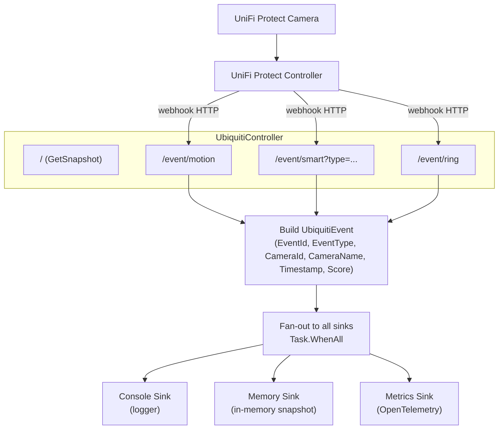

# CasCap.Api.Ubiquiti

A .NET library that integrates with [Ubiquiti UniFi Protect](https://ui.com/camera-security) IP cameras via webhook callbacks, captures camera events (motion detection, smart detection, doorbell ring), and fans them out to a configurable set of sinks for storage and streaming.

## Purpose

The library is built around webhook endpoints that form the core pipeline:

**`UbiquitiController`** – Exposes a `GET /` snapshot query endpoint and REST API webhook endpoints (`/event/motion`, `/event/smart?type=person|vehicle|animal|package`, `/event/ring`) that the UniFi Protect controller or third-party automation tools call when events occur. Each webhook creates a `UbiquitiEvent` containing the event type, camera identifier, camera name, timestamp, and optional smart detection confidence score, then dispatches it in parallel to every registered `IEventSink<UbiquitiEvent>`.

### Sinks

| Sink | Description |
| --- | --- |
| **Console** | Logs every event via the .NET logger (Debug level) |
| **Memory** | Tracks event counts and timestamps in-memory per event type; provides snapshot queries |
| **Metrics** | Publishes event counts as OpenTelemetry gauge metrics |

## Event Flow



## Configuration Examples

### Minimal

```json
{
  "CasCap": {
    "UbiquitiConfig": {
      "BaseAddress": "https://192.168.1.1",
      "Username": "<controller-username>",
      "Password": "<controller-password>",
      "AzureTableStorageConnectionString": "https://<account>.table.core.windows.net",
      "Sinks": {
        "AvailableSinks": {
          "Console": { "Enabled": true },
          "Memory": { "Enabled": true }
        }
      }
    }
  }
}
```

### Fully configured

```json
{
  "CasCap": {
    "UbiquitiConfig": {
      "IsEnabled": true,
      "BaseAddress": "https://192.168.1.1",
      "Username": "<controller-username>",
      "Password": "<controller-password>",
      "AzureTableStorageConnectionString": "https://<account>.table.core.windows.net",
      "HealthCheckAzureTableStorage": "None",
      "Sinks": {
        "AvailableSinks": {
          "Console": { "Enabled": true },
          "Memory": { "Enabled": true },
          "Metrics": { "Enabled": true },
          "AzureTables": { "Enabled": true },
          "Redis": {
            "Enabled": true,
            "Settings": {
              "SnapshotValues": "ubiquiti:snapshot",
              "SeriesValues": "ubiquiti:series"
            }
          },
          "CommsStream": { "Enabled": true }
        }
      }
    }
  }
}
```

## Dependencies

### NuGet packages

| Package | Purpose |
| --- | --- |
| `KoenZomers.UniFi.Api` | UniFi controller API client for future tighter integration |
| `Asp.Versioning.Mvc` | API versioning |
| `Microsoft.AspNetCore.Http.Abstractions` | HTTP abstractions |
| `Microsoft.AspNetCore.Mvc.Core` | MVC core for REST controllers |
| `Microsoft.Extensions.Http` | `HttpClient` factory |
| `CasCap.Common.Caching` | Distributed caching abstractions |
| `CasCap.Common.Configuration` | Configuration binding helpers |
| `CasCap.Common.Extensions` | Common extension methods and sink infrastructure |
| `CasCap.Common.Logging` | Structured logging helpers |
| `CasCap.Common.Net` | HTTP client base classes |
| `CasCap.Common.Extensions.Diagnostics.HealthChecks` | Kubernetes probe tag helpers |
| `Microsoft.Extensions.Diagnostics.HealthChecks` | Health check abstractions |


## License

This project is released under [The Unlicense](../../LICENSE). See the [LICENSE](../../LICENSE) file for details.
