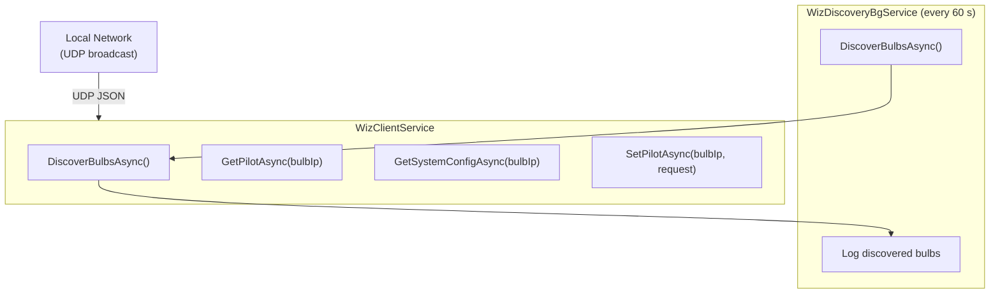

# CasCap.Api.Wiz

A .NET library that integrates with [WiZ](https://www.wizconnected.com) smart bulbs on the local network via the Wiz UDP/JSON protocol, providing bulb discovery, state querying and light control.

## Purpose

The library is built around one background service and a client/query service pair:

**`WizDiscoveryBgService`** – Periodically broadcasts a UDP registration message to discover Wiz bulbs on the local network. The discovery interval is controlled by `DiscoveryPollingDelayMs`.

**`WizClientService`** provides the low-level UDP communication with bulbs:

| Method | Description |
| --- | --- |
| `DiscoverBulbsAsync()` | Broadcasts a registration message and collects responding bulbs |
| `GetPilotAsync(bulbIp)` | Retrieves the current state (on/off, brightness, colour, scene) |
| `GetSystemConfigAsync(bulbIp)` | Retrieves firmware version, MAC address and module info |
| `SetPilotAsync(bulbIp, request)` | Sets the bulb state — on/off, brightness, colour, temperature or scene |

**`WizQueryService`** is a facade implementing `IWizQueryService` that delegates to the client service with logging.

## Configuration

Registered via `IServiceCollection.AddWiz()`. Configuration section: `CasCap:WizConfig`.

| Setting | Type | Default | Required | Description |
| --- | --- | --- | --- | --- |
| `BulbPort` | `int` | `38899` | ✓ | UDP port for sending commands to bulbs |
| `ListenPort` | `int` | `38900` | ✓ | UDP port for receiving bulb responses |
| `DiscoveryTimeoutMs` | `int` | `3000` | ✓ | Timeout for discovery broadcasts |
| `CommandTimeoutMs` | `int` | `2000` | ✓ | Timeout for individual bulb commands |
| `DiscoveryPollingDelayMs` | `int` | `60000` | ✓ | Delay between background discovery cycles |
| `BroadcastAddress` | `string` | `"255.255.255.255"` | ✓ | Broadcast address for bulb discovery |
| `HealthCheckUri` | `string` | `"255.255.255.255"` | ✓ | Required by `IHealthCheckConfig`; not used by `WizConnectionHealthCheck` (which checks discovered bulb count) |
| `HealthCheck` | `KubernetesProbeTypes` | `Readiness` | ✓ | Kubernetes probe type for the health check tag |

## Configuration Examples

### Minimal

```json
{
  "CasCap": {
    "WizConfig": {}
  }
}
```

### Fully configured

```json
{
  "CasCap": {
    "WizConfig": {
      "BulbPort": 38899,
      "ListenPort": 38900,
      "DiscoveryTimeoutMs": 3000,
      "CommandTimeoutMs": 2000,
      "DiscoveryPollingDelayMs": 60000,
      "BroadcastAddress": "192.168.1.255",
      "HealthCheckUri": "192.168.1.255",
      "HealthCheck": "Readiness"
    }
  }
}
```

## Health Check

**`WizConnectionHealthCheck`** – Verifies that at least one Wiz bulb has been discovered on the local network. Returns `Healthy` when bulbs are found and `Degraded` when none are discovered.

## Event Flow



## Dependencies

### NuGet packages

| Package | Purpose |
| --- | --- |
| [OpenWiz](https://www.nuget.org/packages/OpenWiz) | .NET library for communicating with Wiz smart lights |
| [Asp.Versioning.Mvc](https://www.nuget.org/packages/asp.versioning.mvc) | API versioning |
| [Microsoft.AspNetCore.Mvc.Core](https://www.nuget.org/packages/microsoft.aspnetcore.mvc.core) | MVC core for REST controllers |
| [Microsoft.Extensions.Http](https://www.nuget.org/packages/microsoft.extensions.http) | `HttpClient` factory |
| [Microsoft.Extensions.Diagnostics.HealthChecks](https://www.nuget.org/packages/microsoft.extensions.diagnostics.healthchecks) | Health check abstractions |
| [CasCap.Common.Extensions](https://www.nuget.org/packages/cascap.common.extensions) | Shared extension helpers |
| [CasCap.Common.Logging](https://www.nuget.org/packages/cascap.common.logging) | Structured logging helpers |
| [CasCap.Common.Serialization.Json](https://www.nuget.org/packages/cascap.common.serialization.json) | JSON serialisation helpers |
| [CasCap.Common.Extensions.Diagnostics.HealthChecks](https://www.nuget.org/packages/cascap.common.extensions.diagnostics.healthchecks) | Kubernetes probe tag helpers |
| [CasCap.Common.Configuration](https://www.nuget.org/packages/cascap.common.configuration) | Configuration binding helpers |


## License

This project is released under [The Unlicense](../../LICENSE). See the [LICENSE](../../LICENSE) file for details.
