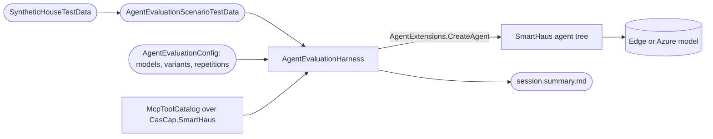

# CasCap.App.Tests

Tests for the [CasCap.App](../CasCap.App) application, covering the web host, the communications
orchestration, KNX summaries, and an evaluation framework for the SmartHaus AI agents.

## Purpose

Most classes exercise components that span multiple feature libraries and need the full configuration
chain. The agent evaluation tests ask the production agents questions such as "How many lights are
turned on?" against a matrix of edge and Azure models, instruction variants and tool surface variants,
and report pass rates, latency and token usage. The harness itself is the reusable
[CasCap.Common.AI.Evaluation](https://github.com/f2calv/CasCap.Common/tree/main/src/CasCap.Common.AI.Evaluation) package; this project supplies the SmartHaus scenarios, the
synthetic house and the assertions.

### Test classes

| Class | Methods | Cases | Category | Description |
| --- | --- | --- | --- | --- |
| `AgentEvaluationTests` | 1 | 4 | Integration, AgentEvaluation | Runs each agent evaluation scenario against every configured model and variant |
| `AgentToolSurfaceTests` | 1 | 1 | Integration, ToolSurface | Measures every agent's tool surface and checks that each tool and parameter is described; calls no model |
| `AIAgentExtensionsTests` | 3 | 3 | Integration | `AgentExtensions.RunAnalysisAsync` against a live inference server: text, image and session resumption |
| `LlamaCppApiClientTests` | 3 | 3 | Integration | The llama.cpp OpenAI-compatible chat client: response, streaming and file content |
| `FeatureServiceRegistrationTests` | 4 | 4 | Integration | `IBgFeature` registrations and `EnabledFeatures` filtering |
| `HealthTests` | 4 | 7 | Integration | Health-check endpoints |
| `SystemControllerTests` | 4 | 4 | Integration | `GET /api/system`, including Basic authentication |
| `AgentEvaluationScenarioTests` | 5 | 11 | AgentEvaluation | SmartHaus graders, tool classification, lighting fixture and scenario data integrity |
| `McpPromptToolReferenceTests` | 1 | 1 | McpPrompts | Every shipped MCP prompt names only tools that exist |
| `KnxContactSummaryTests` | 4 | 13 | Knx | Door and window contact summaries |
| `KnxDoorLockSummaryTests` | 4 | 7 | Knx | Door lock summaries |
| `CameraClipQueueTests` | 7 | 7 | CameraClips | Private-ID exclusion, Ubiquiti/DoorBird mapping, cooldown and bounded queue admission |

Communications orchestration tests live in [CasCap.Comms.Tests](../CasCap.Comms.Tests/README.md), next to the
shared projects they cover. Voice provider adapters and voice processing policy tests live in the
standalone `CasCap.Api.Voice.Tests` project, and the evaluation framework's own tests live in
`CasCap.Common.AI.Tests`.

### Trait categories

| Category | Meaning |
| --- | --- |
| `Integration` | Reads configuration or credentials, or reaches an external service |
| `AgentEvaluation` | Agent evaluation scenarios and runs |
| `ToolSurface` | Agent tool surface measurements |
| `McpPrompts` | MCP prompt contract checks |
| `Knx` | KNX summaries |
| `CameraClips` | Bounded camera event-to-clip admission and privacy policy |

### Skipped tests

| Test | Reason | Count |
| --- | --- | --- |
| `FeatureServiceRegistrationTests` | Requires KNX infrastructure (bus and Azure Storage) | 1 |
| `LlamaCppApiClientTests` | Depends on an uncommitted image fixture | 1 |

`AgentEvaluationTests` skips a scenario at run time when none of the configured providers has an
endpoint and credential on the current machine.

## Agent evaluation

Small language models on edge hardware trade accuracy and speed for privacy and cost. The evaluation
measures that trade instead of guessing at it, using the same agent factory, agent configuration,
instructions and tool schemas as production. See the
[CasCap.Common.AI.Evaluation README](https://github.com/f2calv/CasCap.Common/tree/main/src/CasCap.Common.AI.Evaluation) for how the harness works, its types and its outputs.

### Data Flow



- **SmartHaus bindings.** [SmartHausEvaluationTestData](Tests/SmartHausEvaluationTestData.cs) points the
  harness at the `CasCap.SmartHaus` assembly for MCP tool types and embedded instructions, and falls
  back to `EdgeGpu` when no provider is configured.
- **Synthetic house.** [SyntheticHouseTestData](Tests/SyntheticHouseTestData.cs) renders fixtures through
  the real tool return types, with deliberately distinct values so graders cannot mistake a distractor.
- **Nothing reaches the house.** Tools that switch, move, unlock or send are recorded and never run;
  calling one fails the run. A tool counts as a query when its `McpServerTool` attribute sets
  `ReadOnly` or its name starts with `get_`, `list_`, `search_`, `test_` or `validate_`.
- **Delegation is real.** A question to `CommsAgent` exercises `invoke_home_control_agent` and the
  sub-agent's own tools against the same model.
- **Throttling and thinking are visible.** Azure SDK 429 responses are counted per run, and every request
  records reasoning content and `<think>` blocks, so an edge model whose thinking has been switched back
  on shows up as non-zero thinking runs.
- **Results are statistics.** Each combination runs several times; reports give pass counts with 95%
  Wilson intervals, answer and tool-choice correctness separately, durations, requests and tokens.
  Only the baseline variants are asserted against `MinimumPassRate`.

### Results

Each test session writes a timestamped folder under `ResultsDirectory`:

| File | Content |
| --- | --- |
| `<scenario>.runs.jsonl` | One JSON line per run: answer, verdicts, tool calls, request timeline, throttling |
| `<scenario>.summary.md` | Pass rates, latency and tokens per model and variant, then every request timeline |
| `chat.jsonl` | One tool-free request per model and scenario, measured after the model is loaded |
| `session.summary.md` | Every model across all scenarios so far: pass rate, plain chat, median and P90 run, median request, tokens, throttling, thinking runs, and speed relative to `ReferenceProviderKey` |

The speed column is the geometric mean, over the scenario and variant combinations both models ran,
of the reference model's median run time divided by the model's.

### Scenarios

| Scenario | Agent | Question | Variants compared |
| --- | --- | --- | --- |
| `lights-on-count` | HomeControlAgent | How many lights are turned on? | answer-directly; lighting-only |
| `lights-on-count-via-comms` | CommsAgent | How many lights are turned on? | answer-directly; lighting-only |
| `outdoor-temperature-north` | HeatingAgent | What is the temperature outside on the north side of our house? | house-facts; outdoor-sensor-described, outdoor-temperature-tool |
| `front-door-locked` | HomeControlAgent | Is the front door locked? | answer-directly |

Scenarios and variants live in [AgentEvaluationScenarioTestData](Tests/AgentEvaluationScenarioTestData.cs).
To add one, pick the agent, phrase the question as a household member would, merge the synthetic
responses it needs, and choose the checks. `Scenarios_ReferenceKnownTools` fails offline when a
scenario or variant names a tool that does not exist.

### Configuration

Bound from `CasCap:AgentEvaluationConfig`; every setting has a default. Define the models in a
gitignored `appsettings.Tests.Local.json` next to this README, because endpoints are private:

```json
{
  "CasCap": {
    "AIConfig": {
      "Providers": {
        "EdgeGpu": { "Endpoint": "https://llama-cpp.example.com" },
        "AzureGpt41Mini": {
          "Type": "AzureOpenAI",
          "Endpoint": "https://example.openai.azure.com/",
          "ModelName": "gpt-4.1-mini"
        }
      }
    },
    "AgentEvaluationConfig": {
      "ProviderKeys": [ "EdgeGpu", "AzureGpt41Mini" ],
      "Repetitions": 5
    }
  }
}
```

| Setting | Default | Meaning |
| --- | --- | --- |
| `ProviderKeys` | `EdgeGpu` | Keys into `CasCap:AIConfig:Providers` to evaluate; the `EdgeGpu` fallback is SmartHaus-specific |
| `Repetitions` | `3` | Runs per model and variant combination |
| `InstructionVariants` | all | Variant names to include besides the baseline |
| `ToolSurfaceVariants` | all | Variant names to include besides the baseline |
| `MinimumPassRate` | `0.5` | Baseline pass rate each model must reach |
| `ReferenceProviderKey` | first provider | Model the `× faster` column in `session.summary.md` compares against |
| `RunTimeoutSeconds` | `300` | Limit for one run, including delegation; matches the application default |
| `WarmUpTimeoutSeconds` | `1800` | Limit for the unmeasured request that loads each model before its runs |
| `ResultsDirectory` | `TestResults/AgentEvaluation` | Receives the per-session results described below |
| `ProviderReasoningEffortApplied` | `false` | Sends each provider's `ReasoningEffort`; production currently never does |
| `EndpointToolsMapped` | `false` | Offers `Endpoint` tool sources, which the server currently ignores |

Azure OpenAI providers authenticate with the Entra ID certificate credential resolved from
`AppConfig` (user secrets locally), so no API key is needed. `OpenAI` providers need an `ApiKey`.

## Prerequisites

- `appsettings.json` with `AppConfig`, `AIConfig`, and `KnxConfig` sections.
- `appsettings.Development.json` (optional) with server URLs and secrets.
- `knxgroupaddresses.xml` accessible via the `GroupAddressXmlFilePath` configured in `appsettings.Development.json`.
- A running inference server for `AIAgentExtensionsTests`, `LlamaCppApiClientTests` and `AgentEvaluationTests`.

## Running the tests

```bash
# Self-contained tests only
dotnet test --project src/CasCap.App.Tests/CasCap.App.Tests.csproj --filter-not-trait "Category=Integration"

# Tool surface measurements (no model calls)
dotnet test --project src/CasCap.App.Tests/CasCap.App.Tests.csproj --filter-class "*AgentToolSurfaceTests"

# Agent evaluation against the configured models
dotnet test --project src/CasCap.App.Tests/CasCap.App.Tests.csproj --filter-class "*AgentEvaluationTests"
```

## Test layout

```text
CasCap.App.Tests/
├── Api/                     # Web host integration tests
├── Infrastructure/          # WebApplicationFactory and base class
├── Misc/                    # Live inference server tests
├── Tests/
│   ├── Integration/         # Agent evaluation and tool surface tests
│   ├── Unit/                # Self-contained tests and fakes
│   ├── AgentEvaluationScenarioTestData.cs
│   ├── SmartHausEvaluationTestData.cs
│   └── SyntheticHouseTestData.cs
└── TestBase.cs              # Shared configuration for integration tests
```

## Dependencies

### Project references

| Project | Purpose |
| --- | --- |
| `CasCap.App.Server` | ASP.NET Core host under test |
| `CasCap.Api.Knx` | KNX service and group address lookup under test |
| `CasCap.SmartHaus` | AI agent extensions, MCP tools and hub services under test |
| `CasCap.Common.AI.Evaluation` | Agent evaluation harness, fixture tools, graders and reports |
| `CasCap.Common.Configuration` | `AddStandardConfiguration` / `AddKeyVaultConfigurationFrom` |
| `CasCap.Common.Testing` | `AddXUnitLogging` and test utilities |

## License

This project is released under [The Unlicense](../../LICENSE). See the [LICENSE](../../LICENSE) file for details.
