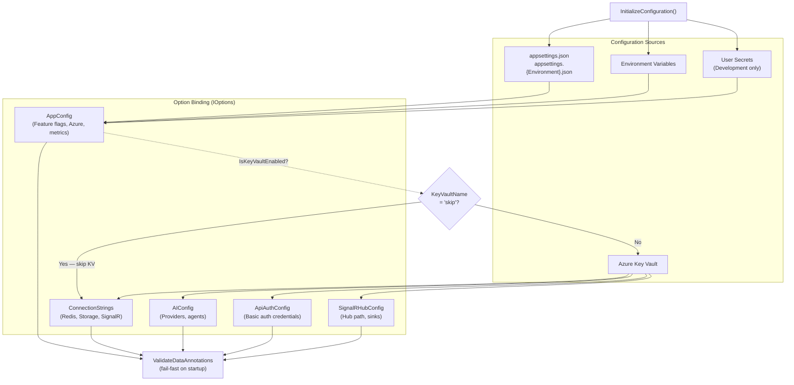

# CasCap.App

Shared bootstrap library that provides configuration initialization for all application hosts (`CasCap.App.Server` and `CasCap.App.Console`). This project is a library — not an executable — that centralizes the configuration and DI wiring common to every entry point.

## Purpose

The single `HostApplicationBuilderExtensions.InitializeConfiguration` extension method performs the full configuration bootstrap sequence:

1. Adds standard configuration sources via `AddStandardConfiguration` (appsettings, environment variables, user secrets).
2. Binds `AppConfig` to extract Key Vault connection details.
3. If `IsKeyVaultEnabled` is `true`, adds Azure Key Vault as a configuration source (skipped when `KeyVaultName = "skip"`).
4. Re-binds `AppConfig` with the newly available Key Vault secrets (or the original sources when Key Vault is skipped).
5. Binds and registers all strongly-typed option sections used across the solution.

### Registered Options

| Section | Type | Description |
| --- | --- | --- |
| `AppConfig` | `AppConfig` | Master application settings (feature flags, Azure, metrics, sensors) |
| `ConnectionStrings` | `ConnectionStrings` | Redis, Azure Storage, SignalR Hub connection strings |
| `AIConfig` | `AIConfig` | AI agent configuration (named providers and agents) |
| `CasCap:ApiAuthConfig` | `ApiAuthConfig` | Basic authentication credentials for the REST API |
| `CasCap:SignalRHubConfig` | `SignalRHubConfig` | SignalR hub path and sink configuration |

All option sections use `AddOptionsWithValidateOnStart` with `ValidateDataAnnotations` for fail-fast validation.

## Configuration Hierarchy

Configuration initialization flow and option binding:

## Dependencies

### Project references

| Project | Purpose |
| --- | --- |
| `CasCap.SmartHaus` | Core orchestration, SignalR hub, AI agent extensions |
| `CasCap.Common.Configuration` | `AddStandardConfiguration` and `AddKeyVaultConfiguration` helpers |
| `CasCap.Common.Extensions.Diagnostics.HealthChecks` | Kubernetes probe tag helpers |

## License

This project is released under [The Unlicense](../../LICENSE). See the [LICENSE](../../LICENSE) file for details.
