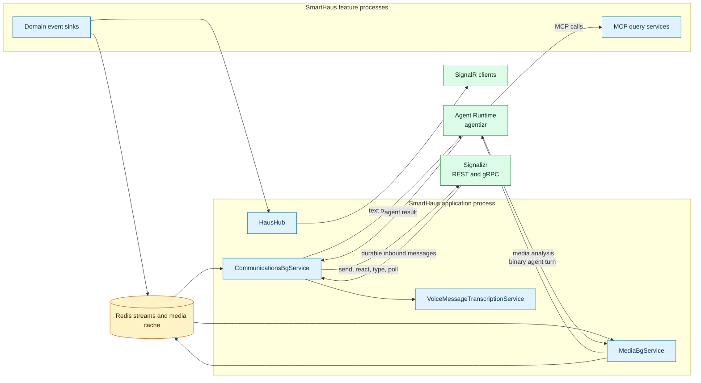
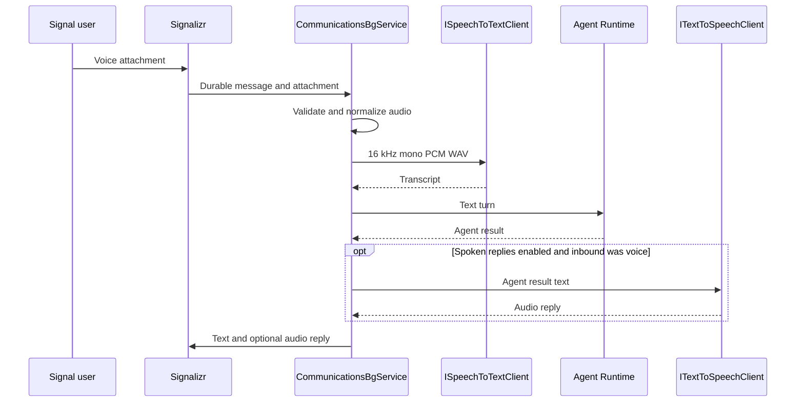

# CasCap.Backend

CasCap.Backend is SmartHaus's shared ASP.NET Core application library. It owns the SignalR hub,
communications and media orchestration, MCP tool implementations, and the application-side clients
for Signalizr and the remote Agent Runtime.

## Purpose

The project provides four application-facing capabilities:

- `HausHub` broadcasts Fronius, KNX, DoorBird, and Buderus events to authenticated SignalR clients.
- `CommunicationsBgService` connects SmartHaus events and inbound Signal messages to the remote
  `CommsAgent` through `CasCap.Comms` and `CasCap.Comms.AI`.
- `MediaBgService` sends cached binary media to a configured remote domain agent and returns its
  findings to the communications stream.
- MCP query services expose SmartHaus domain data and operations to agents without moving those
  implementations into the Agent Runtime.

SmartHaus does not construct language-model agents or select inference providers. Those concerns
belong to the multi-tenant Agent Runtime maintained by
[agentizr](https://github.com/f2calv/agentizr).

## Ownership Boundary

| Owner | Responsibilities |
| --- | --- |
| SmartHaus | Domain services, MCP tools and prompts, SignalR, Redis stream producers and consumers, media caching, speech transcription, and runtime client calls |
| Agent Runtime | Tenant-scoped agent definitions, instructions, provider and model selection, delegation, sessions, overrides, credentials, and definition activation |
| Signalizr | Signal account ownership, exact group resolution, durable inbound delivery, attachments, reactions, typing, polls, and outbound sends |
| `CasCap.Comms` | Shared communications stream and Signal gateway pipeline |
| `CasCap.Comms.AI` | Agent Runtime responder, session commands, delegation diagnostics, and poll-tool adaptation for the communications pipeline |

Names such as `CommsAgent` and `SecurityAgent` are references to active remote definitions. Public
examples under [docs/agent-examples](../../docs/agent-examples/README.md) illustrate expected
behaviour but are not runtime authority.

## Service Architecture



The Agent Runtime may use llama.cpp, Ollama, Azure OpenAI, or another supported provider without a
SmartHaus deployment. Provider changes are definition-level changes in agentizr, not SmartHaus
configuration changes.

## Public Surface

### SignalR Hub

`HausHub` is an `[Authorize]` hub mounted at `SignalRHubConfig.HubPath`. It implements
`IHausServerHub` and broadcasts these events:

| Server method | Payload | Description |
| --- | --- | --- |
| `SendFroniusEvent` | `FroniusEvent` | Solar inverter reading |
| `SendKnxTelegram` | `KnxEvent` | KNX bus telegram |
| `SendDoorBirdEvent` | `DoorBirdEvent` | Door station event |
| `SendBuderusEvent` | `BuderusEvent` | Heating system reading |
| `SendMessage` | User, message, date | Text to all other clients |
| `Broadcast` | Message | Text to every client, including the sender |

After broadcasting, domain events are forwarded to the configured `IEventSink<HubEvent>`
implementations. Console and OpenTelemetry metric sinks are enabled by default.

Feature projects provide the corresponding SignalR client sinks:

| Sink | Hub call |
| --- | --- |
| `FroniusSinkSignalRService` | `SendFroniusEvent` |
| `KnxSinkSignalRService` | `SendKnxTelegram` |
| `DoorBirdSinkSignalRService` | `SendDoorBirdEvent` |
| `BuderusSinkSignalRService` | `SendBuderusEvent` |

### REST API

| Endpoint | Authentication | Description |
| --- | --- | --- |
| `GET /api/system` | Required | Returns `GitMetadata` for the running build |

### MCP Server

The server application exposes one stateless Streamable HTTP MCP endpoint at `AppConfig.McpUrl`.
Tool implementations live under [Services/Mcp](Services/Mcp), MCP-only DTOs live under
[Models/Mcp](Models/Mcp), and reusable prompt classes remain in [Models](Models).

Feature registration adds the owning query service and then calls `WithToolsFromAssembly` for its
assembly. The server does not maintain an agent session or execute a model when servicing an MCP
request.

| Service | Tools | Prompts | Domain |
| --- | ---: | ---: | --- |
| `BusSystemMcpQueryService` | 21 | 4 | Contacts, locks, shutters, HVAC, outlets, rooms, floors, and diagnostics |
| `HeatPumpMcpQueryService` | 2 | 4 | Heat-pump state and writable data points |
| `InverterMcpQueryService` | 7 | 5 | Solar production, power flow, meters, and battery state |
| `FrontDoorMcpQueryService` | 8 | 5 | Door state, images, history, access, night vision, and stream URL |
| `AppliancesMcpQueryService` | 9 | 5 | Appliance state, actions, and programs |
| `EdgeHardwareMcpQueryService` | 1 | 0 | Edge CPU and GPU snapshots |
| `IpCameraMcpQueryService` | 1 | 0 | Camera event status |
| `AquariumMcpQueryService` | 2 | 0 | Aquarium pump state and control |
| `SmartPlugMcpQueryService` | 3 | 0 | Smart-plug state and control |
| `SmartLightingMcpQueryService` | 15 | 0 | KNX and WiZ lighting state and control |
| `MessagingMcpQueryService` | 3 | 0 | Signal poll creation, closure, and status |

This table is the available SmartHaus MCP catalogue. Which tools an agent can call is selected by
its active definition in agentizr; SmartHaus deliberately carries no agent-to-tool assignment map.

## Communications Flow

`CommunicationsBgService` is the only SmartHaus service that exchanges messages with Signalizr.
It combines two input paths:

1. It consumes `CommsEvent` records from the Redis stream configured by `CommsConfig.StreamKey`.
2. It receives durable Signal messages over the Signalizr gRPC subscription identified by
   `SignalizrClientConfig.SubscriberName`.
3. Events listed in `CommsConfig.MonitorSources` bypass the agent and go directly to the operator
   monitor group, and events listed in `CommsConfig.DirectDeliverySources` bypass the agent and go
   directly to the chat group.
4. Other events and user messages are sent to `CommsConfig.AgentName` through
   `IAgentRuntimeClient`.
5. The response is delivered through Signalizr with the configured reaction, typing, poll, and
   diagnostic behaviour.

`EdgeHardwareAgentRunEnricher` measures edge GPU energy use for each communications-agent run and
adds available energy and solar context to the reply footer and monitor timeline.

## Media Flow

`MediaBgService` is a separate binary path so images and other media are not embedded in the text
communications stream:

1. A source sink caches the bytes in Redis and writes a `MediaEvent` to `MediaConfig.StreamKey`.
2. `MediaBgService` maps the event source to a remote definition through
   `MediaConfig.SourceAgentMap`.
3. It fetches the cached bytes and sends a stateless binary turn to that definition.
4. It publishes the result as a `CommsEvent`, retaining a `MediaReference` to the cached bytes.
5. `CommunicationsBgService` relays the result and media to the configured Signal group.

### Camera Clips

For configured Ubiquiti cameras and the optional DoorBird source, the media sink queues a bounded
clip request. `CameraClipBgService` applies the per-camera cooldown, waits for post-roll, downloads
the MediaMTX playback range, enforces the byte limit, and uses FFmpeg stream copy to retain H.264
video and the first AAC audio track when present.

The queue has one reader and fixed capacity. Queue pressure, playback failure, timeout, invalid
output, or oversized output falls back to the existing thumbnail path. Temporary files are always
deleted, and private controller identifiers are not serialized into events.

The base configuration lists `CameraClipBgService` in `CommsConfig.DirectDeliverySources`, so clips
are sent straight to the chat group without an agent turn. Still images continue through
`MediaBgService` and the security agent.

## Voice Flow

Voice attachments are normalized before an agent sees them:

1. `VoiceMessageTranscriptionService` downloads the selected attachment from Signalizr.
2. It verifies the declared media type against the payload signature and enforces compressed,
   decoded, and duration limits.
3. Non-WAV input is piped through FFmpeg to 16 kHz mono signed 16-bit PCM WAV without a temporary
   file.
4. The configured `ISpeechToTextClient` transcribes the normalized audio.
5. Only the transcript is sent to the remote agent. Raw audio is never included in the agent turn.
6. When spoken replies are enabled and the inbound message was voice, the configured
  `ITextToSpeechClient` synthesizes the agent's text response for Signalizr delivery.



`SpeechToTextConfig.Mode` controls the path: `Disabled` rejects voice without downloading,
`Shadow` transcribes for measurement without replying, and `Enabled` drives a normal agent turn.

Three `ISpeechToTextClient` implementations are available:

| Provider | Implementation | Transport |
| --- | --- | --- |
| `WhisperAsr` | `WhisperAsrSpeechToTextClient` | Multipart `POST /asr` |
| `WhisperCpp` | `WhisperCppSpeechToTextClient` | Multipart `POST /inference` |
| `Azure` | `AzureSpeechToTextClient` | Azure AI Speech fast transcription using the ambient token credential |

The two whisper adapters are separate because their routes, multipart names, and options differ.
Both keep audio on the local network. Azure minimizes latency but sends audio to the configured
Azure resource.

Spoken replies use `TextToSpeechConfig`. `Disabled` keeps every reply text-only, while enabled mode
synthesizes only replies to inbound voice messages. `AzureSpeech`, `AzureOpenAi`, and `Piper`
providers are available; their provider-specific endpoints and voices are read only when selected.

## Configuration

### Configuration Examples

Minimal local configuration uses unauthenticated local Agent Runtime and Signalizr endpoints:

```json
{
  "AppConfig": {
    "McpUrl": "/mcp"
  },
  "CasCap": {
    "AgentRuntimeClientOptions": {
      "BaseAddress": "http://localhost:5090"
    },
    "CommsConfig": {
      "GroupName": "Example Group",
      "AgentName": "CommsAgent"
    },
    "SignalizrClientConfig": {
      "BaseAddress": "http://localhost:8090",
      "GrpcAddress": "http://localhost:5001",
      "SubscriberName": "smarthaus-comms"
    }
  }
}
```

A deployment that authenticates to the Agent Runtime supplies identifiers through public
configuration and the PEM certificate through a secret-backed provider:

```json
{
  "CasCap": {
    "AgentRuntimeClientOptions": {
      "BaseAddress": "https://agent-runtime.example.com",
      "TimeoutMinutes": 10
    },
    "AgentRuntimeAzureAuthConfig": {
      "Enabled": true,
      "TenantId": "00000000-0000-0000-0000-000000000000",
      "ClientId": "00000000-0000-0000-0000-000000000000",
      "Certificate": null,
      "Scope": "api://00000000-0000-0000-0000-000000000000/.default"
    }
  }
}
```

Never commit the certificate or real tenant, application, endpoint, group, camera, or device
identifiers.

### Application and Runtime

| Section | Setting | Default | Description |
| --- | --- | --- | --- |
| `AppConfig` | `McpUrl` | `"/mcp"` | Stateless Streamable HTTP MCP route |
| `CasCap:AgentRuntimeClientOptions` | `BaseAddress` | Required | Agent Runtime service base address |
| `CasCap:AgentRuntimeClientOptions` | `TimeoutMinutes` | `10` | Timeout for model and tool runs |
| `CasCap:AgentRuntimeAzureAuthConfig` | `Enabled` | `false` | Enables certificate-backed bearer authentication |
| `CasCap:AgentRuntimeAzureAuthConfig` | `TenantId` | `null` | Microsoft Entra tenant identifier; required when enabled |
| `CasCap:AgentRuntimeAzureAuthConfig` | `ClientId` | `null` | Caller application identifier; required when enabled |
| `CasCap:AgentRuntimeAzureAuthConfig` | `Certificate` | `null` | Combined PEM certificate and private key from private configuration |
| `CasCap:AgentRuntimeAzureAuthConfig` | `Scope` | `null` | Runtime application scope ending in `/.default`; required when enabled |

### SignalR

| Setting | Default | Description |
| --- | --- | --- |
| `CasCap:SignalRHubConfig:HubPath` | `"/hubs/haus"` | Authorized hub route |
| `CasCap:SignalRHubConfig:Sinks:AvailableSinks` | Console and Metrics enabled | Hub-side event sinks |
| `CasCap:SignalRHubConfig:ConsoleLogIntervalMs` | `30000` | Console count interval |
| `CasCap:SignalRHubConfig:MetricsBatchSize` | `10` | Events accumulated before metric flush |
| `CasCap:SignalRHubConfig:MetricsFlushIntervalMs` | `60000` | Periodic metric flush interval |

### Communications and Signalizr

`CommsConfig` is defined by
[CasCap.Comms](https://github.com/f2calv/signalizr/tree/main/src/CasCap.Comms). These are the
settings SmartHaus commonly overrides:

| Setting | Default | Description |
| --- | --- | --- |
| `CasCap:CommsConfig:GroupName` | `"My Test Group Name"` | Exact user-facing Signal group name |
| `CasCap:CommsConfig:MonitorGroupName` | `null` | Exact operator-only diagnostics group; unset disables diagnostics |
| `CasCap:CommsConfig:MonitorSources` | Empty | Event sources sent directly to the monitor group |
| `CasCap:CommsConfig:StreamEventTurnsEnabled` | `true` | Whether chat-bound stream events become agent turns |
| `CasCap:CommsConfig:DirectDeliverySources` | Empty | Event sources sent directly to the chat group without an agent turn |
| `CasCap:CommsConfig:EchoTranscriptToDebugChat` | `false` | Echoes successful transcripts to the monitor group |
| `CasCap:CommsConfig:DelegationMessagesEnabled` | `true` | Sends delegation status as a separate message |
| `CasCap:CommsConfig:AgentName` | Required by deployment | Remote agent definition name |
| `CasCap:CommsConfig:AgentSessionId` | Required by deployment | Stable session identifier for the group conversation |
| `CasCap:SignalizrClientConfig:BaseAddress` | `http://localhost:8090` | Signalizr REST endpoint |
| `CasCap:SignalizrClientConfig:GrpcAddress` | `http://localhost:5001` | Signalizr gRPC endpoint |
| `CasCap:SignalizrClientConfig:SubscriberName` | `smarthaus-comms` | Durable inbound cursor identity |

Group names must exactly match Signalizr's `GET /api/v1/groups` output, including case and spaces.

### Media and Camera Clips

| Section | Setting | Default | Description |
| --- | --- | --- | --- |
| `CasCap:MediaConfig` | `SourceAgentMap` | Empty | Event source to remote agent-definition name |
| `CasCap:MediaConfig` | `ImageCacheKeyPrefix` | `"security:image"` | Redis media-cache key prefix |
| `CasCap:MediaConfig` | `ImageCacheTtlMs` | `300000` | Cached-media lifetime |
| `CasCap:MediaConfig` | `StreamKey` | `"media:stream:events"` | Media Redis Stream key |
| `CasCap:MediaConfig` | `ConsumerGroup` | `"media:processors"` | Redis consumer group |
| `CasCap:MediaConfig` | `ConsumerName` | Machine and application name | Per-process consumer identity |
| `CasCap:MediaConfig` | `ConsumerGroupStartId` | `"0"` | Initial group position |
| `CasCap:MediaConfig` | `StreamReadPosition` | `">"` | `XREADGROUP` position |
| `CasCap:MediaConfig` | `StreamReadCount` | `10` | Entries read per poll |
| `CasCap:MediaConfig` | `PollingIntervalMs` | `1000` | Poll interval |
| `CasCap:CameraClipConfig` | `Enabled` | `false` | Enables event-to-clip capture |
| `CasCap:CameraClipConfig` | `PlaybackBaseAddress` | `http://localhost:9996` | MediaMTX playback endpoint |
| `CasCap:CameraClipConfig` | `Sources` | Empty | Camera identifier to logical source mapping |
| `CasCap:CameraClipConfig` | `DoorBirdSource` | `null` | Optional DoorBird source mapping |
| `CasCap:CameraClipConfig` | `PreRollSeconds` | `5` | Requested pre-event duration |
| `CasCap:CameraClipConfig` | `PostRollSeconds` | `10` | Requested post-event duration |
| `CasCap:CameraClipConfig` | `MaximumClipBytes` | `12582912` | Playback and remux byte limit |
| `CasCap:CameraClipConfig` | `QueueCapacity` | `32` | Pending request capacity |
| `CasCap:CameraClipConfig` | `ProcessingTimeoutMs` | `30000` | Download and remux budget |
| `CasCap:CameraClipConfig` | `FfmpegPath` | `ffmpeg` | FFmpeg executable |

Real camera identifiers belong only in private configuration.

### Voice

| Setting | Default | Description |
| --- | --- | --- |
| `CasCap:SpeechToTextConfig:Mode` | `Disabled` | `Disabled`, `Shadow`, or `Enabled` |
| `CasCap:SpeechToTextConfig:Provider` | `WhisperAsr` | `WhisperAsr`, `WhisperCpp`, or `Azure` |
| `CasCap:SpeechToTextConfig:WhisperAsrEndpoint` | `http://localhost:9000` | openai-whisper-asr endpoint |
| `CasCap:SpeechToTextConfig:WhisperCppEndpoint` | `null` | whisper.cpp endpoint |
| `CasCap:SpeechToTextConfig:AzureEndpoint` | `null` | Azure AI Speech endpoint |
| `CasCap:SpeechToTextConfig:AzureLocales` | `null` | Candidate full locale names |
| `CasCap:SpeechToTextConfig:Language` | `en` | Whisper language code |
| `CasCap:SpeechToTextConfig:ModelId` | `null` | Optional model identifier for diagnostics |
| `CasCap:SpeechToTextConfig:TimeoutMs` | `120000` | End-to-end transcription budget |
| `CasCap:SpeechToTextConfig:MaxCompressedBytes` | `5242880` | Compressed attachment limit |
| `CasCap:SpeechToTextConfig:MaxDecodedBytes` | `19200000` | Decoded WAV limit |
| `CasCap:SpeechToTextConfig:MaxDurationSeconds` | `300` | Recording duration limit |
| `CasCap:SpeechToTextConfig:FfmpegPath` | `ffmpeg` | Audio normalization executable |

| Setting | Default | Description |
| --- | --- | --- |
| `CasCap:TextToSpeechConfig:Mode` | `Disabled` | Enables spoken replies to inbound voice messages |
| `CasCap:TextToSpeechConfig:Provider` | `AzureSpeech` | `AzureSpeech`, `AzureOpenAi`, or `Piper` |
| `CasCap:TextToSpeechConfig:AzureSpeechEndpoint` | `null` | Azure AI Speech resource endpoint |
| `CasCap:TextToSpeechConfig:AzureOpenAiEndpoint` | `null` | Azure OpenAI resource endpoint |
| `CasCap:TextToSpeechConfig:AzureOpenAiDeployment` | `null` | Azure OpenAI audio deployment name |
| `CasCap:TextToSpeechConfig:AzureOpenAiApiVersion` | `2025-03-01-preview` | Audio API version |
| `CasCap:TextToSpeechConfig:AzureSpeechVoice` | `null` | Full Azure AI Speech voice name |
| `CasCap:TextToSpeechConfig:AzureOpenAiVoice` | `null` | Azure OpenAI voice name |
| `CasCap:TextToSpeechConfig:PiperEndpoint` | `null` | Wyoming protocol `host:port` endpoint |
| `CasCap:TextToSpeechConfig:PiperVoice` | `null` | Piper voice name |
| `CasCap:TextToSpeechConfig:FfmpegPath` | `ffmpeg` | PCM audio encoder executable |
| `CasCap:TextToSpeechConfig:MaxCharacters` | `1000` | Longest synthesized reply |
| `CasCap:TextToSpeechConfig:TimeoutMs` | `60000` | Synthesis time budget |

### Other Application Configuration

| Section | Setting | Default | Description |
| --- | --- | --- | --- |
| `CasCap:BuderusCommsConfig` | `Dhw1AlertHysteresis` | `1.0` | DHW1 setpoint alert hysteresis in degrees Celsius |
| `CasCap:BuderusCommsConfig` | `Dhw1AlertCooldownMs` | `3600000` | Minimum interval between DHW1 alerts |

## Dependencies

### External Application Libraries

| Project | Purpose |
| --- | --- |
| `CasCap.AgentRuntime.Contracts` | Versioned remote execution request and response contracts |
| `CasCap.Comms` | Redis stream and Signalizr communications pipeline |
| `CasCap.Comms.AI` | Agent Runtime responder and communications-agent integration |
| `CasCap.Signalizr.Client` | Durable Signalizr REST and gRPC client |
| `CasCap.Api.Voice` | Voice normalization and speech client abstractions |
| `CasCap.Api.Azure.Auth` | Certificate and token credential support |
| `CasCap.Api.Azure.CognitiveServices` | Azure AI Speech adapter |
| `CasCap.Api.Azure.Storage` | Azure Blob Storage integration |

Debug builds use adjacent project references for these repositories. Release builds use published
packages where the project file defines a Release package reference.

### Feature Projects

The backend references the SmartHaus sink projects for Buderus, DoorBird, Fronius, KNX, Miele,
EdgeHardware, Shelly, Sicce, Ubiquiti, and WiZ, plus `CasCap.Api.DDns`.

### Direct NuGet Packages

| Package | Purpose |
| --- | --- |
| `Azure.Identity` | Azure authentication |
| `KoenZomers.UniFi.Api` | UniFi API client |
| `ModelContextProtocol.AspNetCore` | Stateless Streamable HTTP MCP server |
| `Microsoft.AspNetCore.SignalR.Client*` | SignalR client and MessagePack transport |
| `OpenTelemetry*` | Metrics and tracing integration |
| `Tiveria.Home.Knx` | KNX protocol support |
| `Spectre.Console` | Console presentation |

## Development

Build from the repository's Debug solution so adjacent source dependencies are used:

```powershell
dotnet build SmartHaus.Debug.slnx --configuration Debug
```

The backend tests live in `src/CasCap.Backend.Tests`. Generic Agent Runtime protocol and provider
coverage belongs to agentizr and `CasCap.Common.AI.Tests`; SmartHaus tests cover its domain tools,
orchestration, media, and configuration boundaries.

## License

This project is released under [The Unlicense](../../LICENSE).
