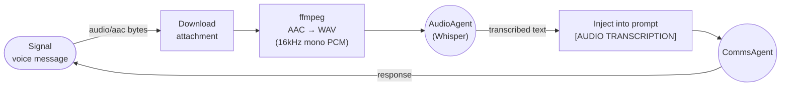
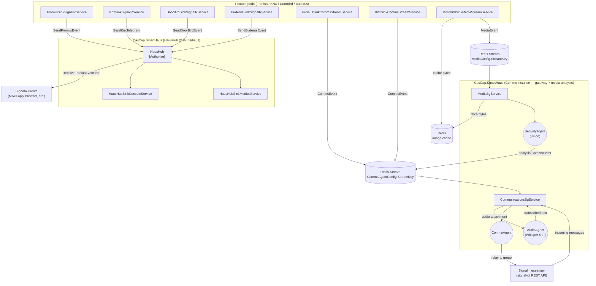

# CasCap.SmartHaus

The central ASP.NET Core library that hosts the consolidated [SignalR](https://learn.microsoft.com/en-us/aspnet/core/signalr/introduction) hub, coordinates real-time event broadcasting across all home automation features, and provides supporting services for AI agents, dynamic DNS, and Signal messenger notifications.

## Purpose

### SignalR Hub — `HausHub`

`HausHub` is an `[Authorize]` SignalR hub mounted at `/hubs/haus` (configurable via `SignalRHubConfig.HubPath`). It implements `IHausServerHub` and broadcasts the four core event types to all connected clients:

| Server method | Payload type | Description |
| --- | --- | --- |
| `SendFroniusEvent(e)` | `FroniusEvent` | Broadcasts a solar inverter reading |
| `SendKnxTelegram(e)` | `KnxEvent` | Broadcasts a KNX bus telegram |
| `SendDoorBirdEvent(e)` | `DoorBirdEvent` | Broadcasts a door station event |
| `SendBuderusEvent(e)` | `BuderusEvent` | Broadcasts a heating system reading |
| `SendMessage(user, message, date)` | — | Broadcasts a text message to all other clients |
| `Broadcast(message)` | — | Broadcasts a text message to all clients (including sender) |

After broadcasting, each event is also written to the server-side `IEventSink<HubEvent>` implementations registered in `SignalRHubConfig.Sinks`.

### Client-Side Event Sinks (forward to hub)

These sinks are registered in the feature pods and forward domain events to the hub:

| Sink | Forwards |
| --- | --- |
| `FroniusSinkSignalRService` | `FroniusEvent` → `SendFroniusEvent` |
| `KnxSinkSignalRService` | `KnxEvent` → `SendKnxTelegram` |
| `DoorBirdSinkSignalRService` | `DoorBirdEvent` → `SendDoorBirdEvent` |
| `BuderusSinkSignalRService` | `BuderusEvent` → `SendBuderusEvent` |

### Hub-Side Event Sinks (server process)

| Sink | Description |
| --- | --- |
| `HausHubSinkConsoleService` | Logs every `HubEvent` via the .NET logger |
| `HausHubSinkMetricsService` | Records OpenTelemetry metrics per `HubEvent` type |
| `CommsStreamSinkService` | Writes/reads `CommsEvent` entries to/from the Redis Stream configured by `CommsAgentConfig.StreamKey` |
| `MediaStreamSinkService` | Writes/reads `MediaEvent` entries to/from the Redis Stream configured by `MediaConfig.StreamKey` |

### Background Services

| Service | Description |
| --- | --- |
| `CommunicationsBgService` | Gateway agent — consumes the comms Redis Stream and incoming Signal messages, routes both through CommsAgent, and relays responses to the Signal notification group. Audio attachments are transcribed via AudioAgent (Whisper) before being passed to CommsAgent. Posts debug notifications to `PhoneNumberDebug` for delegation events, completion events, and session compaction events |
| `MediaBgService` | Consumes the media Redis Stream (`MediaConfig.StreamKey`), routes media to the domain agent configured in `MediaConfig.SourceAgentMap` (e.g. DoorBird → SecurityAgent), and posts analysis findings back to the comms stream. Runs in the Comms pod alongside `CommunicationsBgService` |
| `HausHubSinksBgService` | Initialises the hub-side `IEventSink<HubEvent>` implementations |
| `FroniusSymoSignalRClientService` | Connects to the hub as a SignalR client |
| `UbiquitiBgService` | Ubiquiti network integration (planned) |

### REST API

| Endpoint | Auth | Description |
| --- | --- | --- |
| `GET /api/system` | Required | Returns git build metadata (`GitMetadata`) |

## Configuration

### `SignalRHubConfig` (`CasCap:SignalRHubConfig`)

| Setting | Type | Default | Description |
| --- | --- | --- | --- |
| `HubPath` | `string` | `"/hubs/haus"` | URL path at which the hub is mounted |
| `Sinks.AvailableSinks` | `Dictionary<string, SinkConfigParams>` | `Console=true, Metrics=true` | Hub-side event sinks to enable |
| `ConsoleLogIntervalMs` | `int` | `30000` | Logging interval in milliseconds for the console sink periodic event count output |
| `MetricsBatchSize` | `int` | `10` | Number of events to accumulate before flushing to the OpenTelemetry counter |
| `MetricsFlushIntervalMs` | `int` | `60000` | Periodic flush interval in milliseconds for the metrics sink |

### `CommsAgentConfig` (`CasCap:AIConfig:Agents:CommsAgent:Settings`)

| Setting | Type | Default | Description |
| --- | --- | --- | --- |
| `GroupName` | `string` | — | The name of the Signal group used for notifications |
| `StreamKey` | `string` | `"comms:stream:events"` | Redis Stream key for cross-instance communication of key events |
| `ConsumerGroup` | `string` | `"comms:agents"` | Redis consumer group name |
| `ConsumerName` | `string` | `"comms-0"` | Consumer name within the group |
| `ConsumerGroupStartId` | `string` | `"0"` | Starting ID when creating the consumer group (`"0"` = from beginning, `"$"` = new only) |
| `StreamReadPosition` | `string` | `">"` | Read position passed to `XREADGROUP` |
| `StreamReadCount` | `int` | `10` | Maximum entries per `XREADGROUP` call |
| `PollingIntervalMs` | `int` | `5000` | Polling interval for comms stream and REST message retrieval |
| `HealthCheckProbeDelayMs` | `int` | `2000` | Delay in milliseconds between signal-cli readiness probes at startup |
| `FlushTimeoutMs` | `int` | `5000` | Timeout in milliseconds for flushing pending envelopes at startup |
| `GroupResolutionPollingDelayMs` | `int` | `1000` | Delay in milliseconds between polls when waiting for Signal group resolution |

### `MediaConfig` (`CasCap:MediaConfig`)

| Setting | Type | Default | Description |
| --- | --- | --- | --- |
| `SourceAgentMap` | `Dictionary<string, string>` | — | Maps event source names (e.g. `"DoorBird"`) to agent keys (e.g. `"SecurityAgent"`) for media analysis routing |
| `StreamKey` | `string` | `"media:stream:events"` | Redis Stream key for source-agnostic media events |
| `ConsumerGroup` | `string` | `"media:processors"` | Redis consumer group name |
| `ConsumerName` | `string` | `"media-0"` | Consumer name within the group |
| `ConsumerGroupStartId` | `string` | `"0"` | Starting ID when creating the consumer group (`"0"` = from beginning, `"$"` = new only) |
| `StreamReadPosition` | `string` | `">"` | Read position passed to `XREADGROUP` |
| `StreamReadCount` | `int` | `10` | Maximum entries per `XREADGROUP` call |
| `PollingIntervalMs` | `int` | `1000` | Polling interval for the media stream consumer |

### `SecurityAgentConfig` (`CasCap:AIConfig:Agents:SecurityAgent:Settings`)

| Setting | Type | Default | Description |
| --- | --- | --- | --- |
| `ImageCacheKeyPrefix` | `string` | — | Redis key prefix for cached image bytes |
| `ImageCacheTtlMs` | `int` | `300000` | Time-to-live in milliseconds for cached image bytes in Redis |

### `HeatingAgentConfig` (`CasCap:AIConfig:Agents:HeatingAgent:Settings`)

| Setting | Type | Default | Description |
| --- | --- | --- | --- |
| `Dhw1AlertHysteresis` | `double` | `1.0` | Hysteresis in °C for the DHW1 setpoint alert |
| `Dhw1AlertCooldownMs` | `int` | `3600000` | Minimum cooldown in milliseconds between consecutive DHW1 setpoint alerts |

## Agent Integration — Signal Messenger

### CommsAgent — the gateway agent

`CommunicationsBgService` is the **sole component that communicates with Signal**. It acts as a gateway between the smart home and the user:

1. **Comms stream** — Consumes `CommsEvent` entries from the Redis Stream configured by `CommsAgentConfig.StreamKey` (default `comms:stream:events`). These are published by feature-pod sinks (KNX state changes, Fronius SOC alerts, DDNS changes) and by `MediaBgService` (analysis results from domain agents such as SecurityAgent).
2. **Incoming messages** — Polls the signal-cli REST API for new Signal group messages.
3. **Agent routing** — Routes both stream events and incoming user messages through the `CommsAgent` (`AIAgent` resolved from `AIConfig.Agents[AgentKeys.CommsAgent]`), which decides how to respond.
4. **Outbound** — Sends the agent's response to the Signal notification group via `INotifier`.

Domain agents (SecurityAgent, HeatingAgent, etc.) **never talk to Signal directly**. They publish their findings to the comms stream, and CommsAgent relays, aggregates, or suppresses notifications as appropriate.

### Media pipeline — source-agnostic media analysis (Comms pod)

`MediaBgService` runs alongside `CommunicationsBgService` in the Comms pod and provides a dedicated pipeline for binary media (images, audio, documents):

1. **Media stream** — Consumes `MediaEvent` entries from the Redis Stream configured by `MediaConfig.StreamKey` (default `media:stream:events`), published by source-specific sinks (e.g. `DoorBirdSinkMediaStreamService`).
2. **Agent routing** — Looks up `MediaConfig.SourceAgentMap` to find the domain agent for the event source (e.g. `"DoorBird" → "SecurityAgent"`).
3. **Analysis** — Fetches cached media bytes from Redis and runs the domain agent (e.g. a vision-capable SecurityAgent) against them.
4. **Findings** — Posts the analysis result as a `CommsEvent` to `comms:stream:events` with a `MediaReference` in `JsonPayload` (pointing to the cached image bytes), where CommunicationsBgService picks it up, fetches the image from Redis, and relays both text and image to the Signal group.

This enables users to interact with the smart home AI assistant directly from the Signal mobile app, eliminating the need for a custom mobile application.

Each agent's orchestration settings live in a `Settings` sub-section under the corresponding `CasCap:AIConfig:Agents:{key}` entry in `appsettings.json`, bound to a strongly-typed record (e.g. `CommsAgentConfig`, `SecurityAgentConfig`, `HeatingAgentConfig`). The dictionary key doubles as the agent identifier — `AgentKeys` provides compile-time constants for all well-known agent names.

### Audio attachment flow — speech-to-text transcription

When a user sends an audio clip (e.g. a voice message) via Signal, `CommunicationsBgService` intercepts it before the comms agent sees it:

1. **Download** — The attachment bytes and MIME type (`audio/aac`, `audio/ogg`, etc.) are downloaded from signal-cli.
2. **Transcode** — If the audio is not already WAV, `AgentExtensions.TranscodeToWavAsync` pipes the bytes through `ffmpeg` (stdin → stdout, 16 kHz mono 16-bit PCM WAV) via `ShellExtensions.RunProcessWithStdinAsync`. This ensures Whisper receives a format it supports — Signal sends raw AAC streams which Whisper cannot decode directly.
3. **Transcribe** — The WAV bytes are sent to `AudioAgent` (Whisper model on the edge Ollama instance via `EdgeCpuWhisper` provider). The MIME type is overridden to `image/png` for OllamaSharp transport because `AbstractionMapper.ToOllamaSharpMessages` filters `DataContent` to `image/*` only — Ollama's images field is raw base64 and Whisper interprets the bytes as audio regardless.
4. **Inject** — The transcribed text replaces the binary attachment in the prompt: `[AUDIO TRANSCRIPTION] The user sent an audio clip. Transcribed text: "..."`. CommsAgent then processes the text normally.



## Service Architecture



## Agent Instructions

Agent instruction markdown files are compiled as embedded resources in this project and resolved at runtime by `AgentExtensions.ResolveInstructions` in `CasCap.Common.AI`. To update an agent's behaviour, edit the corresponding file and redeploy.

## MCP Query Services

MCP query services registered by `HausMcpServiceCollectionExtensions` expose domain tools and prompts to AI agents. Each service is conditionally registered based on enabled features.

| Service | Tools | Prompts | Domain |
| --- | --- | --- | --- |
| `SystemMcpQueryService` | 3 | — | System-level tools available to all agents (date/time, provider list, agent list) |
| `BusSystemMcpQueryService` | 19 | 5 | Bus system — shutters, HVAC, power outlets, diagnostics |
| `HeatPumpMcpQueryService` | 2 | 5 | Heat pump |
| `InverterMcpQueryService` | 7 | 5 | Solar inverter |
| `FrontDoorMcpQueryService` | 8 | 5 | Front door intercom |
| `AppliancesMcpQueryService` | 9 | 5 | Home appliances |
| `EdgeHardwareMcpQueryService` | 1 | — | Edge hardware monitoring (GPU/CPU metrics) |
| `IpCameraMcpQueryService` | 1 | — | IP cameras (UniFi Protect event status) |
| `AquariumMcpQueryService` | 2 | — | Aquarium water pump (Sicce) |
| `SmartPlugMcpQueryService` | 3 | — | Smart plugs (Shelly) |
| `SmartLightingMcpQueryService` | 15 | — | Lighting — KNX ceiling/wall lights and Wiz smart bulbs |
| `MessagingMcpQueryService` | 3 | — | Signal messaging polls (create, close, status) |

### MCP Registration

Register individually per feature flag (as done in `Program.cs`):

```csharp
services.AddSystemMcp();
services.AddBusSystemMcp();
services.AddHeatPumpMcp();
services.AddInverterMcp();
services.AddFrontDoorMcp();
services.AddAppliancesMcp();
services.AddEdgeHardwareMcp();
services.AddCamerasMcp();
services.AddAquariumMcp();
services.AddSmartPlugMcp();
services.AddSmartLightingMcp();
services.AddMessagingMcp(phoneNumber, groupName);
```

### MCP Service Architecture

```mermaid
graph TD
    classDef system fill:#e0f2fe,stroke:#0284c7,color:#0c4a6e
    classDef integration fill:#fef3c7,stroke:#f59e0b,color:#78350f
    classDef core fill:#dbeafe,stroke:#3b82f6,color:#1e3a8a

    REG["Program.cs<br/>(feature-gated registration)"]:::core

    subgraph System["System Tools"]
        SYS["SystemMcpQueryService<br/>(3 tools)"]:::system
    end

    subgraph HomeAutomation["Home Automation"]
        BUS["BusSystemMcpQueryService<br/>(19 tools, 5 prompts)"]:::integration
        HEAT["HeatPumpMcpQueryService<br/>(2 tools, 5 prompts)"]:::integration
        INVERTER["InverterMcpQueryService<br/>(7 tools, 5 prompts)"]:::integration
        DOOR["FrontDoorMcpQueryService<br/>(8 tools, 5 prompts)"]:::integration
        APPLIANCES["AppliancesMcpQueryService<br/>(9 tools, 5 prompts)"]:::integration
        CAMERAS["IpCameraMcpQueryService<br/>(1 tool)"]:::integration
        AQUARIUM["AquariumMcpQueryService<br/>(2 tools)"]:::integration
        PLUGS["SmartPlugMcpQueryService<br/>(3 tools)"]:::integration
        LIGHTS["SmartLightingMcpQueryService<br/>(15 tools)"]:::integration
    end

    subgraph Platform["Platform Services"]
        EDGE["EdgeHardwareMcpQueryService<br/>(1 tool)"]:::system
        MSG["MessagingMcpQueryService<br/>(3 tools)"]:::system
    end

    REG --> SYS
    REG --> BUS
    REG --> HEAT
    REG --> INVERTER
    REG --> DOOR
    REG --> APPLIANCES
    REG --> CAMERAS
    REG --> AQUARIUM
    REG --> PLUGS
    REG --> LIGHTS
    REG --> EDGE
    REG --> MSG

    BUS -.uses.-> KNX["CasCap.Api.Knx"]
    HEAT -.uses.-> BUDERUS["CasCap.Api.Buderus"]
    INVERTER -.uses.-> FRONIUS["CasCap.Api.Fronius"]
    DOOR -.uses.-> DOORBIRD["CasCap.Api.DoorBird"]
    APPLIANCES -.uses.-> MIELE["CasCap.Api.Miele"]
    CAMERAS -.uses.-> UBIQUITI["CasCap.Api.Ubiquiti"]
    AQUARIUM -.uses.-> SICCE["CasCap.Api.Sicce"]
    PLUGS -.uses.-> SHELLY["CasCap.Api.Shelly"]
    LIGHTS -.uses.-> WIZ["CasCap.Api.Wiz"]
```



## Agent Architecture

How agents delegate to sub-agents and consume tool services:

```mermaid
flowchart TD
    classDef orchestrator fill:#dbeafe,stroke:#3b82f6,color:#1e3a8a
    classDef specialist fill:#d1fae5,stroke:#10b981,color:#064e3b
    classDef disabled fill:#f3f4f6,stroke:#9ca3af,color:#6b7280,stroke-dasharray:5 5
    classDef shared fill:#fef3c7,stroke:#f59e0b,color:#78350f
    classDef stt fill:#ede9fe,stroke:#8b5cf6,color:#4c1d95
    classDef unassigned fill:#fee2e2,stroke:#ef4444,color:#991b1b

    Comms(["CommsAgent<br/>(orchestrator)"]):::orchestrator

    Security["SecurityAgent"]:::specialist
    Heating["HeatingAgent"]:::specialist
    Energy["EnergyAgent"]:::specialist
    HomeControl["HomeControlAgent"]:::specialist
    Infra["InfraAgent"]:::specialist
    Appliances["AppliancesAgent<br/>(disabled)"]:::disabled
    Audio["AudioAgent<br/>(Whisper STT)"]:::stt

    Comms -->|delegates| Security
    Comms -->|delegates| Heating
    Comms -->|delegates| Energy
    Comms -->|delegates| HomeControl
    Comms -->|delegates| Infra
    Comms -->|delegates| Appliances
    Comms -.->|audio STT| Audio

    subgraph SharedSvc["Shared Services"]
        SYS["SystemMcpQueryService<br/>get_current_datetime_state · get_providers · get_agents"]:::shared
        MSG["MessagingMcpQueryService<br/>create_poll · close_poll · get_poll_status"]:::shared
    end

    Comms -.-> SharedSvc
    Security -.-> SharedSvc
    Heating -.-> SharedSvc
    Energy -.-> SharedSvc
    HomeControl -.-> SharedSvc
    Infra -.-> SharedSvc
    Appliances -.-> SharedSvc

    subgraph AudioPipeline["Audio Transcription"]
        AUDIO_IN["audio/aac bytes"] --> FFMPEG["ffmpeg<br/>AAC → WAV<br/>(16kHz mono PCM)"]
        FFMPEG --> WHISPER["EdgeCpuWhisper<br/>karanchopda333/whisper"]
        WHISPER --> TRANSCRIPTION["transcribed text"]
    end
    Audio --> AudioPipeline

    subgraph FrontDoor["FrontDoorMcpQueryService (8 tools)"]
        FD_state["get_house_door_state"]
        FD_photo["get_house_door_photo"]
        FD_info["get_house_door_photo_info"]
        FD_unlock["unlock_house_door"]
        FD_night["enable_house_door_night_vision"]
        FD_video["get_house_door_video_stream_url"]
        FD_hist["get_house_door_history_image"]
        FD_histInfo["get_house_door_history_image_info"]
    end
    Security --> FrontDoor

    subgraph SecurityBus["BusSystemMcpQueryService (SecurityAgent)"]
        SB_door["get_house_front_door_state"]
    end
    Security --> SB_door

    subgraph SecurityLights["SmartLightingMcpQueryService (SecurityAgent)"]
        SL_doorOn["turn_on_house_door_light"]
        SL_doorOff["turn_off_house_door_light"]
    end
    Security --> SL_doorOn
    Security --> SL_doorOff

    subgraph CommsBus["BusSystemMcpQueryService (CommsAgent)"]
        CB_rooms["get_house_rooms"]
        CB_floors["get_house_floors"]
    end
    Comms --> CB_rooms
    Comms --> CB_floors

    subgraph HeatPump["HeatPumpMcpQueryService"]
        HP_state["get_heat_pump_state"]
        HP_set["set_heat_pump_data_point"]
    end
    Heating --> HeatPump

    subgraph KnxHvac["Remote: mcp/knx (heating zones)"]
        KH_change["change_house_heating_zone"]
        KH_zones["get_house_heating_zones"]
        KH_zone["get_house_heating_zone"]
    end
    Heating --> KnxHvac

    subgraph Inverter["InverterMcpQueryService (7 tools)"]
        INV_flow["get_inverter_power_flow"]
        INV_elec["get_inverter_electrical_readings"]
        INV_info["get_inverter_info"]
        INV_devices["get_inverter_connected_devices"]
        INV_meter["get_inverter_meter_readings"]
        INV_battery["get_inverter_battery_status"]
        INV_snap["get_inverter_snapshot"]
    end
    Energy --> Inverter

    subgraph BusHome["BusSystemMcpQueryService (HomeControl, 16 tools)"]
        BH_note["shutters · outlets · rooms · floors<br/>diagnostics · front door state<br/>(excludes 3 heating zone tools)"]
    end
    HomeControl --> BusHome

    subgraph LightsHome["SmartLightingMcpQueryService (HomeControl, all 15 tools)"]
        LH_note["KNX ceiling/wall lights · WiZ smart bulbs<br/>on/off · status · all-on/all-off"]
    end
    HomeControl --> LightsHome

    subgraph EdgeHW["EdgeHardwareMcpQueryService"]
        EDGE_snap["get_edge_hardware_snapshots"]
    end
    Infra --> EdgeHW

    subgraph AppSvc["AppliancesMcpQueryService (9 tools)"]
        APP_all["get_all_appliances · summary"]
        APP_detail["get_appliance · identification · state · actions"]
        APP_exec["execute_appliance_action · get/start_programs"]
    end
    Appliances --> AppSvc

    subgraph Unassigned["Unassigned Services"]
        UA_cam["IpCameraMcpQueryService · 1 tool"]:::unassigned
        UA_plug["SmartPlugMcpQueryService · 3 tools"]:::unassigned
        UA_aqua["AquariumMcpQueryService · 2 tools"]:::unassigned
    end
```



### Agent Tools Summary

| Agent | Direct Tools | Via Delegation | Total |
| --- | --- | --- | --- |
| SecurityAgent | 17 | — | 17 |
| HeatingAgent | 11 | — | 11 |
| EnergyAgent | 13 | — | 13 |
| HomeControlAgent | 35 | — | 35 |
| InfraAgent | 7 | — | 7 |
| AppliancesAgent | 15 | — | 15 |
| AudioAgent | 0 | — | 0 |
| CommsAgent | 8 | 98 | 106 |

## Agent Instructions

| Agent | Instruction file |
| --- | --- |
| SecurityAgent | [SecurityAgent.instructions.md](Resources/SecurityAgent.instructions.md) |
| HeatingAgent | [HeatingAgent.instructions.md](Resources/HeatingAgent.instructions.md) |
| EnergyAgent | [EnergyAgent.instructions.md](Resources/EnergyAgent.instructions.md) |
| HomeControlAgent | [HomeControlAgent.instructions.md](Resources/HomeControlAgent.instructions.md) |
| CommsAgent | [CommsAgent.instructions.md](Resources/CommsAgent.instructions.md) |
| InfraAgent | [InfraAgent.instructions.md](Resources/InfraAgent.instructions.md) |
| AudioAgent | [AudioAgent.instructions.md](Resources/AudioAgent.instructions.md) |
| AppliancesAgent | [AppliancesAgent.instructions.md](Resources/AppliancesAgent.instructions.md) |

## Dependencies

### NuGet packages

| Package | Purpose |
| --- | --- |
| [Azure.Identity](https://www.nuget.org/packages/azure.identity) | Azure authentication |
| [KoenZomers.UniFi.Api](https://www.nuget.org/packages/koenzomers.unifi.api) | Ubiquiti UniFi API client |
| [ModelContextProtocol.AspNetCore](https://www.nuget.org/packages/modelcontextprotocol.aspnetcore) | MCP server middleware for ASP.NET Core |
| [OpenTelemetry](https://www.nuget.org/packages/opentelemetry) | Telemetry SDK |
| [OpenTelemetry.Extensions.Hosting](https://www.nuget.org/packages/opentelemetry.extensions.hosting) | OpenTelemetry host integration |
| [Tiveria.Home.Knx](https://www.nuget.org/packages/tiveria.home.knx) | KNX protocol library |
| [Microsoft.AspNetCore.SignalR.Client](https://www.nuget.org/packages/microsoft.aspnetcore.signalr.client) | SignalR hub client |
| [Microsoft.AspNetCore.SignalR.Client.Core](https://www.nuget.org/packages/microsoft.aspnetcore.signalr.client.core) | SignalR hub client core |
| [Microsoft.AspNetCore.SignalR.Protocols.MessagePack](https://www.nuget.org/packages/microsoft.aspnetcore.signalr.protocols.messagepack) | MessagePack SignalR protocol |
| [Spectre.Console](https://www.nuget.org/packages/spectre.console) | Rich console output |
| [CasCap.Api.Azure.Storage](https://www.nuget.org/packages/cascap.api.azure.storage) | Azure Blob Storage integration |
| [CasCap.Common.Extensions](https://www.nuget.org/packages/cascap.common.extensions) | Shared extension helpers |
| [CasCap.Common.Logging](https://www.nuget.org/packages/cascap.common.logging) | Structured logging helpers |
| [CasCap.Common.Net](https://www.nuget.org/packages/cascap.common.net) | HTTP client helpers |
| [CasCap.Common.Serialization.Json](https://www.nuget.org/packages/cascap.common.serialization.json) | JSON serialisation helpers |
| [CasCap.Common.Caching](https://www.nuget.org/packages/cascap.common.caching) | Caching helpers |
| [CasCap.Common.Services](https://www.nuget.org/packages/cascap.common.services) | Shared service utilities |
| [CasCap.Api.Azure.Auth](https://www.nuget.org/packages/cascap.api.azure.auth) | Azure authentication and token credential helpers |

### Project references

| Project | Purpose |
| --- | --- |
| `CasCap.Common.AI` | Consolidated MCP tools, prompts, and agent infrastructure |
| `CasCap.Api.SignalCli` | Signal messenger client |
| `CasCap.Api.DDns` | Dynamic DNS service |
| `CasCap.Api.Buderus.Sinks` | Buderus SignalR sink |
| `CasCap.Api.DoorBird.Sinks` | DoorBird SignalR, Redis, Azure Table, and Blob sinks |
| `CasCap.Api.Fronius.Sinks` | Fronius SignalR sink |
| `CasCap.Api.Knx.Sinks` | KNX SignalR sink |
| `CasCap.Api.Miele.Sinks` | Miele SignalR sink |
| `CasCap.Api.EdgeHardware.Sinks` | Edge hardware SignalR sink |
| `CasCap.Api.Shelly.Sinks` | Shelly smart plug SignalR sink |
| `CasCap.Api.Wiz.Sinks` | Wiz smart lighting SignalR sink |
| `CasCap.Api.Ubiquiti.Sinks` | Ubiquiti IP camera SignalR sink |
| `CasCap.Api.Sicce.Sinks` | Sicce SignalR sink |

## License

This project is released under [The Unlicense](../../LICENSE). See the [LICENSE](../../LICENSE) file for details.
